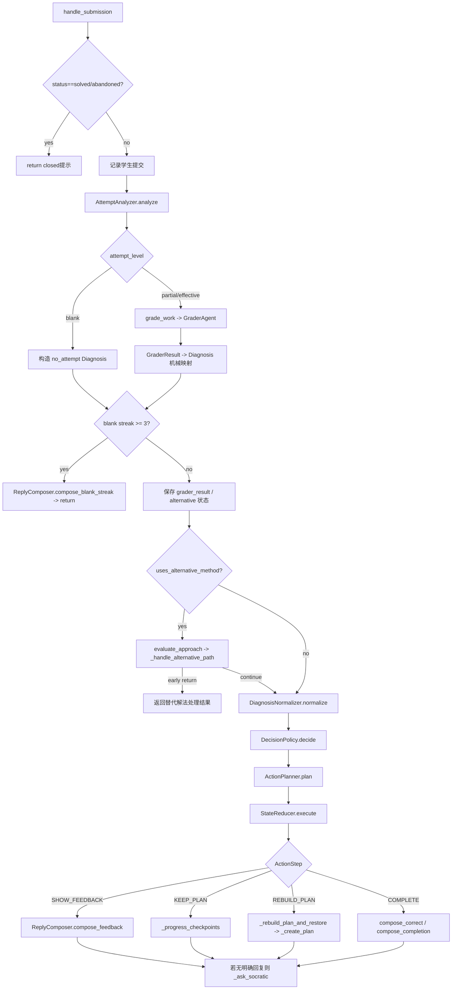
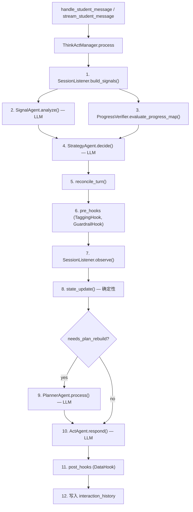
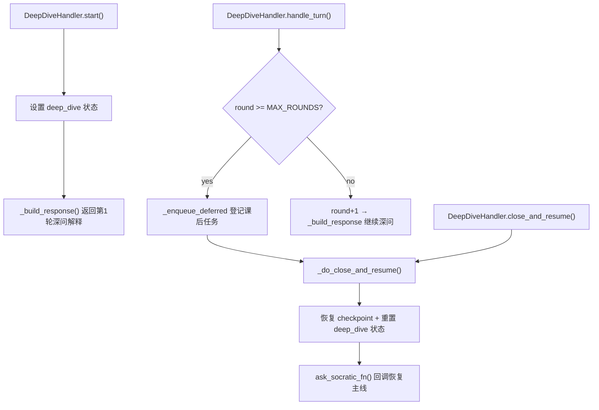
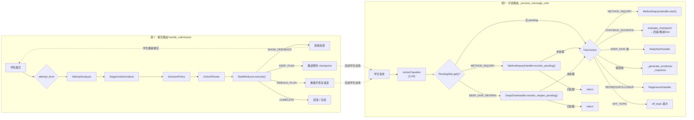
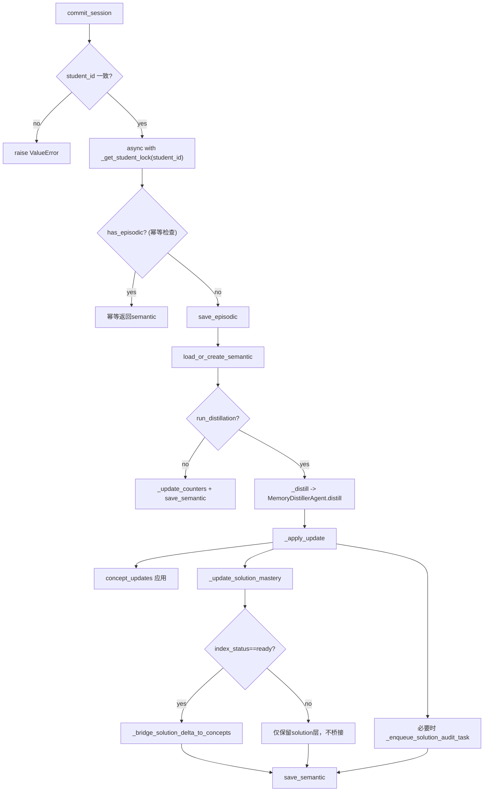

# DeepTutor 系统文档（重写版）

> 更新时间：2026-04-03（PDF 管线 v2 + Foundation + Pass 2c 题目提取 + Tag Clustering + applies-to）
> 审计范围：`agent/**/*.py`（Tutor / Review / Memory / Recommend / Progress）
> 文档目标：用"当前真实代码行为"描述系统，不混入未落地设计
> 架构宪法：见 [`doc/TUTOR_CONSTITUTION.md`](./doc/TUTOR_CONSTITUTION.md)

---

## 目录

1. [系统目标与边界](#1-系统目标与边界)
2. [模块职责总览](#2-模块职责总览)
3. [核心数据契约](#3-核心数据契约)
4. [接口文档（Manager层）](#4-接口文档manager层)
5. [控制流描述（含工作流路径）](#5-控制流描述含工作流路径)
   - 5.13 [自适应学习闭环（Lesson → Session → Memory → Task）](#513-自适应学习闭环)
6. [Skill Registry 与 Agent 映射](#6-skill-registry-与-agent-映射)
7. [会话与存储生命周期](#7-会话与存储生命周期)
8. [架构耦合点评（业务视角）](#8-架构耦合点评业务视角)
9. [TODO List（代码审计）](#9-todo-list代码审计)
10. [代码索引](#10-代码索引)

---

## 1. 系统目标与边界

DeepTutor 的核心架构建立在两大支柱之上：

1. **基于对话的上下文管理 (Context Governance)**：不做简单的"即问即答"，而是通过精细的会话状态机和结构化记忆（Episodic/Semantic），在多轮对话中维持教学目标、追踪学生状态、控制引导节奏。
2. **基于索引的知识卡片 RAG (Indexed Knowledge RAG)**：不做黑盒的知识生成，而是通过严格的二阶段检索（MethodRouter → CardSelector）和概念注册表（ConceptRegistry），将 LLM 的生成能力限制在标准化的教学大纲和解法路径内。

**设计动机与挑战应对**：

1.  **Prompt Engineering 的局限性**：仅靠系统提示词难以让 LLM 在长对话中稳定维持"标准助教"的角色（易直接泄露答案、易遗忘学生前序错误、易偏离苏格拉底式引导节奏）。因此，系统将教学法（Pedagogy）固化为代码逻辑与状态机，而将 LLM 聚焦于执行特定子任务（判题/意图识别/话术生成）的推理引擎角色。
2.  **强推理模型的"连贯性陷阱"**：新一代模型（如 DeepSeek-V3+）将推理过程内化，导致输出具有极强的上下文连贯性和跳跃性。这在解题时是优势，但在教学时是灾难（容易直接剧透、忽略学生中间步骤的卡顿、难以插入引导）。**本系统通过确定性协议状态转移 + Think→Act 多段生成（Signal / Progress / Strategy / Act）来强制"打断" LLM 的连贯生成流**，将连续的推理拆解为可审计的证据、策略与自然语言执行，确保教学节奏不被模型的推理惯性带偏。

在此基础上，系统进一步构建了一个可闭环的学习流程：

1. `Tutor` 负责做题现场的判题与引导（上下文管理的重镇）。
2. `Review` 负责课后复盘与方法迁移。
3. `Memory` 负责跨会话记忆沉淀（concept + solution 分叉）。
4. `Recommend` 负责"下一步做什么"。
5. `Progress` 负责"今天做什么"和阶段总结。

当前明确边界：

1. 已实现二阶段 RAG 知识卡检索（MethodRouter → CardSelector → 消费方）。
2. 已实现审计任务持久化与人工审计发布骨架（`AuditStore` JSONL 追加 + `AuditWorker` proposal + `approve` 后正式回写本地发布层）。
3. 已实现 ConceptRegistry 概念节点注册（YAML 加载 + 前置依赖 BFS 展开 + alias 归一化匹配）。
4. 已实现双层 mastery（concept 维度 + method_slot 维度）以及 pending audit replay（审批后自动触发）。
5. 已完成新增题域实测：圆锥曲线（椭圆 / 双曲线 / 抛物线）与数列（递推与求和）；`tools/rag_e2e_integration.py` 同时保留导数含参讨论 smoke 回归。
6. 已形成本地人工审计闭环：`pending → proposal → approve → publish → done`；尚未实现教师看板 / 发布回滚 / 全量运营闭环（Phase G/H）。
7. 已建立三级卡片树（chapter → anchor → leaf）+ Thought 深层语义索引，现有 31 张手写卡片以 `card_type="anchor"` 向后兼容加载。
8. 已建立 PDF 拆书管线（5 趟 + 人工审核），v2 重构核心原则"LLM 管语义，代码管结构"：opaque card_id（`c_XX_YYY`）+ local_ref 父指针由代码反向构建 children/card_type；teaches/requires 概念字段前移到 Pass 2a；Pass 3 三段式（代码召回 → 小上下文 LLM 判别 → DAG 校验）；SymPy 公式模板匹配；Union-Find 概念聚类。CLI 入口 `tools/pdf_pipeline_cli.py`。
9. **下一阶段：Tool Use 驱动知识消费**（设计已定稿，待实现）。当前 RAG 是被动缓存消费（仅替代解法路径触发），标准对话/判题流从未主动检索。新设计将知识检索作为 LLM 可调用工具暴露（`search_knowledge` 等 6 个 tool），采用"Pre-load + Tool Use"混合策略：会话创建时预加载题目关联卡片覆盖 80% 场景，对话中 LLM 按需调用工具处理 20% 长尾（如学生提出未预期的知识缺口）。详见 §5.12.8。

---

## 2. 模块职责总览

| 模块 | 核心职责 | 状态持有 | 对外产物 |
|---|---|---|---|
| Tutor | 提交判题（v2 管线）、Think→Act 对话推进（自由策略 + Listener 模式） | `TutorSession` | `export_session()` |
| Review | 错误回放、多解法演示、两阶段理解验证、重试信号 | `ReviewSession` | `close_session()/export_session()` |
| Knowledge | 三级卡片树 + 二阶段 RAG 检索 + 概念注册 + Thought 深层语义索引 + 审计发布层 + PDF 拆书管线 | `ConceptRegistry` + `ThoughtStore` + `AuditStore` + `SolutionLinkStore` + `DraftStore` | `CardRetrieveResult` / `ThoughtEntity` / `RagAuditEntry` |
| Memory | 情节记忆入库、语义蒸馏、concept/solution/slot 三维度熟练度更新 | `SemanticMemory` + Episodic files | `get_semantic()/get_student_context()` |
| Recommend | 结合 session + memory 决策推荐类型，并查题库或降级 | 无长驻会话 | `Recommendation` |
| Progress | 遗忘曲线驱动计划 + 阶段总结 + next_review_at 回写 | 无长驻会话 | `TaskPlan` / `ProgressSummary` |

### 2.1 基础设施层 `agent/infra/`（2026-03-22 新建）

原项目所有模块通过 `from src.logging / src.config / src.services.*` 导入基础设施，但 `src/` 目录在本仓库中不存在。此前由 `debug_cli.py` 的 ~200 行 `sys.modules` hack 在运行时伪造整个 `src.*` 包树。

重构后，基础设施实现移入 `agent/infra/`，所有模块直接 `from agent.infra.* import`，不再依赖 `src`：

| 文件 | 替代的旧路径 | 提供的接口 |
|---|---|---|
| `agent/infra/logging.py` | `src.logging` | `get_logger(name)`, `LLMStats` |
| `agent/infra/config.py` | `src.config.settings` + `src.services.config` | `settings`, `get_agent_params(module)` |
| `agent/infra/llm.py` | `src.services.llm` | `complete()`, `stream()`, `get_llm_config()`, `configure()`, `get_token_limit_kwargs()`, `supports_response_format()` |
| `agent/infra/prompt.py` | `src.services.prompt` | `get_prompt_manager()` → `PromptManager.load_prompts()` |

`debug_cli.py` 的 bootstrap 从 ~200 行缩减至 ~40 行：
- Live 模式：调用 `infra_llm.configure()` 从环境变量读取 API 配置
- Mock 模式：将 `infra_llm.complete/stream` 替换为 noop

### 2.2 Tutor 子模块结构（2026-03-30 Think→Act 对话管线 + v2 提交管线）

当前 Tutor 有两条独立管线：

- **Think→Act 对话管线**（`handle_student_message` / `stream_student_message`）：`ThinkActManager` 编排，LLM 自由策略 + SessionListener 信号模式
- **v2 提交判题管线**（`handle_submission`）：`AttemptAnalyzer → DiagnosisNormalizer → DecisionPolicy → ActionPlanner → StateReducer → ReplyComposer`
- **会话编排层**：`TutorManager` 暴露外部接口，管理会话生命周期
- **基础设施层**：`SessionStore` / `SessionExporter` / `KnowledgeBridge` / `context_helpers` / `PendingSlot`
- **外部上下文源**：`KnowledgeBridge` 提供缓存 RAG 补充卡片，`MemoryManager` 提供学生画像字符串（首轮读取后 session 内缓存）

#### 2.2.1 Think→Act 对话管线（2026-03-30 接入生产，Signal / Progress / Strategy 三段）

| 文件 | 类/模块 | 职责 |
|---|---|---|
| `tutor_manager.py` | `TutorManager` | 会话生命周期、提交管线编排、对话入口（委托 ThinkActManager）、导出 |
| `think_act_manager.py` | `ThinkActManager` | Think→Act 管线编排：Listener → `SignalAgent` + `ProgressVerifier`（并行）→ `StrategyAgent` → reconcile → state_update → Act |
| `agents/signal_agent.py` | `SignalAgent` | 感知层：意图 / 情绪 / pending 解析 / 数学内容抽取 |
| `skills/registry.py` + `agents/router_agent.py` | `evaluate_progress_map` | ProgressVerifier：提供 checkpoint 通过数 / 回退建议 / hint 证据 |
| `agents/strategy_agent.py` | `StrategyAgent` | 教学策略层：决定怎么教、是否提前收束、是否回补过程、是否继续追问 |
| `agents/act_agent.py` | `ActAgent` | Act 步骤：根据 ThinkOutput + 上下文生成自然语言回复 |
| `think_act_types.py` | `SignalOutput / ProgressVerdict / StrategyOutput / ThinkOutput / StateControl / TeachingSkill` | Think→Act 架构的核心数据结构与 merge 契约 |
| `pipeline/session_listener.py` | `SessionListener` | 纯观察者 / 数据钩子：维护 engagement/frustration 趋势，生成信号文本注入 prompt |
| `pipeline/strategy_hooks.py` | `TaggingHook / GuardrailHook / DataHook` | pre_hooks（标记/守卫）+ post_hooks（数据采集 InteractionSignal） |
| `pipeline/think_state_update.py` | `state_update()` | 确定性状态转移：只读 StateControl，处理 checkpoint/pending/deep_dive/plan rebuild |
| `skills/yang_teacher.yaml` | `TeachingSkill` 配置 | Per-teacher 教学风格：persona + 约束 + 12 种教学方法库 |
| `context_builder.py` | `TutorContextBuilder` | 为 Think→Act 构造 `session_context`（稳定 key-value 快照） |
| `regression_handler.py` | `RegressionHandler` | 追问、回退、软回顾/硬回退（仍被 StateReducer 在提交管线中调用） |

**已删除的旧对话管线模块**（2026-03-30）：

| 已删除文件 | 原职责 | 替代方 |
|---|---|---|
| `action_classifier.py` | LLM 动作路由 → 单 action 分类 | Think 步骤的多信号感知 |
| `deep_dive_handler.py` | 深问窗口管理 + 独立回复生成 | state_update 管理窗口 + Act 统一生成回复 |
| `method_inquiry_handler.py` | 方法提议澄清 + 归档 | Think 感知 method_inquiry 意图 + state_update 设置 pending |

#### 2.2.2 Tutor v2 提交流水线（不变）

| 文件 | 类/模块 | 职责 |
|---|---|---|
| `pipeline/attempt_analyzer.py` | `AttemptAnalyzer` | 分类提交（blank/partial/effective）+ 调用 `grade_work` + Phase 0 机械映射 `GraderResult → Diagnosis` |
| `pipeline/diagnosis_normalizer.py` | `DiagnosisNormalizer` | 诊断校验、枚举归一化、矛盾修正、回填 legacy error_type |
| `pipeline/decision_policy.py` | `DecisionPolicy` | 纯代码决策矩阵：`Diagnosis → Decision(feedback × plan_control)` |
| `pipeline/action_planner.py` | `ActionPlanner` | 将 `Decision` 展开为有序 `ActionPlan` |
| `pipeline/state_reducer.py` | `StateReducer` | **唯一合法的 session 状态变更入口**；承接原 error handlers、plan 管理、checkpoint 推进 |
| `pipeline/reply_composer.py` | `ReplyComposer` | 学生可见回复生成与 `correction_note` 清洗 |
| `v2_data_structures.py` | `Evidence / Diagnosis / Decision / ActionPlan` | v2 诊断-决策-执行的数据契约 |

#### 2.2.3 Tutor 基础设施抽取

| 文件 | 类/模块 | 职责 |
|---|---|---|
| `pipeline/session_store.py` | `SessionStore` | TutorSession 持久化、TTL 清理、磁盘快照 |
| `pipeline/session_exporter.py` | `SessionExporter` | `export_session()` 输出组装 |
| `pipeline/knowledge_bridge.py` | `KnowledgeBridge` | 二阶段 RAG 检索、补充卡片格式化、audit 回写、缓存 bundle 供 Think→Act 消费 |
| `pipeline/pending_slot.py` | `PendingSlot` | 统一待澄清交互槽：`set/get/clear/cancel/build_context` |
| `pipeline/context_helpers.py` | `get_recent_history()` 等 | 最近历史 / 已通过 checkpoint / 最近上下文的请求级缓存工具 |

补充说明：

1. `ThinkActManager._build_contexts()` 当前会消费 `session.last_retrieval_bundle`，将其格式化为 `knowledge_context` 注入 Think / Act。
2. `ThinkActManager._build_contexts()` 当前会在 session 首轮读取 `MemoryManager.get_student_context(student_id)`，并缓存为 `session._cached_student_context` 注入 Think。
3. `SessionExporter` 不再依赖任何 `deep_dive_handler` 同步器；deep dive 记录直接从 `TutorSession` 导出。

流式与非流式对话路径当前都委托给 `ThinkActManager`：
- `handle_student_message`：调用 `ThinkActManager.process()`，Act 非流式返回完整 dict
- `stream_student_message`：调用 `ThinkActManager.stream_process()`，Act 流式逐 chunk yield

#### 2.2.1.a Think→Act 设计原则（2026-03-30 明确化）

1. **少做加法**：Tutor 不再通过不断增加枚举、handler、特判状态来修复 bad case；默认优先修改 prompt、证据抽取与教学策略，而不是扩张状态机。
2. **状态机只管协议，不管教学**：`state_update()` 只处理 checkpoint/pending/deep_dive/plan rebuild 等协议状态，不决定“这轮该怎么教”。
3. **证据与决策分离**：
   - `SignalAgent` 负责“学生在说什么、情绪如何、是否在回应 pending”。
   - `ProgressVerifier` 负责“学生客观上展示了多少掌握证据”。
   - `StrategyAgent` 负责“老师这轮怎么推进、是否提前收束、是否要求补过程、是否直接教学”。
4. **Listener 只是钩子**：`SessionListener` 当前既是 prompt 的在线弱信号注入器，也是未来个性化画像与后训练的数据埋点层；它不应演化成新的决策器。
5. **默认粗粒度**：当模型时延较高时，系统不应把简单题切成过细 checkpoint。细粒度只该局部出现在新概念、高风险错误或学生明显不会的地方。
6. **RAG / 画像是上下文源，不是控制器**：`KnowledgeBridge` 与 `MemoryManager` 只提供上下文，不直接决定教学路径。

### 2.3 Knowledge 子系统演进（2026-03-31 三级卡片树 + Thought + PDF 管线）

#### 2.3.1 三级卡片树

`PublishedKnowledgeCard` 新增 4 个可选字段（向后兼容，现有卡片默认 `card_type="anchor"`）：

| 字段 | 类型 | 默认值 | 说明 |
|---|---|---|---|
| `card_type` | `str` | `"anchor"` | `chapter` / `anchor` / `leaf` 三级 |
| `parent_card_id` | `str \| None` | `None` | 父卡片 ID |
| `children` | `list[str]` | `[]` | 子卡片 ID 列表 |
| `thought_ids` | `list[str]` | `[]` | 关联 Thought 实体 ID |

`FileCardStore` 新增 3 个层级查询 helper：`get_children()` / `get_parent()` / `cards_by_type()`。

#### 2.3.2 Thought 深层语义索引

Thought 是跨章节的深层思维模式实体（"草蛇灰线"），代表在不同题型/章节中共享的底层思维迁移。

- `ThoughtEntity`：`thought_id / name / description / insight / linked_cards / source / status`
- `ThoughtLinkedCard`：`card_id / chapter / role`（role: 典型应用 / 跨域迁移 / 高阶变体 / 逆向应用）
- `ThoughtStore`（`agent/knowledge/thought_store.py`）：懒加载 `content/thoughts/` 下的 YAML，API 与 `ConceptRegistry` 同模式
- 生命周期：`proposed`（DeepThink 自动发现）→ `reviewed`（人工审核）→ `published`（正式生效）

#### 2.3.3 PDF 拆书管线（`agent/knowledge/pdf_pipeline/`）

五趟管线 + 人工审核 + promote 流程，将一本完整 PDF 教材自动拆解为结构化知识卡片：

```
Pass 1 (StructureExtractor)     → BookOutline（章节大纲树，含 section_type: content/exercise/answer）
Pass 2a (SectionAnalyzer)       → SectionAnalysis（教学分析 + teaches/requires 概念 + 公式提取）
Pass 2b (CardGenerator)         → list[DraftCard]（LLM 输出 local_ref，代码分配 opaque ID + 构建层级）
Pass 2c (QuestionExtractor)     → list[DraftQuestion]（archetype 例题 + exercise 习题，习题不带答案）
Pass 3 (RelationshipBuilder)    → 三段式：3a 代码召回 → 3b 小上下文 LLM 判别 → 3c DAG 校验
                                  + Union-Find 概念聚类 → LLM 命名
Foundation (RelationshipBuilder) → 检测书外概念 → LLM 语义分组 → FoundationConcept + 卡片 assumed_knowledge 回填
Pass 3.5 (DeepThinkAgent)       → list[ThoughtEntity]（可选，用最强模型发现深层模式）
Pass 4 (TagClusterer+CatalogBuilder) → 白名单过滤 + 三维 tag clustering + applies-to 映射 + method_catalog + concepts YAML
Review (CLI interactive)        → approve / reject / skip
Promote                         → 将 approved 内容 additive merge 到生产目录
```

**v2 核心原则：LLM 管语义，代码管结构**

| 职责 | LLM 负责 | 代码负责 |
|------|----------|----------|
| 内容 | 标题、摘要、方法、提示、易错点 | — |
| 结构标识 | 输出 `local_ref` + `parent_local_ref` | 分配 opaque `card_id`（`c_{ch}_{seq}`），反向构建 children，派生 card_type |
| 依赖信号 | 输出 `teaches_concepts` / `requires_concepts` / `formulae_raw` | set join + SymPy 公式模板匹配 + tag 重叠打分 → 候选召回 |
| 前置关系 | 3b 小上下文二元判别（target + 15 个 candidates，用 idx 不用 card_id） | 3a 召回 + 3c DAG 无环校验 + 存在性/去重/上限 5 条 |
| 概念分组 | 给 cluster 命名和写描述 | Union-Find 聚类（teaches_concepts 交集） |
| 基石概念 | 对书外概念做语义分组 + 命名 + 描述 | 检测 requires - teaches 差集，回填 assumed_knowledge |
| 题目提取 | 识别例题/习题边界，提取题干和解答 | 按 section_type 分路，archetype 带解答，exercise 不带 |
| 标签聚类 | 对过滤后的 verified tags 做语义分组 | 白名单过滤（method 参考集 / problem 共现+频率 / thinking 频率），applies-to 共现统计 |

**设计要点**：
- **两阶段卡片生成**：先当老师分析（Pass 2a 识别知识原子/卡点/陷阱 + teaches/requires 概念 + 公式），再填模板（Pass 2b few-shot 生成），避免 LLM 沦为"教材复述"。
- **Opaque card_id**：格式 `c_{chapter_idx:02d}_{seq:03d}`，每节预分配 100 个 slot 避免并发冲突。LLM 永远不接触 card_id，消除幻觉引用。
- **SymPy 公式层**（`formula_utils.py`）：LaTeX → SymPy Expr → 变量抽象模板（`a³+b³` 和 `x³+y³` → 同模板）。解析失败自动 fallback 到文本相似度。
- **DraftStore 暂存区**：所有生成物先进 `content/drafts/<book_name>/`，人工审核后才 promote 到生产目录。promote 是加法 merge，不删已有条目。
- **可恢复**：`PipelineState` 记录进度（current_pass + completed_sections + errors），崩溃后 `resume()` 从断点继续。
- **并发控制**：Pass 2 逐 section 并发（默认 `Semaphore(16)`），Pass 3b 判别也高并发（每次 ~2K token）。
- **few-shot 注入**：`CardGenerator` 从 `FileCardStore` 加载最佳手写卡片（默认 3 张）作为 few-shot 示范，全量加载一次复用。
- **孤儿认领**：Pass 2b 的 Step 3.5，parentless leaf 按 concept overlap 匹配同 section anchor，score ≥ 1 才认领，保护合理孤儿（综合应用卡）。Prompt 同步要求显式声明 parent_local_ref 意图。
- **基石概念层（方案 D）**：独立 pass，检测书外前置概念（`requires_concepts - all_taught`），一次 LLM 调用做语义分组+命名，生成 `foundation_concepts.yaml`（含 `covers` + `source_book` 字段为跨书方案 C 留接口），回填卡片 `assumed_knowledge`。
- **题目提取（Pass 2c）**：`QuestionExtractor` 从 section 提取 archetype（例题，含 solution_text）和 exercise（习题，不带答案——答案由学生做题产生或强模型求解）。`DraftQuestion` 含 question_type / stem / solution_text / source_label。section_type 由 Pass 1 标注。
- **标签聚类 + 废话过滤（Pass 4 扩展）**：`TagClusterer` 三维度独立处理：method_tags 用 anchor 标题 + teaches_concepts + catalog 白名单过滤；problem_tags 用同 method 组共现 ≥2 + 全局频率 ≥3 过滤；thinking_tags 用全局频率 ≥5 过滤。过滤后 verified tags 送 LLM 聚类。回填卡片 `problem_type/method_type/thinking_type`。额外提取 `applies_to` 映射（method_type → problem_type 共现），是题目召回骨架。废话标签存入 `filtered_tags` 反馈下一轮 card_generator prompt。

CLI 入口：`tools/pdf_pipeline_cli.py`，子命令含 extract / analyze / generate / questions / relate / foundation / think / catalog / review / promote / status / run。

---

## 3. 核心数据契约

### 3.1 ProblemContext 输入兼容

`ProblemContext.from_dict()` 支持两类输入：

1. legacy：`problem_id/problem/answer/knowledge_cards`
2. unified：`question_id/stem/answer_schema/solutions/question_cards`

unified 关键行为（当前代码）：

1. 默认取 `solutions[0]` 作为注入解法（`_pick_solution`）。
2. 把 `slice.hint_pack(l1/l2/l3)` 合并到关联 `KnowledgeCard.hints`。
3. `answer_schema` 自动提取到 `answer`（`answer_text/reference_answer/correct/accepted`）。

### 3.2 Tutor 导出契约（Memory/Review 上游）

`TutorManager.export_session()` 输出核心字段分组：

1. 会话结果：`status/outcome/attempts/hints/checkpoints/error_types_seen`
2. 替代解法：`used_alternative_method/alternative_flagged/solution_id/solution_tags/index审计标记`
3. 深问信息：`deep_dive_count/deep_dive_topics/deferred_deep_dive_tasks`
4. 复盘输入：`error_details/struggle_checkpoints`
5. 方法提议归档：`method_inquiries[]` + `summary.method_inquiries_count`

### 3.3 TutorSession 的统一待澄清槽（Pending Interaction）

当前 Tutor 已把所有“系统向学生发出二选一澄清、等待下轮回复”的中间态统一收口为：

- `PendingType`
  - `deep_dive_reopen`
  - `method_inquiry`
- `PendingInteraction`
  - `pending_type`
  - `payload`
  - `question_text`
  - `created_at`
- `TutorSession.pending_interaction`

生命周期统一由 [`PendingSlot`](./agent/tutor/pipeline/pending_slot.py) 管理：

1. `set()`：写入新 pending；若槽位已占用，则先按旧类型执行 `displaced` 取消善后。
2. `get()` / `get_of_type()`：读取当前 pending。
3. `clear()`：handler 正常解析完成后移除。
4. `cancel()`：被提交解题过程、会话关闭、跨类型新 pending 挤占时触发，执行类型专属善后。
5. `build_context()`：把 `pending.type / pending.topic / pending.method_name` 投影到 `TutorContextBuilder`，供 Think prompt 判断当前待澄清语义。

兼容层说明：

- `TutorSession.deep_dive_reopen_pending`
- `TutorSession.method_inquiry_pending`

这两个字段仍保留在数据结构中，但已标记 **DEPRECATED**，当前真实逻辑不再直接读写。

### 3.4 Review 导出契约

`ReviewChatManager.export_session()` 输出：

1. 复盘元信息：`original_tutor_session_id/student_method_used/methods_explored`
2. 行为结果：`retry_triggered/retry_method`
3. 学习质量：`understanding_summary`（method -> understood/partial/not_understood）

### 3.5 Memory 语义层核心结构

1. `concept_mastery[concept_id]`：Progress 直接消费。
2. `solution_mastery[solution_id]`：记录 question 下不同 solution 分叉掌握度。
3. `slot_mastery[slot_id]`：`MethodSlotMastery`（use_count / success_count / success_rate / last_used_at），记录标准化方法 slot 维度的掌握度。由 `episode.method_slot_matched` 自动驱动。
4. `pending_audit_tasks[]`：替代解法索引补齐任务池。审计条目同步持久化到 `AuditStore`（JSONL），并可通过 replay 在发布态索引补齐后回放。
5. `index_status`：`pending/ready/rejected`，决定是否允许 solution->concept bridge；`ready` 可来自正式 `solution_card_links` 回填。

### 3.6 PathEvaluationResult

`PathEvaluatorAgent.process()` 返回：

| 字段 | 类型 | 说明 |
|---|---|---|
| `is_mathematically_valid` | bool | 替代方法数学上是否正确 |
| `pedagogical_alignment` | aligned/bypass/inferior | 教学对齐度 |
| `recommendation` | accept/redirect_gentle/accept_with_flag | 处置建议 |
| `student_approach_summary` | str | 对学生方法的一句话描述（内部用） |
| `student_method_name` | str | 方法简称如"配方法"（面向学生展示用，2026-03-22 新增） |
| `redirect_reason` | str? | redirect 时的说明 |
| `replan_start_from` | str? | accept 时从哪里开始重新规划 |

---

## 4. 接口文档（Manager层）

### 4.1 TutorManager

```python
create_session(problem_context, student_id=None, mastery_before=None) -> TutorSession
get_session(session_id) -> TutorSession | None
close_session(session_id, final_status=None) -> dict[str, Any]

async handle_submission(session_id, student_work) -> dict[str, Any]
async handle_student_message(session_id, student_message) -> dict[str, Any]
async stream_student_message(session_id, student_message) -> AsyncGenerator[str, None]

export_session(session_id) -> dict[str, Any]
```

### 4.2 ReviewChatManager

```python
create_session(problem_context, tutor_session_export=None, student_id=None) -> dict[str, Any]
get_session(session_id) -> ReviewSession
close_session(session_id) -> dict[str, Any]
export_session(session_id) -> dict[str, Any]

async chat(session_id, student_message) -> dict[str, Any]
```

### 4.3 MemoryManager

```python
async commit_session(student_id, episode, run_distillation=True) -> SemanticMemory

build_episodic_from_tutor(student_id, export) -> EpisodicMemory   # @staticmethod
build_episodic_from_review(student_id, export) -> EpisodicMemory  # @staticmethod

get_student_context(student_id, include_recent_episodes=True) -> str
get_semantic(student_id) -> SemanticMemory | None
get_recent_episodes(student_id, limit=10, source=None) -> list[EpisodicMemory]
```

### 4.4 RecommendManager

```python
async recommend_after_tutor(student_id, session_export, working_memory_limit=10) -> Recommendation
async recommend_after_review(student_id, session_export, working_memory_limit=10) -> Recommendation
```

### 4.5 ProgressManager

```python
async get_daily_plan(student_id, max_tasks=5, max_minutes=60, episode_window=20) -> TaskPlan
async get_summary(student_id, period="week", episode_limit=30) -> ProgressSummary

def update_next_review_dates(student_id) -> int
def get_overdue_concepts(student_id) -> list[dict]
```

---

## 5. 控制流描述（含工作流路径）

### 5.1 全链路数据飞轮

```text
ProblemContext
   |
   v
TutorManager ------------------------------> tutor_export
   |                                            |
   |                                            v
   |                                       MemoryManager
   |                                  (episodic + semantic)
   |                                     /             \
   v                                    /               \
ReviewChatManager ----review_export----/                 \----> ProgressManager
   |
   \---------------------------> RecommendManager
```

---

### 5.2 Tutor 提交流（`handle_submission`，v2 Pipeline）

当前 `handle_submission()` 已不再直接用 `switch(error_type)` 驱动一串 handler，而是改为 **分析 → 标准化 → 决策 → 动作编排 → 状态执行** 的提交流水线。

函数调用链（`agent/tutor/tutor_manager.py`）：

```text
handle_submission(session_id, student_work)
  ├─ session/status guard
  ├─ PendingSlot.cancel(reason="submission_received")   # 提交会中断任何待澄清交互
  ├─ session.add_interaction("[提交解题过程]")
  │
  ├─ Pipeline Step 1: AttemptAnalyzer.analyze(problem_context, student_work)
  │    ├─ classify_submission(student_work)              # blank / partial / effective
  │    ├─ [blank] 直接构造 Diagnosis(no_attempt)，不调用 grader
  │    └─ [non-blank] skill: grade_work → GraderAgent.process()
  │                 └─ Phase 0: GraderResult → Diagnosis 机械映射
  │
  ├─ [blank streak >= 3] ReplyComposer.compose_blank_streak() → early return
  │
  ├─ 保存 session.last_grader_result / 重置或保留 alternative 状态
  │
  ├─ [grader_result.uses_alternative_method?]
  │    └─ skill: evaluate_approach → PathEvaluatorAgent.process()
  │         ├─[is_correct=true]  _apply_correct_alternative_evaluation(session, path_result)
  │         └─[is_correct=false] _handle_alternative_path(session, grader_result, path_result, ...)
  │              ├─[ACCEPT] / [ACCEPT_WITH_FLAG] 仍可能早返回
  │              └─[REDIRECT_GENTLE] 返回消息 + 重建标准路径
  │
  ├─ Pipeline Step 2: DiagnosisNormalizer.normalize(diagnosis, attempt_level)
  ├─ Pipeline Step 3: DecisionPolicy.decide(diagnosis, session)
  ├─ Pipeline Step 4: ActionPlanner.plan(decision, diagnosis, session)
  └─ Pipeline Step 5: StateReducer.execute(action_plan, session, diagnosis, decision, grader_result, student_work)
       ├─ SHOW_FEEDBACK  → ReplyComposer.compose_feedback()
       ├─ KEEP_PLAN      → _progress_checkpoints()
       ├─ REBUILD_PLAN   → _rebuild_plan_and_restore() → _create_plan(progress_snapshot)
       ├─ COMPLETE       → compose_correct() / compose_completion()
       └─ [若所有动作未产出回复] _ask_socratic()
```

几个关键变化：

1. **空白提交不再直接走旧 `_handle_no_attempt()`**，而是先进入 `AttemptAnalyzer`，再由 blank streak guard 和 `DecisionPolicy` 决定后续动作。
2. **旧的 `_handle_computational_error / _handle_misconception / _handle_incomplete / _handle_correct` 等 handler 已收拢到 `StateReducer + ReplyComposer`**。
3. **`DecisionPolicy` 取代了 `handle_submission` 内部按 `error_type` 的硬编码分支**；`RouterAgent` 不再是提交判题链路的唯一控制流入口。
4. **替代解法处理仍有一段 inline 拦截逻辑**，暂留在 `TutorManager` 中，后续计划提取到 `StrongMethodVerifier` 类似组件。
5. **提交事件会强制取消当前 pending 澄清槽**（如 deep dive 恢复确认、method inquiry 澄清），避免“学生已开始正式提交解题过程，但系统还停留在二选一等待态”的脏状态。

控制流转移图：



---

### 5.3 Tutor 对话推进（Think→Act 管线，2026-03-30 Signal / Progress / Strategy 版）

`handle_student_message` 和 `stream_student_message` 委托给 `ThinkActManager`。当前对话轮由三段组成：

- `SignalAgent`：感知学生意图 / 情绪 / pending 解析 / 数学内容
- `ProgressVerifier`：给出 checkpoint 通过与回退证据
- `StrategyAgent`：基于信号与证据决定如何教学

随后 `reconcile_turn()` 汇总为一份 `ThinkOutput`，再交给 `state_update()` 与 `ActAgent`。

调用入口（`agent/tutor/tutor_manager.py`）：

```text
handle_student_message(session_id, student_message)
  ├─ [status/mode/limit guards]
  └─ ThinkActManager.process(session, student_message)

stream_student_message(session_id, student_message)
  ├─ [status/mode/limit guards]
  └─ async for chunk in ThinkActManager.stream_process(session, student_message)
```

`ThinkActManager.process()` 管线（`agent/tutor/think_act_manager.py`）：

```text
ThinkActManager.process(session, student_message)
  ├─ session.add_interaction("student", student_message)
  │
  ├─ 1) SessionListener.build_signals(session)          # 趋势/计数 → 注入 Think prompt
  │    └─ 深问状态 / 引导效果 / 情绪轨迹 / 陷阱计数 / 会话轮数
  │
  ├─ 2) SignalAgent.analyze(...)                         # LLM 调用
  │    └─ 输出：SignalOutput
  │         ├─ student_intent / math_content
  │         ├─ emotional_state / pending_resolution
  │         └─ flags
  │
  ├─ 3) ProgressVerifier(...)                            # 复用 evaluate_progress_map
  │    └─ 输出：ProgressVerdict
  │         ├─ passed_count / regressed_to_checkpoint
  │         ├─ next_hint_level
  │         └─ used_alternative_method / alternative_method_name
  │
  ├─ 4) StrategyAgent.decide(...)                        # LLM 调用
  │    └─ 输出：StrategyOutput
  │         ├─ state_control（仅高层策略部分：deep_dive / pending / plan / hint 微调）
  │         └─ teaching（approach + response_elements）
  │
  ├─ 5) reconcile_turn(signal, progress, strategy)
  │    └─ 生成合成后的 ThinkOutput（供 hooks / state_update / Act 使用）
  │
  ├─ 6) pre_hooks
  │    ├─ TaggingHook: 从 approach 提取结构化标签（guide/teach/correction/demo 等）
  │    └─ GuardrailHook: 检查 gradual_release 合规、response_elements 数量
  │
  ├─ 7) SessionListener.observe(think_output)            # 更新趋势数据 / 埋点
  │
  ├─ 8) state_update(session, think_output)              # 确定性状态转移（纯 Python）
  │    ├─ pending 解析（affirm/decline）
  │    ├─ checkpoint 推进/回退
  │    ├─ hint level 更新
  │    ├─ deep dive 窗口 open/continue/close
  │    ├─ plan rebuild 标记
  │    ├─ 新 pending 设置（method_inquiry / deep_dive_reopen）
  │    ├─ 统计计数（attempts / hints）
  │    └─ 完成检查（is_all_checkpoints_done → status="solved"）
  │
  ├─ 9) [条件] PlannerAgent.process(...)                 # plan rebuild（LLM 调用）
  │
  ├─ 10) ActAgent.respond(...)                           # LLM 单次调用 → 自然语言回复
  │    ├─ system prompt: persona + teaching_style_rules + session_state（会话 GPS）
  │    └─ user prompt: approach + response_elements + student_message + 情绪/意图描述
  │         + checkpoint 段 + [条件] 深问上下文 / 知识卡片
  │         + [预留] 学生历史档案（当前固定为空串）
  │
  ├─ 11) post_hooks
  │    └─ DataHook: 采集 InteractionSignal（intent/math/checkpoint/emotion/approach_tags）
  │
  └─ 12) session.add_interaction("tutor", response, metadata)
```

设计要点：

1. **Signal 不裁决教学**：Signal 负责听懂学生，不负责决定“必须 advance 还是必须收束”。
2. **ProgressVerifier 提供证据，不接管老师**：它回答“学生做到了哪”，不回答“老师这轮必须怎么教”。
3. **Strategy 才是教学方向盘**：提前收束、补过程、继续追问、直接教学、是否给答案等，属于教学策略，而不是状态机特判。
4. **Merge 只做协议收口**：`reconcile_turn()` 负责把信号、证据与策略汇成一轮合法决策，不把 Merge 本身做成新的状态机。
5. **Listener 是仪表盘 + 埋点钩子**：它提供短期趋势给 prompt，也为未来个性化画像 / 后训练留下互动数据，不直接控制本轮教学。
6. **state_update 只读 StateControl**：确定性状态转移不关心教学方法，只关心结构化的 checkpoint/pending/deep_dive/plan 操作。
7. **RAG / 画像只读接入**：Think→Act 不在每轮重新检索；`knowledge_context` 仅消费 `session.last_retrieval_bundle`，`student_profile_context` 仅消费首轮缓存的 `MemoryManager.get_student_context()` 结果。
8. **系统延迟高时默认粗粒度**：设计上宁可让 LLM 做“提前收束 / 大步推进 / 补一句理由”，也不鼓励把状态机切得越来越碎。



LLM 调用次数：常规 4 次（`SignalAgent` + `ProgressVerifier` 并行两次、`StrategyAgent` 一次、`ActAgent` 一次），偶尔 5 次（需要 rebuild plan 时）。

---

> **历史参考**：以下 5.4-5.6 节描述的旧 classifier→handler 管线已于 2026-03-30 删除，仅保留供历史追溯。当前对话管线见上文 5.3。
    M -->|no| N
    M1 --> N{checkpoint_passed?}

    N -->|yes| O[advance_checkpoint]
    O --> P{是否完成}
    P -->|yes| P1[_handle_all_checkpoints_done]
    P -->|no| Q[return None]
    N -->|no| R[更新hint_level] --> Q

    Q --> S{调用方}
    S -->|非流式| S1["_ask_socratic() -> SocraticAgent.process()"]
    S -->|流式| S2["stream_hint -> SocraticAgent.stream_process()"]
```

---

### 5.4 ~~Tutor 深问子流程~~ [已删除 2026-03-30，由 Think→Act state_update 替代]

<details>
<summary>历史参考（点击展开）</summary>

函数调用链（`agent/tutor/deep_dive_handler.py` — `DeepDiveHandler`，**文件已删除**）：

```text
DeepDiveHandler.start(session, student_message, intent_decision)
  ├─ [命中历史窗口?] -> PendingSlot.set(DEEP_DIVE_REOPEN) + 先发恢复确认
  ├─ [否则] _open_window()
  │    ├─ session.deep_dive_active = True
  │    ├─ session.deep_dive_rounds = 1
  │    ├─ session.deep_dive_return_checkpoint = current_checkpoint
  │    ├─ session.deep_dive_topic = topic
  │    └─ _build_response（第一轮深问解释）

DeepDiveHandler.handle_turn(session, student_message)
  ├─ [round >= _DEEP_DIVE_MAX_ROUNDS]               # 规则护栏：轮次预算
  │    └─ _enqueue_deferred(预算超限) → _do_close_and_resume
  └─ round += 1 → _build_response（继续深问）
  注：回主线/已理解/超纲 等子路由已移至 ActionClassifier LLM 判断，
      分别映射为 CLOSE_DEEP_DIVE / OFF_TOPIC 等 action。

DeepDiveHandler.close_and_resume(session, student_message)      # 由 CLOSE_DEEP_DIVE action 触发
  └─ _do_close_and_resume(session, ...)

DeepDiveHandler.resolve_reopen_pending(session, student_message, routed_action)
  ├─ PendingSlot.get_of_type(DEEP_DIVE_REOPEN)
  ├─ [START/CONTINUE_DEEP_DIVE] -> 恢复旧窗口（resume）
  ├─ [CONTINUE_SOCRATIC]        -> 回主线（mainline）
  ├─ [FOLLOWUP/EXPLICIT_REGRESS] -> 清 pending，交还主线回退处理
  └─ [其余] -> 复提示 / 关键词兜底

DeepDiveHandler.yield_to_mainline(session, reason, from_action)
  ├─ 记录 deep_dive_records(event="yield_mainline")
  ├─ 关闭 active window 元数据（closed_reason=yield_mainline）
  └─ 清空 deep_dive_active/deep_dive_rounds/deep_dive_topic，并清除相关 pending

DeepDiveHandler._do_close_and_resume(session, closure_message, ...)
  ├─ session.current_checkpoint = deep_dive_return_checkpoint
  ├─ session.deep_dive_active = False
  ├─ session.deep_dive_rounds = 0
  ├─ PendingSlot.clear()        # 若此前处于 deep_dive_reopen 待确认，正常收口
  └─ ask_socratic_fn(session, ...)                   # 通过回调恢复主线
```

当前实现要点（2026-03-25）：

1. deep_dive 支持多窗口（`deep_dive_windows` + `deep_dive_active_window_id`），可恢复历史窗口而不是每次新开。
2. 对于“恢复旧深问窗口”的二选一，状态不再散落在 `session.deep_dive_reopen_pending`，而是统一存入 `PendingSlot(DEEP_DIVE_REOPEN)`；决策仍以 LLM 路由动作为主，关键词仅兜底。
3. 当主线动作（`CONTINUE_SOCRATIC` / `FOLLOWUP_QUESTION` / `EXPLICIT_REGRESS`）接管时，先执行 `yield_to_mainline` 收口，避免“主线回退但 deep_dive 仍 active”的串窗状态。
4. **Checkpoint 语义区分**：
   - `close_and_resume` / `_do_close_and_resume`：会把 `session.current_checkpoint` 显式恢复到 `deep_dive_return_checkpoint`，然后再回主线提问。
   - `yield_to_mainline`：只收口 deep_dive 状态，不主动改 `current_checkpoint`；checkpoint 由接手动作决定。
     - `EXPLICIT_REGRESS`：由 `RegressionHandler.handle_hard_regress()` 改写 checkpoint。
     - `FOLLOWUP_QUESTION`：软回顾，不改 checkpoint。
     - `CONTINUE_SOCRATIC`：沿当前 checkpoint 继续评估与推进。



---


</details>

### 5.5 ~~Tutor 动作路由~~ [已删除 2026-03-30，由 Think 步骤的多信号感知替代]

<details>
<summary>历史参考（点击展开）</summary>

函数调用链（`agent/tutor/action_classifier.py` — `ActionClassifier`，**文件已删除**）：

```text
ActionClassifier.classify(session, student_message)
  ├─ TutorContextBuilder.build(session)            # 构造 session_context
  ├─ skill: classify_action                        # LLM 单次调用
  │    └─ TutorActionClassifierAgent.classify_action()
  │         └─ _parse_action() → {primary_action, target_step, confidence, reason}
  ├─ _apply_deep_dive_guardrails()
  │    ├─ LLM 置信度 >= 0.55：默认信任 LLM 语义判定
  │    └─ 置信度较低：才启用关键词护栏兜底（close/continue deep_dive）
  └─ fallback（LLM 失败时）
       ├─ [deep_dive_active] → CONTINUE_DEEP_DIVE (conf=0.3)
       └─ [default]          → CONTINUE_SOCRATIC (conf=0.3)
```

`TutorContextBuilder` 已补充主线语义锚点（当前/上一步 checkpoint 描述、guiding question、最近导师消息类型），并统一输出 `PendingSlot.build_context()` 生成的 `pending.type / pending.topic / pending.method_name`，用于提升 LLM 在“深问恢复确认 / 方法提议澄清 / 主线回顾”之间的判别稳定性。

LLM 可输出的动作枚举（`TutorAction`）：

| 动作 | 含义 |
|---|---|
| `continue_socratic` | 默认，继续苏格拉底引导 |
| `handle_frustration` | 学生挫败/焦虑 |
| `handle_answer_request` | 学生索要答案 |
| `handle_challenge` | 学生质疑题目 |
| `start_deep_dive` | 启动深问 |
| `method_inquiry` | 学生提到具体方法并询问是否可行，先进入方法提议澄清 |
| `continue_deep_dive` | 深问中继续 |
| `close_deep_dive` | 收束深问 |
| `followup_question` | 追问已完成步骤 |
| `explicit_regress` | 明确要求回退 |
| `off_topic` | 偏题 |

#### 5.5.1 路由总表

系统有两层路由，分别作用于提交阶段和对话阶段：

**层 1：提交路由（`handle_submission`）** — Grader 返回 `ErrorType` 后的分发

当前真实实现已经不是“按 `ErrorType` 直接分支到 `_handle_*`”，而是：

1. `AttemptAnalyzer` 先把提交分成 `blank / partial / effective`。
2. 非空提交进入 `GraderAgent`，再被机械映射为 `Diagnosis`。
3. `DiagnosisNormalizer` / `DecisionPolicy` / `ActionPlanner` 决定是：
   - `SHOW_FEEDBACK`
   - `KEEP_PLAN`
   - `REBUILD_PLAN`
   - `COMPLETE`
4. 真正的状态迁移统一由 `StateReducer.execute()` 执行。

因此这里更适合看“动作级路由”，而不是旧式 `ErrorType -> handler`：

| ActionPlan Step | 典型来源 | 处理方 | 说明 |
|---|---|---|---|
| `SHOW_FEEDBACK` | 计算错误 / 局部概念错误 / 不完整 | `ReplyComposer` | 直接生成学生可见反馈，不单独重建 plan |
| `KEEP_PLAN` | 正常推进 / 小偏差 / 局部修正 | `StateReducer._progress_checkpoints()` | 保持当前 plan，按 checkpoint 推进 |
| `REBUILD_PLAN` | no_attempt / blocking concept error / invalid & off_target / 替代解法重定向 | `StateReducer._rebuild_plan_and_restore()` | 重建 plan，并尽量恢复既有进度 |
| `COMPLETE` | 正确完成或所有 checkpoint 通过 | `ReplyComposer.compose_correct/compose_completion` | 结束当前题目流程 |

**层 2：对话路由（`_process_message_core`）** — ActionClassifier LLM 返回 `TutorAction` 后的分发

| TutorAction | 处理方 | 返回值 | 是否早返回 |
|---|---|---|---|
| `CONTINUE_SOCRATIC` | `yield_to_mainline` → `evaluate_checkpoint` → 回退/替代解法/推进 | `None`（fall-through 到 socratic hint） | ✗ |
| `START_DEEP_DIVE` | `DeepDiveHandler.start()` | `dict` | ✓ |
| `METHOD_INQUIRY` | `MethodInquiryHandler.start()` | `dict` | ✓ |
| `CONTINUE_DEEP_DIVE` | `DeepDiveHandler.handle_turn()` | `dict` | ✓ |
| `CLOSE_DEEP_DIVE` | `DeepDiveHandler.close_and_resume()` | `dict` | ✓ |
| `HANDLE_FRUSTRATION` | `_generate_emotional_response()` | `dict` | ✓ |
| `HANDLE_ANSWER_REQ` | `_generate_emotional_response()` | `dict` | ✓ |
| `HANDLE_CHALLENGE` | `_generate_emotional_response()` | `dict` | ✓ |
| `EXPLICIT_REGRESS` | `yield_to_mainline` → `RegressionHandler.handle_hard_regress()` | `dict` | ✓ |
| `FOLLOWUP_QUESTION` | `yield_to_mainline` → `RegressionHandler.handle_followup()` | `dict` | ✓ |
| `OFF_TOPIC` | 内联 off_topic 提示 | `dict` | ✓ |

Checkpoint 影响补充：

1. `CLOSE_DEEP_DIVE`：恢复到 `deep_dive_return_checkpoint` 后再回主线。
2. `EXPLICIT_REGRESS`：按目标步硬回退（可小于 return_checkpoint）。
3. `FOLLOWUP_QUESTION`：不改进度，仅回顾指定 checkpoint。
4. `CONTINUE_SOCRATIC`：不自动回退，按当前 checkpoint 继续评估推进。

**层 1 → 层 2 的衔接**：提交路由执行完 `ActionPlan` 后，只要结果仍处于 `SOCRATIC` 模式，后续学生消息就进入层 2 路由；两层之间共享同一个 `TutorSession` 和 checkpoint 状态。



---


</details>

### 5.6 Tutor 流式/非流式统一架构（2026-03-30 更新）

当前两者均委托给 `ThinkActManager`：

- `handle_student_message` → `ThinkActManager.process()` — Think + state_update 同步，Act 非流式返回
- `stream_student_message` → `ThinkActManager.stream_process()` — Think + state_update 同步，Act 流式 yield

决策路径完全共享（Think + state_update），仅在 Act 输出步骤分叉（`respond()` vs `stream_respond()`）。

### 5.6.1 Tutor 追问与回退（RegressionHandler）

函数调用链（`agent/tutor/regression_handler.py` — `RegressionHandler`）：

```text
RegressionHandler.handle_followup(session, message, target_checkpoint?, reason?, from_regression?) → dict
  └─ _resolve_followup_target → 展示目标 checkpoint 信息，不改进度

RegressionHandler.decide_regression_action(session, message, regressed_to, checkpoint) → (action, target)
  ├─ [显式回退] → ("hard", target)
  ├─ [attempts >= 3 或 hint_level >= 3 + attempts >= 2] → ("hard", target)
  └─ [其他] → ("soft", target)

RegressionHandler.handle_hard_regress(session, target, reason, message) → dict
  └─ session.regress_to(target) → ask_socratic_fn(session, ...)
```

> 注：原有的 `is_followup()` 和 `extract_explicit_regress_target()` 方法（含 `_FOLLOWUP_SIGNALS` / `_HARD_REGRESS_SIGNALS` 规则匹配）已移除；对话期的追问/回退判断已由 Think 步骤统一感知，RegressionHandler 仅保留执行层职责。

---

### 5.7 Review 复盘流（`chat`）

函数调用链（`agent/review/review_chat_manager.py`）：

```text
chat(session_id, student_message)
  ├─ session.add_interaction("student", message)
  │
  ├─ [pending_verification?]
  │    ├─ _wants_to_interrupt_verification(message)       # 规则信号匹配
  │    │    └─ [打断] _clear_verification_state → 继续意图识别
  │    └─ [未打断] _handle_verification_response(session, message)
  │         ├─ [stage=="transfer"]
  │         │    ├─ skill: evaluate_understanding → ReviewChatAgent.evaluate_understanding()
  │         │    ├─ check.final_quality()                  # 两阶段融合
  │         │    └─ _clear_verification_state → 返回最终质量
  │         └─ [stage=="concept"]
  │              ├─ skill: evaluate_understanding
  │              ├─ [NOT_UNDERSTOOD] → _clear_verification_state → 提示回看
  │              └─ [UNDERSTOOD/PARTIAL] → 进入迁移阶段
  │                   ├─ skill: ask_transfer → ReviewChatAgent.ask_transfer()
  │                   └─ pending_verification_stage = "transfer"
  │
  ├─ skill: classify_intent → ReviewChatAgent.classify_intent()
  │    └─ 返回 (ReviewIntent, method_target)
  │
  ├─ [REPLAY_ERRORS] _handle_replay_errors(session, method_target)
  │    ├─ [无错误] → 返回"掌握得不错"
  │    ├─ [target_method 为空] → skill: enumerate_methods → MethodEnumeratorAgent.process()
  │    │    └─ 选第一个非学生方法；若全部相同则回退到第一个方法
  │    ├─ [target_method 未演示] → skill: solve_method → MethodSolverAgent.process()
  │    └─ skill: replay_errors → ReviewChatAgent.replay_errors()
  │
  ├─ [ENUMERATE_METHODS] _handle_enumerate(session)
  │    └─ skill: enumerate_methods → MethodEnumeratorAgent.process()
  │
  ├─ [SHOW_SOLUTION] _handle_show_solution(session, method_name, message)
  │    ├─ [method_name 不在已知列表]
  │    │    └─ skill: evaluate_approach → PathEvaluatorAgent.process()（验证数学有效性）
  │    ├─ skill: solve_method → MethodSolverAgent.process()
  │    ├─ skill: ask_understanding → ReviewChatAgent.ask_understanding()
  │    └─ 设置 pending_verification = method_name, stage = "concept"
  │
  ├─ [COMPARE_METHODS] _handle_compare(session, message)
  │    ├─ [已演示方法 < 2] → 补充演示（solve_method）
  │    └─ skill: respond_review → ReviewChatAgent.respond()
  │
  ├─ [RETRY_WITH_METHOD] _handle_retry_signal(session, method_name)
  │    └─ 返回 retry_signal（前端编排新 TutorSession）
  │
  ├─ [EXPLAIN_CONCEPT] _handle_explain_concept(session, message)
  │    └─ skill: respond_review（注入 knowledge_cards 上下文）
  │
  └─ [GENERAL] _handle_general(session, message)
       └─ skill: respond_review → ReviewChatAgent.respond()
```

关键状态机：

```text
SHOW_SOLUTION
  → pending_verification = method_name
  → stage = "concept"
  → 学生回答
     → evaluate_understanding
        → [NOT_UNDERSTOOD] → 清除验证状态 → 可继续自由对话
        → [UNDERSTOOD/PARTIAL]
           → ask_transfer → stage = "transfer"
           → 学生回答
              → evaluate_understanding → final_quality
              → 清除验证状态
```

---

### 5.8 Memory 提交流（水位门控）

函数调用链（`agent/memory/memory_manager.py`）：

```text
commit_session(student_id, episode, run_distillation=True)
  ├─ [student_id != episode.student_id?] → raise ValueError     ← 一致性校验
  ├─ [has_episodic?] → 幂等返回 semantic
  │
  ├─ store.save_episodic(episode)                                 # MemoryStore I/O
  │    └─ 原子写入 tmp → rename + _upsert_episodic_index
  ├─ store.load_or_create_semantic(student_id)
  │
  ├─ [run_distillation=false]
  │    └─ _update_counters(semantic, episode) → save_semantic
  │
  └─ [run_distillation=true]
       ├─ skill: distill_memory → MemoryDistillerAgent.distill()
       │    ├─ current_semantic.to_distill_snapshot(target_tags)   ← 任务快照
       │    ├─ assemble({episode, current_profile, current_mastery_summary}, MEMORY_DISTILL_POLICY)
       │    └─ 返回 MemoryUpdate
       ├─ _apply_update(semantic, episode, update)
       │    ├─ _update_counters(semantic, episode)
       │    │    └─ total_sessions++, total_hints_given+=, total_problems_solved+=
       │    │
       │    ├─ [alternative_flagged + used_alternative_method?]
       │    │    ├─ allowed_solution_concepts = set(episode.solution_tags)
       │    │    └─ [needs_audit 或 concepts 为空] _enqueue_solution_audit_task("solution_card_index")
       │    │
       │    ├─ [首次观察替代方法?]
       │    │    └─ _enqueue_solution_audit_task("new_method_rag")
       │    │
       │    ├─ for cu in update.concept_updates:
       │    │    └─ _apply_concept_delta(semantic, concept_id, delta, ...)
       │    │         └─ MasteryRecord: level clamp [0,1], practice_count++, error_count/consecutive_correct
       │    │
       │    ├─ [fallback: alternative + solved + 无 concept_update 被应用]
       │    │    └─ 对 solution_tags 做小幅正向 delta (+0.08)
       │    │
       │    ├─ _update_solution_mastery(semantic, episode, now)
       │    │    ├─ [source != TUTOR] → 跳过
       │    │    ├─ _estimate_solution_delta(episode) → 基于 outcome/hints/attempts
       │    │    ├─ _infer_solution_index_status(episode, linked_concepts)
       │    │    └─ 创建或更新 SolutionMasteryRecord
       │    │
       │    ├─ [solution index_status == "ready" + linked_concepts 非空]
       │    │    └─ _bridge_solution_delta_to_concepts(semantic, linked, delta, already_updated)
       │    │         └─ bridge_delta = clamp(solution_delta * 0.4, ±0.06)
       │    │
       │    ├─ [episode.method_slot_matched?]
       │    │    └─ slot_mastery[slot_id]: use_count++, [solved?] success_count++
       │    │
       │    ├─ update.method_observations → semantic.method_observations（保留最近20条）
       │    ├─ update.new_error_types → semantic.persistent_errors++
       │    └─ update.profile_summary / recent_focus → semantic 覆写
       │
       └─ store.save_semantic(semantic)
```



替代解法门控规则：

1. `alternative_flagged + used_alternative_method` 时，concept 更新限制在 `solution_tags`。
2. 若 `solution_tags` 缺失或需要审计，`index_status=pending`，禁止 bridge。
3. 首次观察新方法会追加 `new_method_rag` 审计任务。

---

### 5.9 Recommend 推荐流

函数调用链（`agent/recommend/recommend_manager.py` + `agent/recommend/agents/recommend_agent.py`）：

```text
recommend_after_tutor(student_id, session_export, ...)
recommend_after_review(student_id, session_export, ...)
  │
  ├─ _build_context(student_id, source, session_export, limit)
  │    ├─ memory.get_semantic(student_id)
  │    ├─ memory.get_recent_episodes(student_id, limit)
  │    └─ → RecommendContext
  │
  └─ _recommend(ctx)
       ├─ skill: decide_recommendation → RecommendAgent.decide(ctx)
       │    ├─ ctx.semantic_memory.to_recommend_snapshot(ctx.current_tags)  ← 任务快照
       │    ├─ assemble({student_profile, weak_concepts, recent_problems}, RECOMMEND_POLICY)
       │    ├─ _extract_outcome(ctx)                                  ← 已修复 gave_up 漏判
       │    │    └─ 同时检查 outcome + status，显式处理 gave_up/abandoned
       │    ├─ call_llm(user_prompt, system_prompt, json)
       │    ├─ _parse(response, ctx)
       │    │    └─ 解析 recommendation_type/target_tags/difficulty/explanation
       │    └─ [无 prompt 降级] _rule_based_decide(ctx)
       │         ├─ [review 来源] 按 understanding_quality 分档
       │         └─ [tutor 来源] 按 outcome + hints 分档
       │
       ├─ [REST / RETRY_WITH_METHOD / REVIEW_CONCEPT]
       │    └─ 直接返回 Recommendation（不查题库）
       │
       ├─ [需要题库] _build_query(decision, ctx) → ProblemQuery
       │    └─ ProblemBankBase.query(query)
       │
       └─ [题库为空] _fallback(ctx, decision, original_query)
            ├─ 放宽难度重试 → ProblemBankBase.query(relaxed_query)
            ├─ [仍空] ctx.get_weak_tags() → REVIEW_CONCEPT
            └─ [无薄弱点] → REST
```

---

### 5.10 Progress 计划与总结流

函数调用链（`agent/progress/progress_manager.py` + `agent/progress/ebbinghaus.py`）：

```text
get_daily_plan(student_id, max_tasks, max_minutes, episode_window)
  ├─ memory.get_semantic(student_id)
  ├─ memory.get_recent_episodes(student_id, limit=episode_window)
  ├─ [无 semantic] → 返回空计划（"先做一道题"）
  │
  ├─ rank_concepts_by_urgency(semantic.concept_mastery)            # ebbinghaus.py
  │    ├─ for each concept: build_decay_record(concept_id, record)
  │    │    ├─ compute_stability(consecutive_correct)              # BASE 1.5d + 0.8d/correct, max 30d
  │    │    ├─ compute_retention(record, now)                      # level × e^(-elapsed/stability)
  │    │    └─ → DecayRecord(retention, needs_review, next_review_at)
  │    └─ 过滤 retention < REVIEW_THRESHOLD(0.60)，按 retention 升序
  │
  └─ skill: plan_tasks → TaskPlannerAgent.plan(semantic, decay_due, recent, max_tasks, max_minutes)
       ├─ semantic.to_progress_snapshot()                              ← 任务快照
       ├─ _fmt_mastery: top5弱(by level) + top3高错(by error_count)
       ├─ _fmt_decay: top5 待复习
       ├─ _fmt_episodes: top5 近期会话
       ├─ assemble({long_term_profile, concept_mastery, decay_due, recent_episodes}, PROGRESS_POLICY)
       └─ → (list[DailyTask], plan_summary)

get_summary(student_id, period, episode_limit)
  ├─ memory.get_semantic(student_id)
  ├─ memory.get_recent_episodes(student_id, limit=episode_limit)
  ├─ _filter_episodes_by_period(episodes, period)                  ← 已实现时间窗过滤
  │    ├─ [week]     → cutoff = now - 7 days
  │    ├─ [month]    → cutoff = now - 30 days
  │    └─ [all_time] → 不过滤
  └─ skill: summarize_progress → ProgressSummaryAgent.summarize(student_id, semantic, episodes, period)
       ├─ semantic.to_progress_snapshot()                              ← 任务快照
       ├─ _fmt_mastery: top5弱(by level) + top3进步(by consecutive_correct)
       ├─ _fmt_episodes: top5 近期会话
       └─ assemble({long_term_profile, concept_mastery, recent_episodes}, PROGRESS_POLICY)

update_next_review_dates(student_id)
  ├─ memory.get_semantic(student_id)
  ├─ for each concept: next_review_date(record, target_retention=0.70)
  │    └─ days_until = -stability × ln(target/level)
  └─ memory.store.save_semantic(semantic)

get_overdue_concepts(student_id)
  ├─ memory.get_semantic(student_id)
  └─ rank_concepts_by_urgency → [{concept_id, retention, elapsed_days, priority}]
```

Ebbinghaus 当前硬编码参数：

| 参数 | 值 | 含义 |
|---|---|---|
| `BASE_STABILITY_DAYS` | 1.5 | 初始记忆稳定天数 |
| `STABILITY_INCREMENT` | 0.8 | 每次连续答对增加的天数 |
| `MAX_STABILITY_DAYS` | 30.0 | 稳定性上限 |
| `REVIEW_THRESHOLD` | 0.60 | 低于此保留率触发复习 |
| `URGENT_THRESHOLD` | 0.40 | 低于此保留率标记紧急 |

---

### 5.11 端到端验证与回归脚本（2026-03-24 更新）

当前验证口径分两类：

1. `tools/auto_test.py`：验证 Tutor + Review 的完整对话生命周期与 checkpoint 推进。
2. `tools/rag_e2e_integration.py`：验证 MethodRouter → CardSelector → Planner / Review / Recommend 的 RAG 消费链。

综合这两类验证，当前新增知识域中，圆锥曲线（椭圆 / 双曲线 / 抛物线）与数列已完成实测；导数保留为回归 smoke case。

#### 5.11.1 Tutor + Review Live 对话验证（2026-03-22）

使用 `tools/auto_test.py` + live API 完成的全链路验证，覆盖了 Tutor + Review 的完整生命周期。该脚本主要验证通用教学状态机，不承担新增题域 RAG 检索覆盖的主回归职责。

**验证的完整调用链**：

```text
Phase 1: 创建会话
  TutorManager.create_session(problem) → TutorSession(mode=idle, status=active)

Phase 2: 提交含计算错误的解答
  handle_submission(session_id, student_work)
    → GraderAgent.process() → error_type=COMPUTATIONAL
    → _handle_computational_error() → 返回错误定位 + 修正建议
    → mode 回到 idle，等待重新提交

Phase 3: 提交不完整配方法（触发替代方法检测 + Socratic）
  handle_submission(session_id, student_work)
    → GraderAgent.process() → error_type=ON_TRACK_STUCK, uses_alternative_method=True
    → PathEvaluatorAgent.process() → ACCEPT_WITH_FLAG, method_name="配方法"
    → flag_msg 使用 student_method_name（简洁显示）
    → PlannerAgent.process() → 4 checkpoints
    → SocraticAgent.process() → 第一条引导 hint
    → mode=socratic, status=active

Phase 4: Socratic 对话 4 轮
  handle_student_message(session_id, msg) × 4
    → ActionClassifier.classify() → continue_socratic
    → RouterAgent.evaluate_checkpoint(interaction_context=recent_history)
      → checkpoint_passed=true（利用对话上下文识别已达成的 checkpoint）
    → session.advance_checkpoint()
    → SocraticAgent.process() → 下一条 hint
    → Round 4: _handle_all_checkpoints_done() → status=solved, mode=idle

Phase 5: Review 复盘
  ReviewChatManager.create_session(problem, tutor_export)
    → 自动承接 error_snapshots, student_method_used
    → 生成开场白

  chat(session_id, "这道题还有哪些其他解法？")
    → ReviewChatAgent.classify_intent() → ENUMERATE_METHODS
    → MethodEnumeratorAgent.process() → 5 种解法

  chat(session_id, "因式分解法和求根公式法哪个更好？")
    → ReviewChatAgent.classify_intent() → COMPARE_METHODS
    → MethodSolverAgent.process() × 2（补充演示）
    → ReviewChatAgent.respond() → 方法对比回复
```

**验证结果**：所有 checkpoint 正确推进（4/4），会话正确终结（solved），Review 正确承接 Tutor 数据。完整日志见 `test_log.md`。

#### 5.11.2 RAG 知识卡回归验证（2026-03-24）

使用 `tools/rag_e2e_integration.py` 对新增知识卡检索链做可重复回归。脚本特征：

1. 直接读取真实目录数据：`content/method_catalog/`、`content/knowledge_cards/`、`content/concepts/`。
2. 非 RAG LLM 步骤使用确定性 skill stub，避免把 Planner / Review / Recommend 之外的波动混进检索验证。
3. 聚焦验证三件事：`MethodRouter` 是否选中预期 slot，`CardSelector` 是否选中预期卡片，消费方是否真正使用了检索结果。

**当前脚本覆盖的固定 case**：

| Case | 题域 | 预期 slot | 验证消费方 |
|---|---|---|---|
| 双曲线-渐近线法 | 解析几何 / 双曲线 | `hyperbola_asymptote` | Planner / Review / Recommend |
| 抛物线-参数化设点 | 解析几何 / 抛物线 | `parabola_parametric` | Planner / Review / Recommend |
| 导数-含参讨论 | 导数 / 导数应用 | `derivative_parameter_discussion` | Planner / Review / Recommend |
| 数列-构造辅助数列 | 数列 / 递推与求和 | `sequence_auxiliary_transform` | Planner / Review / Recommend |

椭圆替代解法目前由 live 对话链补足验证，用于确认 `ACCEPT/ACCEPT_WITH_FLAG` 后的替代路径重规划、checkpoint 推进与 RAG 注入能协同工作。

**运行方式**：

```bash
python3 tools/rag_e2e_integration.py
```

脚本会打印 `LLM mode`：

1. 未配置 API 环境变量时为 `fallback-only`，用于稳定回归。
2. 配置 `OPENAI_API_KEY` / `OPENAI_BASE_URL` / `OPENAI_MODEL` 时可走 live 模式，但结果仍以是否命中预期 slot / card 为准，不以 provider 输出措辞为准。

### 5.12 对话上下文管理（Session → Agent 的信息流）

#### 5.12.1 TutorSession 的 interaction_history 结构

`TutorSession.interaction_history` 是一个无界增长的 `list[dict]`，每条记录格式：

```python
{
    "role": "student" | "tutor" | "system",
    "content": str,                    # 消息全文（无截断）
    "timestamp": float,                # datetime.now().timestamp()
    "metadata": {
        "type": str,                   # socratic / deep_dive / frustration / ...
        "checkpoint_index": int,       # 当前 checkpoint 编号
        "hint_level": int,             # 1-3
        "round": int,                  # 深问轮次
        "attempt": int,                # 提交尝试次数
    }
}
```

写入点（`add_interaction` 调用位置）：

| 调用方 | role | 触发时机 |
|---|---|---|
| `ThinkActManager.process / stream_process` | student | 每次学生消息进入 Think→Act 时 |
| `ThinkActManager.process / stream_process` | tutor | Act 回复生成完成后 |
| `TutorManager.handle_submission` | student | 学生提交整段解题过程时 |
| `StateReducer` / `ReplyComposer` | tutor | 提交流中的直接反馈 / Socratic hint / 完成态回复 |
| `_close_for_interaction_limit` | system | 交互轮数超限自动关闭 |

#### 5.12.2 各 Agent 的上下文消费方式

**当前状态：Think→Act 对话链已经统一收口到 `_build_contexts()`；提交链、Review 链和 Memory/Recommend 链仍各自有专用投影。**

| Agent | 接收的上下文 | 截取策略 | 截取位置 | 信息重叠 |
|---|---|---|---|---|
| **SignalAgent / StrategyAgent** | `problem` + `student_message` + `session_context` + `checkpoint_context` + `pending_context` + `recent_history` + `listener_signals` + `knowledge_context` + `student_profile_context`（Strategy 额外接收 `ProgressVerdict`） | `recent_history` 统一取最近 8 条且单条截断 150 字；知识/RAG 与学生画像只读缓存 | `think_act_manager.py:_build_contexts()` | `session_context` 与 `listener_signals` 仍可能有少量进度类重叠 |
| **ActAgent** | `ThinkOutput` + `session_state` + `checkpoint_description/guiding_question` + `recent_history` + `[条件] deep_dive_context / knowledge_context / student_history_context` | `recent_history` 同 Think；`student_history_context` 当前固定为空串 | `think_act_manager.py:_build_contexts()` + `session_listener.py:build_session_state()` | 主要是 `session_state` 与 checkpoint 段的轻微重叠 |
| **SocraticAgent** | `interaction_history` + `problem` + `checkpoint` + `student_response` | Agent 内部格式化历史，主要由提交流 fallback 使用 | `socratic_agent.py:_format_history()` | — |
| **RouterAgent** (checkpoint eval) | `passed_checkpoints_history` + `interaction_context` + `student_response` | `interaction_context` 由调用方显式截断；`passed_history` 已压缩为紧凑格式 | `state_reducer.py` | — |
| **GraderAgent** | 仅 `student_work` + `problem_context`（`intended_methods` / `common_mistakes` top-k） | 无历史；整 prompt 由 `GRADER_POLICY` 仲裁 | `grader_agent.py` | 无问题 |
| **PlannerAgent** | `error_description` + `problem_context`（预算化：`selected_methods` top-3、`planning_hints` top-3 无 slice、`answer_outline` 截断） | 无历史；整 prompt 由 `PLANNER_POLICY` 仲裁 | `planner_agent.py` | 无问题 |
| **PathEvaluatorAgent** | `student_approach` + `student_work_excerpt`（≤500 字截断）+ `target_skills`（卡片标题+核心技能）+ `alignment_constraints`（每卡 1 条易错点） | 无历史；整 prompt 由 `PATH_EVALUATOR_POLICY` 仲裁 | `path_evaluator_agent.py` | 无问题 |

**Review 模块**（`ReviewChatManager` 通过 `session.get_recent_history()` 统一取 `[-6:]`）：

| Agent | 接收的上下文 | 截取策略 |
|---|---|---|
| **ReviewChatAgent.classify_intent** | `interaction_history` + `session_context`（k=v 格式） | `[-4:]` |
| **ReviewChatAgent.respond** | `interaction_history` + `context_str` | `[-6:]` |
| **ReviewChatAgent.replay_errors** | `interaction_history` + 错误/挣扎数据 | `[-4:]` |
| **ReviewChatAgent.ask_understanding** | `interaction_history` | `[-4:]` |
| **ReviewChatAgent.evaluate_understanding** | `interaction_history` | 取决于方法实现 |
| **MethodEnumeratorAgent** | `problem` + `card_titles`（top-k，替代全量 `knowledge_hints`） | 无历史 |
| **MethodSolverAgent** | `problem` + `method_guidance`（方法匹配 1-2 条提示 + 1 条易错，替代全量 `knowledge_hints` + `common_mistakes`） | 无历史 |

**Review handler 上下文裁剪**：

| Handler | 裁剪规则 |
|---|---|
| `_handle_compare` | 最多比较 2 个方法，每个只保留 `key_insight` / `step_count` / `comparison_note`，附 `context_signature` |
| `_handle_explain_concept` | 最多 2 张卡，每张只保留标题 + 1 条通性通法 + 1 条提示 + 1 条易错，附 `context_signature` |

**Memory / Progress / Recommend 模块**：

| Agent | 接收的上下文 | 投影方式 |
|---|---|---|
| **MemoryDistillerAgent** | `to_distill_snapshot(target_tags)` + `current_mastery_summary` | `MEMORY_DISTILL_POLICY` 仲裁 |
| **ProgressSummaryAgent** | `to_progress_snapshot()` + mastery top5弱+top3进步 + episodes ≤5 | `PROGRESS_POLICY` 仲裁 |
| **TaskPlannerAgent** | `to_progress_snapshot()` + mastery top5弱+top3高错 + decay ≤5 + episodes ≤5 | `PROGRESS_POLICY` 仲裁 |
| **RecommendAgent** | `to_recommend_snapshot(current_tags)` + weak_concepts ≤4 | `RECOMMEND_POLICY` 仲裁 |

#### 5.12.3 上下文构建函数

```text
ThinkActManager._build_contexts(session, student_message)
  ├─ session_context              ← TutorContextBuilder.build(session)
  ├─ checkpoint_context           ← 当前 checkpoint 描述 / guiding_question / hint_level / attempts
  ├─ pending_context              ← PendingSlot.get(session)
  ├─ recent_history               ← context_helpers.get_recent_history(max_entries=8, max_content_chars=150)
  ├─ deep_dive_context            ← 仅 deep_dive_active 时注入
  ├─ knowledge_context            ← session.last_retrieval_bundle 经 KnowledgeBridge.format_supplementary_cards() 格式化
  ├─ student_profile_context      ← MemoryManager.get_student_context(student_id) 首轮读取后缓存到 session._cached_student_context
  └─ student_history_context      ← 当前保留空串（预留给跨 session 近期历史摘要）

SessionListener.build_signals(session)
  ├─ 深问信号
  ├─ 当前 checkpoint 引导效果
  ├─ 情绪轨迹
  ├─ trap 次数
  └─ 会话轮数

SessionListener.build_session_state(session)
  ├─ 当前 checkpoint 进度 / 已完成 checkpoint 摘要
  ├─ 深问状态
  ├─ pending 提示
  └─ 会话累计统计

TutorContextBuilder.build(session)
  ├─ 输出格式：稳定 key-value（mode=socratic\ncheckpoint.current=2\n...）
  ├─ 字段：mode / deep_dive / checkpoint.{current,total,attempts,hint_level,passed}
  ├─ 字段：total_hints / total_attempts / last_error_type / alternative_method / dialog.last_tutor_type
  └─ 统一拼接 PendingSlot.build_context() 的 `pending.*`

ReviewContextBuilder.build(session)
  ├─ 输出格式：稳定 key-value（mode=free_review/verification\n...）
  ├─ 字段：mode / verification.stage / verification.method / known_methods（最多 4 个）
  ├─ 字段：last_demo_method / last_action_type / errors / struggle_points / student_method
  └─ ✓ 与 TutorContextBuilder 对齐的 k=v 格式

SemanticMemory 任务快照（替代 to_context_string() 的全量输出）：
  ├─ to_distill_snapshot(tags)    — MemoryDistiller 专用：画像[:120] + 方法偏好[:3] + 高频错误[:3]
  ├─ to_progress_snapshot()       — Progress/TaskPlanner 专用：弱点[:5] + 错误模式[:3] + 学习统计
  └─ to_recommend_snapshot(tags)  — Recommend 专用：当前题相关弱点优先[:4] + 偏好[:3] + 高频错误[:2]

StateReducer._build_recent_context(session)
  ├─ 用于 RouterAgent 的 submission / checkpoint 评估
  ├─ 最近历史显式截取
  └─ 与 Think→Act 的 `_format_history()` 分离维护
```

#### 5.12.4 上下文管理的已知问题

**问题 A：Think/Act 固定前缀仍偏厚**

当前对话链虽然已经统一上下文入口，但 `TeachingSkill.serialize_for_prompt()`、Think prompt schema 说明、Act prompt 规则仍然偏长。即便固定前缀可被 provider cache 命中，它们仍会占用上下文窗口并增加注意力噪音。

**问题 B：动态上下文仍有轻微重叠**

Think 同时接收 `session_context` 与 `listener_signals`，Act 同时接收 `session_state` 与 checkpoint 段。虽然比旧 ActionClassifier 时代干净很多，但“当前进度 / 当前目标 / 当前 hint”等信息仍存在少量重复表达。

**问题 C：长对话仍缺摘要压缩**

`recent_history` 目前是固定窗口（8 条 × 150 字），早期轮次直接丢弃。对于方法逐步修正、老师中途推翻策略、跨多轮情绪变化这类长链路场景，仍缺一层“历史摘要 + 最近原文”的混合表示。

**问题 D：学生历史上下文还未拆层**

`student_profile_context` 已接入，但 `student_history_context` 仍为空串。当前画像字符串里已经含有 recent episodes 的压缩摘要，但还没有在 Think/Act 中区分“长期稳定画像”和“最近几次跨 session 事件”。

**问题 E：RAG 目前仍是被动缓存消费** → **已有解决方案设计（§5.12.8 Tool Use 驱动知识消费）**

Think→Act 已能读取 `knowledge_context`，但不会主动触发检索。只有替代解法等上游链路先把 `session.last_retrieval_bundle` 写好，Think/Act 才能消费。这符合”每轮不新增检索”的约束，但也意味着普通对话轮次暂不具备按需补知识卡的能力。

**根因诊断**（2026-04-02）：11 个知识消费点中，仅 `StrongMethodVerifier`（替代解法路径）主动调用 `retrieve_supplementary_cards()`，其余 10 个消费点全部读取缓存。标准提交流和对话流从未触发检索。同时存在类型断裂：Tutor 的 `ProblemContext.knowledge_cards: list[KnowledgeCard]`（手动配置、简单字段）与 Knowledge 层的 `PublishedKnowledgeCard`（管线生成、含 card_type/parent/children/prerequisites）是两套完全独立的类型体系。新设计见 §5.12.8。

#### 5.12.5 建议改进方向

| 改进项 | 描述 | 优先级 | 状态 |
|---|---|---|---|
| 统一上下文管理层 | ~~新建 `ContextWindowManager`~~ → 已建立 `agent/context_governance/` | P1 | ✅ 已实现 |
| Prompt token 预算控制 | `budget_policy.py` 集中维护预算，`assembler.py` 按优先级裁剪 | P1 | ✅ 已实现 |
| PlannerAgent 输入投影 | `selected_methods` top-3、`planning_hints` 无 slice、`answer_outline` 截断 | P1 | ✅ 已实现 |
| PathEvaluatorAgent 输入投影 | `target_skills` + `alignment_constraints` 替代全量 hints/mistakes | P1 | ✅ 已实现 |
| GraderAgent 输入投影 | `intended_methods` / `common_mistakes` top-k + `GRADER_POLICY` 仲裁 | P1 | ✅ 已实现 |
| TutorContextBuilder 结构化 | 输出改为稳定 key-value 格式，已通过步骤只保留编号 | P1 | ✅ 已实现 |
| ReviewContextBuilder 结构化 | 输出改为稳定 k=v 格式（mode/verification.stage/known_methods 等），与 TutorContextBuilder 对齐 | P1 | ✅ 已实现 |
| ProblemContext 预算化 helper | `get_hints_for_llm()` 等 4 个 top-k 方法 | P1 | ✅ 已实现 |
| Review compare/explain 裁剪 | compare 限 2 方法 + key_insight/step_count/comparison_note；explain 限 2 卡 + 1 通法/1 提示/1 易错 | P1 | ✅ 已实现 |
| MethodEnumerator/Solver 投影 | Enumerator 改用 `card_titles`；Solver 改用 `method_guidance`（1-2 条提示 + 1 条易错） | P1 | ✅ 已实现 |
| SemanticMemory 任务快照 | `to_distill_snapshot()` / `to_progress_snapshot()` / `to_recommend_snapshot()` 替代 `to_context_string()` | P1 | ✅ 已实现 |
| Memory/Progress/Recommend 投影 | MemoryDistiller / ProgressSummary / TaskPlanner / Recommend 全部接入 assembler + 任务快照 | P1 | ✅ 已实现 |
| Projection Registry | `projection_registry.py` 定义 7 类 Agent 的 projection 协议（允许字段/可空/降级/版本号） | P1 | ✅ 已实现 |
| 决策型 prompt 精简 | `task_planner_agent.yaml` / `recommend_agent.yaml` system + template 压缩；`planner` / `path_evaluator` 已满足标准 | P1 | ✅ 已实现 |
| Think→Act 调用方侧截取 | `ThinkActManager._format_history()` 统一消费 `get_recent_history(max_entries=8, max_content_chars=150)` | P1 | ✅ 已实现 |
| content 截断 | Think→Act 最近历史统一截断 150 字；提交链 `interaction_context` 继续显式截取 | P1 | ✅ 已实现 |
| passed_history 精简 | `_build_passed_history` 改为紧凑格式 `已通过: 1.xxx 2.xxx` | P2 | ✅ 已实现 |
| 滑动窗口+摘要 | 超过 N 轮后，将早期对话压缩为一句摘要，保留最近 3-4 轮原文 | P2 | 待实现 |
| Think/Act prompt 精简 | 将稳定策略前缀与命中后详细策略块拆分，减少固定 prompt 体积 | P1 | 待实现 |
| 学生画像接入 | `student_profile_context` 首轮缓存注入 Think | P1 | ✅ 已实现 |
| 跨 session 历史拆层 | `student_history_context` 单独拆出近期历史摘要 | P2 | 待实现 |
| 替代解法知识卡检索 | 二阶段 RAG（MethodRouter → CardSelector）为 Planner/Review/Recommend 补充卡片 | P1 | ✅ 已实现 |
| Think→Act RAG 消费 | 只读消费 `session.last_retrieval_bundle` → `knowledge_context` | P1 | ✅ 已实现 |
| **Tool Use 驱动知识消费** | LLM 按需调用 `search_knowledge` 等 6 个 tool，替代被动缓存模式 | P0 | 🔲 设计完成，待实现 |
| Pre-load 会话预热 | 会话创建时预加载题目关联卡片，覆盖标准解法 80% 场景 | P0 | 🔲 设计完成，待实现 |
| 类型统一 | `ProblemContext.knowledge_cards` 从手配 `KnowledgeCard` 迁移到 `PublishedKnowledgeCard` | P1 | 🔲 设计完成，待实现 |
| 卡片树遍历 | 学生基础缺口时沿 `parent_card_id` / `prerequisite_card_ids` 回退到前置卡片 | P1 | 🔲 设计完成，待实现 |
| 题目提取管线 (Pass 2c) | PDF 中提取例题/习题 → MethodRouter 自动绑定 question_cards | P0 | 🔲 设计完成，待实现 |
| 实时绑定降级链 | 无 question_id 时：MethodRouter 分类 → SimpleCardIndex → Tool Use | P1 | 🔲 设计完成，待实现 |

> 完整的上下文优化方案详见 [`AGENT_CONTEXT_OPTIMIZATION_DESIGN.md`](./doc/context/AGENT_CONTEXT_OPTIMIZATION_DESIGN.md)（含 Phase 0-5 实施计划、Context Governance Layer、知识卡 RAG 检索设计、评审备注）。

#### 5.12.6 Context Governance Layer（2026-03-23 新增）

位置：`agent/context_governance/`

| 模块 | 职责 |
|---|---|
| `budget_policy.py` | 集中维护预算常量（`FieldBudget`）和 7 个 Agent 的整 prompt 优先级策略（`BudgetPolicy`） |
| `assembler.py` | 统一返回结构 `ContextAssemblyResult`（payload + token_estimate + coverage_status + warnings + dropped_fields） |
| `projection_registry.py` | 7 类 Agent 的 projection 协议（`ProjectionSpec` / `FieldSpec` / `DegradationStrategy`），`validate()` 校验、`get_projection()` 查询 |
| `signature.py` | 基于 key-value 生成稳定 16 位 hex 签名，供缓存和诊断 |
| `telemetry.py` | 组装埋点：裁剪前后字段数、字符数、token 估算、降级状态 |

整 prompt 预算仲裁流程：

```text
各 Agent 调用点
  ↓ 用预算化 helper 构建候选 payload
  ↓ assemble(candidate, policy)
  ├─ 按 policy.fields_priority 从低优先级开始裁剪
  ├─ 超预算时先缩 supplementary_cards → 再缩 hints → 最后才缩 target_cards
  └─ 输出 ContextAssemblyResult
      ├─ coverage_status: full | partial | degraded
      ├─ dropped_fields: 被裁掉的字段列表
      └─ warnings: concept_link_missing / alias_ambiguous 等
```

`ProblemContext` 预算化 helper（`agent/tutor/data_structures.py`）：

| 方法 | 作用 | 默认预算 |
|---|---|---|
| `get_methods_for_llm()` | 去重后 top-k 方法 | max=4, 120 字 |
| `get_hints_for_llm()` | per-card top-k 提示，默认跳过 slice 级 | max=4, 240 字 |
| `get_common_mistakes_for_llm()` | per-card top-k 易错点 | max=4, 240 字 |
| `get_card_titles_for_llm()` | top-k 卡片标题 | max=3 |

旧 helper（`get_hints_summary()` 等）保留兼容，新代码一律使用预算版。

#### 5.12.7 Knowledge 子系统（二阶段 RAG 知识卡检索）（2026-03-24 新增）

位置：`agent/knowledge/`

**整体架构**：

```text
TutorManager / ReviewChatManager / RecommendManager
  ↓ CardRetriever.retrieve(request)
  ├─ Stage 1: MethodRouterAgent — 从 method_catalog 选 slot
  ├─ Stage 2: CardSelectorAgent — 从候选卡片中选最终卡
  ├─ audit_entries 自动持久化到 AuditStore (JSONL)
  ├─ 审批通过后 AuditPublisher 正式回写本地发布层（catalog/card/concept/solution_card_links）
  └─ 返回 CardRetrieveResult (retrieved_cards + audit_entries)
```

| 模块 | 职责 |
|---|---|
| `card_retriever.py` | 编排 MethodRouter → CardSelector 两阶段管线，收集审计条目 |
| `card_store.py` | `FileCardStore` — 从 `content/knowledge_cards/` 加载 `PublishedKnowledgeCard` |
| `card_index.py` | `MethodCardIndex` — 维护 slot→card 倒排索引 |
| `method_catalog.py` | `MethodCatalog` — 加载 `content/method_catalog/` 的方法目录 |
| `concept_registry.py` | `ConceptRegistry` — 从 `content/concepts/` 加载概念节点，支持前置依赖 BFS 展开 |
| `solution_link_store.py` | `SolutionLinkStore` — 维护 `content/solution_card_links.yaml` 发布态索引 |
| `audit_store.py` | `AuditStore` — JSONL 追加持久化 `RagAuditEntry`，支持 query/stats |
| `audit_worker.py` | `AuditWorker` — 消费 pending/proposed 审计项并生成 proposal payload |
| `audit_publisher.py` | `AuditPublisher` — 将已审批 proposal 回写到 method_catalog / knowledge_cards / concepts / solution_card_links |
| `factory.py` | `build_card_retriever()` — 组装 CardRetriever 实例（含 AuditStore） |
| `agents/method_router_agent.py` | Stage 1: 根据题目 + 学生方法从 method_catalog 选 slot |
| `agents/card_selector_agent.py` | Stage 2: 从候选卡片中选最终卡片 |

**消费方接入**：

| 消费方 | 触发条件 | 使用方式 |
|---|---|---|
| Planner | ACCEPT / ACCEPT_WITH_FLAG | `supplementary_cards` 注入规划上下文 |
| Review `explain_concept` | 用户请求概念解释 | 检索相关卡片作为解释素材 |
| Recommend | REVIEW_CONCEPT 推荐类型 | 检索薄弱方法对应卡片，判断素材覆盖度 |

**形式索引消费（2026-03-25）**：

1. `tools/audit_cli.py approve` 现在会串起 `AuditWorker -> AuditPublisher -> Memory replay`，把 proposal 正式写回本地发布层，并自动补回旧会话里的 pending audit 任务。
2. `AuditPublisher` 当前会回写四类内容：`method_catalog` slot、`knowledge_card` 的 `method_tags/formula_cues`、`concept` 的 `related_slots/related_card_ids/aliases`、`content/solution_card_links.yaml`。
3. `TutorManager.export_session()` 在替代解法场景优先读取发布态 `solution_card_links.yaml`，若缺失则退回 `ConceptRegistry.find_by_alias()`，最后再退回旧的 fuzzy 方案。
4. `MemoryManager.replay_pending_audit_tasks()` 会优先消费发布态 `solution_card_links` / concept alias，将旧的 pending audit 任务补回到 `solution_mastery` 和 `concept_mastery`。
5. 当前自动 replay 通过审计记录的 `session_id` 定向匹配学生旧会话；更完整的教师后台、回滚和批量运营能力仍待 Phase G/H。

**当前内容覆盖（2026-03-24）**：

| 章节 | Topic | 目录文件 | 当前覆盖的代表性方法/卡片 |
|---|---|---|---|
| 解析几何 | 椭圆 | `content/method_catalog/解析几何/椭圆.yaml` | 设点联立、参数法、点差法、焦点弦、极坐标、几何性质 |
| 解析几何 | 双曲线 | `content/method_catalog/解析几何/双曲线.yaml` | 设点联立、渐近线法、点差法、焦点弦、几何性质 |
| 解析几何 | 抛物线 | `content/method_catalog/解析几何/抛物线.yaml` | 设点联立、参数化设点、点差法、反射法、焦点弦 |
| 数列 | 递推与求和 | `content/method_catalog/数列/递推与求和.yaml` | 逐差求和、辅助数列、递推转基本列、错位相减 |
| 导数 | 导数应用 | `content/method_catalog/导数/导数应用.yaml` | 单调性、极值、含参讨论、零点个数、切线、导数不等式 |

`content/method_catalog/_question_topics.yaml` 当前已显式映射：

1. `analytic_ellipse_001`
2. `analytic_hyperbola_001`
3. `analytic_parabola_001`
4. `derivative_001`
5. `sequence_001`

**ConceptRegistry 概念节点**（`content/concepts/<chapter>/<topic>.yaml`）：

| 字段 | 说明 |
|---|---|
| `concept_id` | 唯一标识（如 `concept_ellipse_definition`） |
| `name` / `chapter` / `topic` | 基本信息 |
| `difficulty` | 1-3 难度等级 |
| `prerequisites` | 前置概念 ID 列表（支持 BFS 展开） |
| `related_slots` | 关联方法 slot ID |
| `related_card_ids` | 关联知识卡 ID |

**双层 mastery**：

- `concept_mastery[concept_id]` — `MasteryRecord`，由 MemoryDistiller LLM 驱动。
- `slot_mastery[slot_id]` — `MethodSlotMastery`，由 `episode.method_slot_matched` 自动驱动（use_count / success_count / success_rate）。
- `SemanticMemory.get_weak_slots(threshold)` / `get_strong_slots(threshold)` 查询方法维度薄弱/掌握良好的 slot。

#### 5.12.8 Tool Use 驱动知识消费架构（2026-04-02 设计定稿，待实现）

> **设计动机**：当前 RAG 是被动缓存消费，11 个知识消费点中仅 1 个主动触发检索（见 §5.12.4 问题 E）。300+ 张管线生成的 `PublishedKnowledgeCard` 无法接入标准教学流。新设计将知识检索从"代码预填充 + 被动消费"升级为"LLM 按需调用工具"，让模型在对话过程中自主决定何时、查什么、怎么用。

##### 5.12.8.1 分叉管线设计

学生进入会话后，根据提交状态分叉为两条管线：

```text
学生上传/选取题目
  ├─ 有答案 + 标准答案已上传 → Grader 路径
  │    ├─ GraderAgent 判题（对/错/部分）
  │    ├─ Pre-loaded 卡片 + Tool Use 按需补充
  │    └─ 生成讲解/提示（引用卡片树中的方法和 hints）
  │
  └─ 无答案 / 不会做 → Planner 路径
       ├─ PlannerAgent 生成讲解流程（RAG 深度参与选方法、组 checkpoint）
       ├─ Think→Act 对话（LLM 可随时调 tool 补知识）
       └─ 学生暴露基础缺口 → 沿卡片树回退到 parent/prerequisite 卡片
```

两条路径共享同一套 Tool Use 接口；区别仅在于 Grader 路径以判题结果驱动知识选择，Planner 路径以教学规划驱动知识选择。

##### 5.12.8.2 题目来源与知识卡绑定

题目进入系统有四种来源，每种的知识卡绑定策略不同。

> **重要补充**（§5.13.3）：下表描述的是题目**入库时**的粗绑定。最终精准绑定发生在 **Lesson 备课阶段**——同一道题在不同课时目标下可绑定不同卡片。入库绑定仅提供粗标签，Lesson 模块根据教学意图做最终决策。

| 来源 | 有标准答案？ | 知识卡绑定方式 | 绑定时机 |
|---|---|---|---|
| **教辅 PDF**（知识+例题） | ✅ 从书中提取 | 管线自动绑定（Pass 2c 提取例题 → MethodRouter 匹配卡片） | 离线入库时 |
| **题集 PDF**（纯题目） | ✅ 从书中提取 | 自动绑定到已有卡片库（不产出新卡） | 离线入库时 |
| **教师上传** | ✅ 教师提供 | 自动绑定（MethodRouter 分类） | 上传时 |
| **学生拍照/输入** | ❌ 通常无 | 实时绑定（降级链） | 会话创建时 |

前三种在入库时已有 `question_cards` 绑定关系，Pre-load 直接命中。学生拍照是唯一需要实时发现的场景，走降级链：

```text
有 question_id 且已入库？ → 预绑定路径（精确，零延迟）
  ↓ 没有
能提取 chapter+topic？ → MethodRouter 分类（1 次 LLM，精度高）
  ↓ 提取失败
SimpleCardIndex 文本匹配 → 粗筛 top-10（即时，有噪声）
  ↓ 对话中
Tool Use 持续精修 → LLM 按需补充/替换
```

**题目提取管线**（PDF 管线扩展）：

当前 PDF 管线只产出知识侧（知识卡 + 方法目录 + 概念）。需要扩展 **Pass 2c (ProblemExtractor)** 从书中提取例题/习题：

```text
已有管线                          新增
──────                          ──────
Pass 1  → BookOutline
Pass 2a → SectionAnalysis
Pass 2b → DraftCard（知识卡）
Pass 2c → DraftQuestion（题目）    ← 新增
  │  识别 section 中的例题/习题
  │  提取：题目文本 + 标准答案（如有）+ 难度 + tags
  │  调 MethodRouter → 自动绑定 question_cards
  │  输出 PublishedQuestion YAML
Pass 3  → Relationships
Pass 4  → CatalogBuilder
```

对纯题集 PDF：跳过 Pass 2a/2b（无知识讲解），只跑 Pass 1 + 2c + 绑定。复用已有知识卡库。

##### 5.12.8.3 分级索引 Pre-load

Pre-load 不是"全量灌入 prompt"，而是分级索引，按需投影：

| 级别 | 内容 | 位置 | 大小控制 |
|---|---|---|---|
| **L0 菜单** | card_id + title + summary + key_insight | prompt 常驻，每轮可见 | 每张 ~80 字，20 张 ≈ 1600 字 |
| **L1 全文** | hints(分级) + methods + mistakes + formula_cues + prerequisites | 内存中，选中后展开注入 prompt | 每张 ~500-800 字，展开 2-3 张 |
| **L2 树遍历** | parent/children/prerequisite 链上的卡片 | 不预加载，Tool Use 按需遍历 | 按需，单次 ~1-2s |

```text
create_session(problem_context)
  │
  ├─ FileCardStore 加载所有关联卡片到内存（不进 prompt）
  │   → session._preloaded_cards: dict[str, PublishedKnowledgeCard]
  │
  ├─ 生成 L0 菜单（进 prompt，使用已有 CandidateCardSummary）
  │   → session._card_menu: list[CandidateCardSummary]
  │   → 注入 Grader/Planner/Strategy 的 {card_menu} 变量
  │
  └─ L1 按需展开（仅选中的卡片进 prompt）
      → Grader 判题后，根据学生错误选 1-3 张展开全文
      → Planner 规划时，根据方法路线选 2-4 张展开全文
      → 展开函数: session.expand_cards(card_ids) → 格式化文本
```

L0 菜单的 token 开销是固定的（~1600 字），无论卡片总量膨胀到多少。L1 展开控制在 2-4 张（~2000 字）。总知识上下文预算 ≈ 3600 字，稳定可控。

Tool Use 的结果追加到 `session._preloaded_cards` 并更新 L0 菜单，供后续轮次消费。

##### 5.12.8.4 六工具清单

| Tool 名称 | 功能 | 底层实现 | 典型触发场景 |
|---|---|---|---|
| `search_knowledge` | 按关键词/概念检索知识卡片 | `CardRetriever.retrieve()` 二阶段 RAG，或 `SimpleCardIndex` 文本匹配 | 学生说"我不会解方程" → 检索方程相关卡片 |
| `compute` | 符号计算（解方程、化简、验证等式） | SymPy | 学生给出数值答案，需要验证；或需要演示推导步骤 |
| `verify_step` | 校验学生某一步推导是否正确 | LLM + SymPy 混合 | 学生写了一步过程但不确定对不对 |
| `recall_student` | 查询学生历史画像（薄弱点、掌握情况） | `MemoryManager.get_student_context()` + `SemanticMemory.get_weak_slots()` | 决定是否需要回退到更基础的概念 |
| `draw_graph` | 生成函数图像/几何图形 | Matplotlib / 前端渲染指令 | 解析几何题需要可视化椭圆、渐近线等 |
| `get_similar_problem` | 查找相似题目（巩固练习） | `RecommendManager` 对外暴露的检索接口 | 学生掌握当前方法后推荐类似题巩固 |

**Tool 注册方式**：每个 tool 以 JSON Schema 描述参数和返回值，在 `SkillRegistry` 中注册为 function calling 格式。Think→Act 管线的 StrategyAgent / ActAgent 在 prompt 中接收 tool 列表，LLM 输出 `tool_calls` 字段时由编排层执行并将结果注入下一轮上下文。

##### 5.12.8.5 卡片树遍历与基础回退

当 `search_knowledge` 返回卡片后，系统可沿卡片树进行智能导航：

```text
学生暴露"不会三角代换"
  → search_knowledge("三角代换") → card_ellipse_parametric (anchor)
  → 检查 prerequisite_card_ids → [card_trig_substitution_basics]
  → 学生仍不会 → get_parent(card_trig_substitution_basics) → chapter 级卡片
  → 逐级回退，直到找到学生能理解的起点
```

关键接口：
- `FileCardStore.get_parent(card_id)` → 上溯到父卡片
- `FileCardStore.get_children(card_id)` → 展开子卡片（由粗到细）
- `ConceptRegistry.get_prerequisites(concept_id, max_depth=3)` → BFS 展开前置概念链
- `PublishedKnowledgeCard.prerequisite_card_ids` → 直接前置卡片

##### 5.12.8.6 类型统一迁移方案

当前断裂：

| 层 | 类型 | 来源 | 字段 |
|---|---|---|---|
| Tutor | `KnowledgeCard` | 手动 JSON 配置 | card_id, title, general_methods: list[str], hints: list[str], common_mistakes: list[str] |
| Knowledge | `PublishedKnowledgeCard` | YAML 管线生成 | card_id, chapter, title, summary, general_methods, hints: dict[int,str], common_mistakes, prerequisite_card_ids, card_type, parent_card_id, children, thought_ids, ... |

**迁移路径**：

1. **Phase 1**：`ProblemContext` 新增 `published_cards: list[PublishedKnowledgeCard]` 字段，Pre-load 时直接填充。现有 `knowledge_cards: list[KnowledgeCard]` 保留为兼容层，`get_methods_for_llm()` 等 helper 优先读 `published_cards`。
2. **Phase 2**：所有消费方（GraderAgent / PlannerAgent / ActAgent / StrategyAgent）切换到 `published_cards`，利用 `hints: dict[int,str]` 的分级结构实现渐进提示。
3. **Phase 3**：移除 `KnowledgeCard` 类型和 `knowledge_cards` 字段，`ProblemContext.from_unified_question()` 直接从 `FileCardStore` 加载。

##### 5.12.8.7 当前断联点与新设计的对应关系

| 断联点 | 现状 | 新设计如何解决 |
|---|---|---|
| 标准提交流不触发 RAG | GraderAgent 消费手配 `KnowledgeCard`，不知道 300+ 管线卡片 | 分级 Pre-load：L0 菜单常驻 + L1 按需展开，替代手配 |
| Think→Act 不主动检索 | 只读 `session.last_retrieval_bundle` 缓存 | LLM 通过 `search_knowledge` tool 按需检索（L2 树遍历） |
| PlannerAgent 知识上下文空 | `supplementary_cards` 仅在替代解法路径填充 | L0 菜单保证规划时有完整卡片索引；Planner 选中后 L1 展开 |
| 对话中学生暴露基础缺口无响应 | 无机制沿卡片树回退 | `search_knowledge` + `get_parent()` + `prerequisite_card_ids` 实现逐级回退 |
| `KnowledgeCard` vs `PublishedKnowledgeCard` 类型断裂 | 两套独立类型，字段不兼容 | Phase 1-3 渐进迁移，最终统一为 `PublishedKnowledgeCard` |
| 题目来源单一 | 仅支持手动 JSON 配置，无自动入库 | 题目提取管线（Pass 2c）+ 四种来源统一入库 + 自动 question_cards 绑定 |
| 新题/学生上传无知识绑定 | 无 question_cards 关联时 Pre-load 为空 | 降级链：MethodRouter 分类 → SimpleCardIndex 文本匹配 → Tool Use 持续精修 |

##### 5.12.8.8 施工计划

```text
Step 1  分级 Pre-load + 类型桥接                    ← 零依赖，立刻能用
  │     • ProblemContext 新增 published_cards + _card_menu
  │     • create_session 时 FileCardStore 加载 → L0 菜单 + L1 内存
  │     • get_methods_for_llm() 等 helper 优先读 published_cards
  │     • 【效果：300+ 管线卡片立刻进入 Grader/Planner/Act 上下文】
  │
Step 2  LLM 基础设施：tools 支持                    ← Step 3-6 的前置
  │     • llm.py complete() 增加 tools / tool_choice 参数转发
  │     • 返回值扩展为支持 tool_calls 解析
  │
Step 3  search_knowledge tool 注册                  ← 第一个 tool
  │     • 封装 CardRetriever.retrieve() 为 JSON Schema
  │     • 含卡片树遍历（parent/children/prerequisites）
  │     • SkillRegistry 注册为 function calling 格式
  │
Step 4  Think→Act tool 编排层                       ← 核心，最复杂
  │     • StrategyAgent/ActAgent prompt 注入 tool 列表
  │     • 编排层解析 tool_calls → 执行 → 结果注入下轮
  │     • 需要 DeepSeek v3.2+ function calling 验证
  │
Step 5  题目提取管线（Pass 2c ProblemExtractor）     ← 与 Step 2-4 并行
  │     • 从 PDF section 中识别例题/习题
  │     • 提取题目文本 + 标准答案 + 难度
  │     • MethodRouter 自动绑定 question_cards
  │     • 输出 PublishedQuestion YAML
  │     • 纯题集 PDF 支持：跳过 2a/2b 只跑 1 + 2c
  │
Step 6  compute + verify_step tool                  ← 独立
  │     • SymPy 集成：解方程/化简/验证等式
  │
Step 7  recall_student / draw_graph / get_similar_problem  ← 低优先
  │
Step 8  类型清理：移除 KnowledgeCard                ← 最后做
```

依赖关系与并行度：

```text
Step 1 ──→ Step 3 ──→ Step 4
  │                     ↑
  └──→ Step 2 ─────────┘

Step 5 （独立，可与 Step 1-4 并行）
Step 6 （独立，可与 Step 1-5 并行）
Step 7 （独立，低优先）
Step 8 （依赖 Step 1 + 回归验证，最后做）
```

| Step | 前置依赖 | 可并行 | 预估工作量 |
|---|---|---|---|
| **1** 分级 Pre-load | 无 | — | 中（L0/L1 分级 + helper 改造） |
| **2** LLM tools 基础设施 | 无 | 与 Step 1 并行 | 小（~30 行） |
| **3** search_knowledge tool | Step 1 | — | 中 |
| **4** Think→Act 编排 | Step 2, 3 | — | 大 |
| **5** 题目提取管线 | 无（复用现有 PDF 管线框架） | 与 Step 1-4 全程并行 | 大 |
| **6** compute / verify_step | 无 | 全程并行 | 中 |
| **7** 其余 3 个 tool | 无 | — | 小-中 |
| **8** 类型清理 | Step 1 + 回归 | — | 小 |

---

### 5.13 自适应学习闭环

> **状态**：架构设计阶段，尚无代码实现。本节描述的是目标系统，不是当前行为。

#### 5.13.1 闭环总览

```text
┌─────────────────────────────────────────────────────────────────┐
│                      知识图谱 (已实现)                            │
│  ConceptRegistry + PublishedKnowledgeCard + MethodCatalog        │
│  概念节点 → 前置依赖链 → 方法槽 → 知识卡片                         │
└──────────────────────────┬──────────────────────────────────────┘
                           │
                           ▼
┌──────────────┐    ┌──────────────┐    ┌──────────────┐
│  Lesson 备课  │───→│  Session 教学 │───→│  Memory 更新  │
│  (未实现)     │    │  (已实现)     │    │  (部分实现)   │
└──────┬───────┘    └──────────────┘    └──────┬───────┘
       │                                       │
       │         ┌──────────────┐              │
       └─────────│  Task 生成   │←─────────────┘
                 │  (未实现)     │
                 └──────────────┘
```

完整闭环：**Lesson 备课 → Session 教学 → Memory 更新 → Task 生成 → 喂回 Lesson/推荐**。

#### 5.13.2 Session 统一抽象

所有用户交互都是 session，不同类型共享同一底层框架：

| Session 类型 | 触发方式 | 核心流程 | 实现状态 |
|---|---|---|---|
| **辅导 session** | 学生提交解题过程 | Submission pipeline → Think→Act 对话 | ✅ 已实现（TutorSession） |
| **复盘 session** | 辅导结束后复盘 | Review 对话 → 概念追问 | ✅ 已实现（ReviewSession） |
| **讲题 session** | 学生搜到题目要求讲解 | 实时绑卡 → 辅导 | ❌ 未实现 |
| **批改 session** | 学生上传题目批改 | 图片识别 → grading → 辅导 | ❌ 未实现 |
| **出题 session** | 要求专题练习 | 系统选题/生成 → 辅导 | ❌ 未实现 |
| **备课 session** | 老师/系统准备课程 | 选题 → 绑卡 → 产出 lesson | ❌ 未实现 |

#### 5.13.3 题目挂载知识卡片：三条路径

题目进入系统后，绑定知识卡片有三种时机：

| 路径 | 触发时机 | 绑定精度 | 绑定方式 |
|---|---|---|---|
| **备课组装** | Lesson 模块选题时 | 最高（有课时教学目标上下文） | Lesson 按目标精准绑定 |
| **孤立入库** | 题目提取/上传时 | 低（仅粗粒度标签） | 章节 + 知识点标签，不做最终绑定 |
| **学生搜索** | 学生主动找题时 | 中（可结合学生画像） | 实时 MethodRouter + 学生薄弱点 |

关键设计决策：**同一道题在不同课时目标下可绑定不同卡片**。例如同一道椭圆题，在"参数方程"课绑 `card_ellipse_parametric`，在"联立消元"课绑 `card_ellipse_set_point`。因此最终绑定权在 Lesson 模块，不在题目入库时。

当前已实现的 `question_cards` 结构（含 `relation: target/background/prereq`）为课时级绑定预留了接口。

#### 5.13.4 Lesson 模块（未实现）

Lesson 负责自动备课，产出可挂载到 Tutor 的课程结构：

```text
Lesson 输入：
  - 课程大纲 / 教学目标（本节要练什么知识点）
  - 题目素材池（已入库、带粗标签的题目）
  - 学生记忆（各卡片实时掌握度）

Lesson 输出：
  - 选题列表（每题绑定 question_cards，带 relation）
  - 课时结构（题目顺序、预期难度梯度）
  → 挂载到 TutorManager 驱动教学
```

Lesson 有两种生成方式：

| 类型 | 触发源 | 选题策略 |
|---|---|---|
| **教学推进课** | 老师/课程大纲驱动 | 按知识图谱顺序，解锁新概念 |
| **复习课** | Task 聚合自动生成 | 按衰减掌握度选题，数据驱动 |

两种课底层框架相同（Lesson → Session → Memory 更新），只是触发源不同。

#### 5.13.5 分层记忆与压缩（部分实现）

记忆围绕 session 组织，逐层压缩：

| 层 | 粒度 | 生命周期 | 实现状态 |
|---|---|---|---|
| **L0 turns** | 每轮对话原文 | session 内 | ✅ `interaction_history` |
| **L1 session summary** | 单次 session 压缩摘要 | 跨 session | ⚠️ 部分实现（`MemoryDistiller` 做 episodic → semantic） |
| **L2 student portrait** | 跨 session 学生画像 | 长期 | ⚠️ 部分实现（`SemanticMemory` 有 `concept_mastery`） |
| **L3 curriculum state** | 课程进度级 | 学期级 | ❌ 未实现 |

**聚合维度**（两个正交轴）：

- **按时间**：近期 session 摘要 → 近期学习状态（"最近在椭圆上反复卡住"）
- **按章节**：同章节所有 session 摘要 → 知识点掌握画像（"参数化会了，联立消元不稳"）
- **交叉使用**：备课看章节聚合，上课看时间聚合，推荐用两者结合

#### 5.13.6 卡片掌握度与艾宾浩斯衰减（部分实现）

长期记忆负责维护每张卡片对每个学生的掌握度：

```text
Session 结束
  → L1 session summary（本次练了哪张卡，结果如何）
  → 更新卡片掌握度（做对涨、做错降）
  → 艾宾浩斯衰减（距上次练习时间 → 当前实际掌握度）
  → 喂给 Lesson / 推荐（该复习什么、该推进什么）
```

| 组件 | 实现状态 | 位置 |
|---|---|---|
| `compute_stability()` / `compute_retention()` | ✅ 已实现 | `agent/progress/ebbinghaus.py` |
| `SemanticMemory.concept_mastery` | ✅ 已实现 | `agent/memory/data_structures.py` |
| 卡片级掌握度更新 | ❌ 未实现 | 需要 session → card mastery 的写回链路 |
| 衰减后的实时掌握度查询 | ❌ 未实现 | 需要 mastery × retention 的计算层 |

#### 5.13.7 Task 生成（未实现）

基于记忆 + 知识图谱自动生成"下一步该做什么"：

```text
知识图谱（卡片 + 概念 + 前置依赖）
  × 学生记忆（各卡片实时掌握度 + 艾宾浩斯衰减）
  × 课程进度（Lesson 当前目标）
  → Task 生成
```

| Task 类型 | 触发条件 | 目的 |
|---|---|---|
| **巩固型** | 掌握度衰减到阈值以下 | 出复习题防遗忘 |
| **推进型** | 前置卡片全部过关 | 解锁下一个概念 |
| **诊断型** | 掌握度不确定（长期未练） | 出探测题确认真实水平 |

多个 Task 可聚合为一节复习课 Lesson，形成完整闭环。

#### 5.13.8 各组件实现状态总结

| 组件 | 状态 | 关键文件 |
|---|---|---|
| 知识图谱（概念 + 卡片 + 依赖） | ✅ 已实现 | `concept_registry.py`, `card_store.py`, `method_catalog.py` |
| 分级 Pre-load（L0/L1/L2） | ✅ 已实现 | `card_preloader.py`, `tool_registry.py` |
| Tool Use 编排（search_knowledge） | ✅ 已实现 | `tool_registry.py`, `act_agent.py` |
| 辅导 Session（Tutor + Review） | ✅ 已实现 | `tutor_manager.py`, `review_chat_manager.py` |
| Session 内记忆（L0→L1） | ⚠️ 部分实现 | `memory_manager.py`, `memory_distiller_agent.py` |
| 跨 Session 画像（L1→L2） | ⚠️ 部分实现 | `SemanticMemory` 有结构，缺聚合逻辑 |
| 艾宾浩斯衰减计算 | ✅ 已实现 | `agent/progress/ebbinghaus.py` |
| 卡片掌握度写回 | ❌ 未实现 | — |
| Lesson 模块（备课 + 选题绑卡） | ❌ 未实现 | — |
| Task 生成（巩固/推进/诊断） | ❌ 未实现 | — |
| 讲题/批改/出题 Session | ❌ 未实现 | — |

---

## 6. Skill Registry 与 Agent 映射

### 6.1 Tutor SkillRegistry

位置：`agent/tutor/skills/registry.py`

**Think→Act 管线 Agent（直接实例访问，非 skill 调用）**：

| 属性 | Agent 类 | 用途 |
|---|---|---|
| `registry.signal_agent` | `SignalAgent` | 感知层：意图 / 情绪 / pending / 数学内容 |
| `registry.strategy_agent` | `StrategyAgent` | 教学策略层：决定怎么教、是否收束、是否回补过程 |
| `registry.act_agent` | `ActAgent` | Act 步骤：自然语言回复生成 |
| `registry.planner_agent` | `PlannerAgent` | plan rebuild（也注册为 `plan_guidance` skill） |

**Skill 注册表**：

| Skill 名称 | Agent 类 | 方法 | 类型 | 备注 |
|---|---|---|---|---|
| `grade_work` | `GraderAgent` | `.process()` | LLM | 提交管线 |
| `plan_guidance` | `PlannerAgent` | `.process()` | LLM | 提交管线 + Think→Act rebuild |
| `generate_hint` | `SocraticAgent` | `.process()` | LLM | 提交管线 StateReducer |
| `evaluate_approach` | `PathEvaluatorAgent` | `.process()` | LLM | 提交管线 |
| `evaluate_checkpoint` | `RouterAgent` | `.evaluate_checkpoint()` | LLM | 提交管线 |
| `evaluate_progress_map` | `RouterAgent` | `.evaluate_progress_map()` | LLM | 提交管线 |
| `route_decision` | `RouterAgent` | `.decide_after_grading()` | 规则（wrapped async） | 提交管线 |
| `retrieve_cards` | `CardRetriever` | `.retrieve()` | LLM（二阶段 RAG） | |

### 6.2 Review SkillRegistry

位置：`agent/review/skills/registry.py`

| Skill 名称 | Agent 类 | 方法 | 类型 |
|---|---|---|---|
| `evaluate_approach` | 注入自 Tutor / 或 `_fallback_evaluate_approach` | — | LLM 或 fallback |
| `enumerate_methods` | `MethodEnumeratorAgent` | `.process()` | LLM |
| `solve_method` | `MethodSolverAgent` | `.process()` | LLM |
| `classify_intent` | `ReviewChatAgent` | `.classify_intent()` | LLM |
| `respond_review` | `ReviewChatAgent` | `.respond()` | LLM |
| `replay_errors` | `ReviewChatAgent` | `.replay_errors()` | LLM |
| `ask_understanding` | `ReviewChatAgent` | `.ask_understanding()` | LLM |
| `ask_transfer` | `ReviewChatAgent` | `.ask_transfer()` | LLM |
| `evaluate_understanding` | `ReviewChatAgent` | `.evaluate_understanding()` | LLM |

### 6.3 Memory SkillRegistry

位置：`agent/memory/skills/registry.py`

| Skill 名称 | Agent 类 | 方法 | 类型 |
|---|---|---|---|
| `distill_memory` | `MemoryDistillerAgent` | `.distill()` | LLM |

### 6.4 Recommend SkillRegistry

位置：`agent/recommend/skills/registry.py`

| Skill 名称 | Agent 类 | 方法 | 类型 |
|---|---|---|---|
| `decide_recommendation` | `RecommendAgent` | `.decide()` | LLM |

### 6.5 Progress SkillRegistry

位置：`agent/progress/skills/registry.py`

| Skill 名称 | Agent 类 | 方法 | 类型 |
|---|---|---|---|
| `plan_tasks` | `TaskPlannerAgent` | `.plan()` | LLM |
| `summarize_progress` | `ProgressSummaryAgent` | `.summarize()` | LLM |

---

## 7. 会话与存储生命周期

### 7.1 Session 快照

| 对象 | 存储路径 | TTL |
|---|---|---|
| TutorSession | `data/sessions/tutor/{session_id}.pkl` | active 6h / closed 30min |
| ReviewSession | `data/sessions/review/{session_id}.pkl` | active 6h / closed 30min |

### 7.2 Memory 持久化

| 对象 | 存储路径 | 特性 |
|---|---|---|
| EpisodicMemory | `data/memory/{student_id}/episodic/{memory_id}.json` | 幂等ID，附带 `_index.json` |
| SemanticMemory | `data/memory/{student_id}/semantic.json` | 原子写覆盖 |

`MemoryStore` 关键实现细节：
- `save_episodic/save_semantic` 均先写 `.tmp` 再 `rename`（原子写，防中断损坏）。
- `list_episodic` 优先走 `_index.json` 快路径；索引缺失时 fallback 到全量扫描并重建。
- `episodic_count` 排除 `_index.json`（2026-03-20 修复）。

---

## 8. 架构耦合点评（业务视角）

### 8.1 已控制住的耦合

1. 模块间用 `export dict` + `build_episodic_*` 交互，避免强依赖对象引用。
2. SkillRegistry 把 LLM 调用封装为无状态 skill，便于跨模块复用（如 Tutor 的 `evaluate_approach` 注入 Review）。
3. `solution_mastery` 与 `concept_mastery` 用 `index_status` 做门控，避免错误桥接污染。
4. `commit_session` 强制校验 `student_id` 一致性，防止跨学生数据污染（2026-03-20 修复）。
5. **Tutor Think→Act 管线替代旧 classifier→handler**（2026-03-30 重构）：
   - 对话管线由 `ThinkActManager` 统一编排，删除 `ActionClassifier`/`DeepDiveHandler`/`MethodInquiryHandler`。
   - 对话管线拆为 `SignalAgent + ProgressVerifier + StrategyAgent + ActAgent`；Signal 与 Progress 并行，Strategy 决定教学推进，Act 负责表达。
   - 教学策略由 LLM 自由决定（参考 TeachingSkill YAML），代码只做协议状态转移；客观证据与教学决策显式分离。
   - 流式/非流式共用 `Signal + Progress + Strategy + state_update`，仅在 Act 输出步骤分叉。
6. **Think→Act 上下文已接入外部基础设施**（2026-03-30 收尾）：
   - `knowledge_context` 只读消费 `KnowledgeBridge` 缓存到 `session.last_retrieval_bundle` 的补充卡片，不在每轮重新检索。
   - `student_profile_context` 只读消费 `MemoryManager.get_student_context(student_id)`，并在 session 首轮后缓存。
   - `SessionExporter` 已不再依赖任何 `deep_dive_handler` 参数，deep dive / method inquiry 信息均直接从 `TutorSession` 导出。
7. **`src.*` 依赖清除**（2026-03-22 重构）：
   - 所有模块的 `from src.*` import 替换为 `from agent.*`，基础设施实现移入 `agent/infra/`。
   - `debug_cli.py` 不再需要伪造 `src.*` 包树（~200 行 `sys.modules` hack → ~40 行）。
   - IDE 可正常解析所有 import 路径，支持跳转和补全。

### 8.2 仍然偏强的耦合点

1. `deep_dive_*` 已进入 EpisodicMemory，但 Review / Recommend / Progress 侧还未形成稳定的深问消费策略，更多仍停留在 Tutor 导出与 Memory 摘要层。
2. `ProblemContext.from_unified_question` 默认取 `solutions[0]`，未优先选 `is_standard=true`。
3. `question_cards.relation`（target/background/prereq）未被下游区分使用，基本按全量 tags 进入 Tutor/Memory。

### 8.3 架构审计（2026-03-22）

对 Tutor 完整调用链和 Review + Skill 架构进行深度审计，发现以下问题：

> 注：已解决项已从本节移出；为避免打乱后文的历史编号引用，下面保留原编号体系。

#### P0 — 性能瓶颈（直接影响用户体验）

1. **串行 LLM 调用链过长**
   - 提交流：`Grader → (PathEvaluator) → Router.evaluate_checkpoint` = 2-3 次串行调用
   - 对话流（Think→Act）：`SignalAgent + ProgressVerifier`（并行）→ `StrategyAgent` → `ActAgent` = 3 段等待（偶尔再加 plan rebuild）
   - 每次调用 ~3-5s（SiliconFlow GLM-5 / DeepSeek 类模型），一轮交互仍可能达到 **15-25s**
   - 当前主要瓶颈不再是 handler 分发，而是多段结构化生成带来的总体等待时延

#### P1 — 结构性问题（增加维护成本）

3. **SkillRegistry 重复实现**
   - `TutorSkillRegistry` 和 `ReviewSkillRegistry` 代码几乎一样（注册、分发、权限检查），5 个模块各实现一遍
   - 建议：抽取通用 `BaseSkillRegistry`，子类只定义 skill 映射

4. **ReviewChatManager.chat() 过于庞大**
   - 一个方法内 9 个 action 分支路由，职责过重
   - 建议：每个 action handler 独立方法（已部分拆分），`chat()` 只做分发

6. **TutorSession 存在死字段**
   - `sub_plans`、`active_sub_problem` 已定义但从未写入
   - 建议：删除，需要时再加

7. **ReviewSession 验证状态碎片化**
   - `_pending_verification`、`_pending_verification_problem` 等私有字段通过 `getattr` 访问
   - 建议：封装为 `VerificationState` 数据类

#### P1 — 对话上下文管理（注意力稀释风险，详见 5.12）

8. **各 Agent 上下文截取策略不统一**
   - ~~SocraticAgent、ActionClassifier 接收全量 `interaction_history`~~ → 对话管线已由 ThinkActManager 统一管理上下文（`_build_contexts` + `_format_history`，固定窗口 8 轮）
   - 提交管线中 RouterAgent 的 `_build_recent_context` 仍在 StateReducer 侧截取

11. ~~**ActionClassifier 上下文冗余**~~ → 已删除，Think 步骤统一接收所有上下文

12. **无摘要压缩机制**
    - 纯硬截断，早期对话直接丢弃
    - 跨多轮追踪学生思路演变时可能丢失关键转变信号

#### P2 — 设计隐患（目前可控，长期需关注）

13. **Prompt 无 token 预算控制**
    - `interaction_history` 和 `passed_checkpoints_history` 持续增长，无截断策略
    - 长对话场景可能超出模型 context window

14. ~~**ActionClassifier 输出无校验**~~ → 已删除。Think 输出通过 `ThinkOutput.from_dict()` 做显式解析和 clamp。

15. **Agent 全量初始化，无懒加载**
    - `TutorManager.__init__` 中 5 个 Agent 全部实例化，即使 PathEvaluator 很少被调用
    - 建议：懒加载，首次使用时再创建

16. **Review 模块硬耦合 Tutor 的 SkillRegistry**
    - `ReviewChatManager` 直接 import `TutorSkillRegistry` 的类型
    - 建议：通过接口或协议类解耦

---

### 8.4 教育业务边界覆盖度

已覆盖：

1. 做题中追问、软回顾、硬回退。
2. 多意图同句（primary + secondary）。
3. 深问插入主线、超纲收束、课后任务入队。
4. 替代方法接受/重定向/接受但不强化（流式与非流式已对齐）。
5. 复盘中的理解验证与迁移验证（两阶段）。
6. 推荐中 `gave_up` 正确映射为降难度推荐。
7. 进展报告按 `period=week/month` 真实过滤时间窗。
8. Checkpoint 评估带对话上下文（`interaction_context`），解决提交已覆盖的 checkpoint 无法推进的问题（2026-03-22）。
9. PathEvaluator 面向学生的消息使用 `student_method_name`（简称），不再泄露内部长描述（2026-03-22）。
10. 端到端 Live LLM 测试验证全链路（Tutor 判题→Socratic 4 轮→solved→Review 复盘，2026-03-22）。
11. `src.*` 依赖全量清除，基础设施移入 `agent/infra/`，IDE 可正常解析所有 import（2026-03-22）。

已修复（会话生命周期护栏）：

1. ~~Tutor 终态会话无保护~~ → 2026-03-21 修复，新增 `status` 前置检查。
2. ~~Tutor 完成后 mode 未重置~~ → 2026-03-21 修复，`_handle_all_checkpoints_done()` 同时重置 mode。
3. ~~Review 关闭后可继续对话~~ → 2026-03-21 修复，`chat()` 新增 status 检查。
4. ~~无最大轮次限制~~ → 2026-03-21 修复，Tutor 200 / Review 120。

已修复（数据完整性）：

5. ~~Memory 并发写竞争~~ → 2026-03-21 修复，per-student `asyncio.Lock`。

未覆盖——数据完整性：

6. **Session 持久化失败无恢复**：`_save_session_snapshot()` 写入失败时仅 warning 日志。内存中的 session 继续被修改，后续保存可能持续失败，造成内存与磁盘状态漂移。
7. **Pickle 序列化版本兼容**：dataclass 字段变更后旧 `.pkl` 文件反序列化可能失败或字段缺失，无版本号或迁移机制。

未覆盖——业务语义：

8. ~~后台自动 RAG 索引与审计闭环~~ → 2026-03-25 进一步完成：`AuditStore` + `AuditWorker` proposal + `approve` 后本地发布层回写（catalog/card/concept/solution_card_links）+ pending replay 已落地；教师审计看板 / 回滚 / 自动运营闭环待 Phase G/H。
9. ~~深问学习结果未写入 EpisodicMemory~~ → 2026-03-25 修复，`build_episodic_from_tutor` 已承接 `deep_dive_*` 字段，近期会话摘要与 MemoryDistiller prompt 已可见。
10. ~~学生连续空白提交的循环保护缺失~~ → 2026-03-25 修复：`blank_submission_streak` 超过阈值后触发 guard，不再重复重建 plan。
11. `level=0` 知识点在 Ebbinghaus 中的死角处理。
12. 多问小题（`sub_plans`）空挂。
13. `ProblemContext.from_unified_question` 默认取 `solutions[0]`，未优先选 `is_standard=true`。
14. `question_cards.relation`（target/background/prereq）未被下游区分使用。

已修复（LLM 容错可观测性）：

15. ~~ActionClassifier fallback 无感知~~ → 2026-03-21 修复 → 2026-03-30 ActionClassifier 已删除。现由 `SignalAgent` / `StrategyAgent` 各自 fallback 返回保底输出，再经 `reconcile_turn()` 合成为保底 ThinkOutput。
16. ~~**LLM 响应 schema 异常静默吞没**~~ → ActionClassifier 已删除。现由 `SignalAgent` / `StrategyAgent` 使用 `safe_parse_json()` + 各自 `from_dict()` 显式解析，解析失败走本地 fallback；最终仍能生成保底 `ThinkOutput`。

---

## 9. TODO List（代码审计）

> 完整状态追踪见 `TODO_LOG.md`。本节仅列出未完成项。

### P0（高优先）

- [x] **Tutor 终态会话保护**（2026-03-21 修复）。
  - `handle_submission()` / `handle_student_message()` / `stream_student_message()` 新增 `status in ("solved", "abandoned")` 前置检查，终态会话返回提示而非继续处理。

- [x] **Tutor 完成后 mode 未重置**（2026-03-21 修复）。
  - `_handle_all_checkpoints_done()` 和 `_handle_correct()` 在设 `status="solved"` 同时设 `session.mode = TutorMode.IDLE`。

- [x] ~~后台 RAG Worker 未实现~~（2026-03-25 进一步完成）。
  - 已完成：`AuditStore` JSONL 持久化（`data/rag_audit/entries.jsonl`）、`query()`/`stats()` 查询接口、CardRetriever 自动写入、`AuditWorker` proposal、`approve` 后本地发布层回写、自动 replay。
  - 剩余：教师审计后台、发布回滚、全量运营闭环（Phase G/H）。

### P1（中优先）

- [x] **Review 关闭后可继续对话**（2026-03-21 修复）。
  - `chat()` 入口新增 `session.status == "closed"` 前置检查。

- [x] **无最大轮次限制**（2026-03-21 修复）。
  - Tutor `_MAX_INTERACTIONS=200`（在 `_process_message_core` 入口检查）。
  - Review `_MAX_INTERACTIONS=120`（在 `chat()` 入口检查）。

- [x] **Memory 并发写竞争**（2026-03-21 修复）。
  - `commit_session()` 通过 per-student `asyncio.Lock` 串行化 read-modify-write，防止并发 commit 丢失更新。

- [x] ~~Memory 的 deferred concept replay 未落地~~（2026-03-25 修复）。
  - `replay_pending_audit_tasks()` / `replay_all_pending_audit_tasks()` 已支持在发布态索引补齐后回放旧的 pending audit 任务。
  - `tools/audit_cli.py approve` 现已在正式回写后自动触发定向 replay。

- [x] ~~Tutor deep_dive 导出信息未写入 EpisodicMemory~~（2026-03-25 修复）。
  - `build_episodic_from_tutor()` 已承接 `deep_dive_count/deep_dive_topics/deep_dive_understanding/deferred_deep_dive_tasks`。

- [x] **LLM fallback 无可观测性**（2026-03-21 修复）。
  - ActionClassifier 返回 `is_fallback: bool` 字段，正常路由 `False`、降级 `True`。
  - Review classify_intent fallback 日志级别从 `debug` 提升至 `warning`。

### P1（中优先 — 新增）

- [x] ~~Planner 未感知学生已完成步骤~~（2026-03-25 修复）。
  - `ACCEPT / ACCEPT_WITH_FLAG` 后已在 `_create_plan()` 之后调用 `_pre_advance_plan()`，尝试直接跳过学生已完成的前置 checkpoint。
  - 当前限制：若 checkpoint 评估器不可用，会 warning 后保守降级，不影响主链路。

- [ ] **LLM 串行调用链过长 / 延迟过高**（架构审计 8.3 #1）。
  - 现状：Phase 3 的 `handle_submission`（Grader + PathEvaluator + Planner + Socratic = 4 次 LLM）耗时 247s，平均每次 ~60s。提交流 3-4 次串行，消息流 3 次串行。
  - 建议：1) ActionClassifier 与 Grader 并行化；2) 或将 ActionClassifier 合并进 Router；3) 增加超时 + 重试策略。

- [ ] **SkillRegistry 5 个模块重复实现**（架构审计 8.3 #3）。
  - 现状：`TutorSkillRegistry` 和 `ReviewSkillRegistry` 等代码几乎一样（注册、分发、权限检查）。
  - 建议：抽取通用 `BaseSkillRegistry`，子类只定义 skill 映射。

- [ ] **ReviewChatManager.chat() 过于庞大**（架构审计 8.3 #4）。
  - 现状：一个方法内 9 个 action 分支路由，职责过重。
  - 建议：每个 action handler 独立方法，`chat()` 只做分发。

- [ ] **ReviewSession 验证状态碎片化**（架构审计 8.3 #7）。
  - 现状：`_pending_verification` 等私有字段通过 `getattr` 访问，缺乏类型安全。
  - 建议：封装为 `VerificationState` 数据类。

- [ ] **统一上下文截取策略**（架构审计 8.3 #8，详见 5.12.4 问题 B）。
  - 现状：SocraticAgent/ActionClassifier 在 Agent 内部隐式截取 `[-6:]`，RouterAgent 在 TutorManager 侧显式截取，两种模式混用。
  - 建议：统一在 TutorManager 侧截取后传入，Agent 不再接收全量 history。

- [ ] **ActionClassifier 上下文冗余消除**（架构审计 8.3 #11，详见 5.12.4 问题 E）。
  - 现状：同时接收 `interaction_history[-6:]` 和 `session_context`，进度/尝试次数信息重叠。
  - 建议：合并为单一信息源或去重。

- [x] ~~Checkpoint 无法批量推进~~（2026-03-25 修复）。
  - `_process_message_core()` 现已通过 `_progress_checkpoints()` 支持单轮评估多个连续 checkpoint。
  - 当前限制：批量推进有上限（默认 6 步），用于避免单轮消息触发过长的串行 checkpoint 评估链。

- [x] ~~学生连续空白提交无限制~~（2026-03-25 修复）。
  - `TutorSession` 新增 `blank_submission_streak`；前 2 次空白提交仍正常走 `_handle_no_attempt()`，第 3 次开始触发 guard，避免重复重建 plan。
  - 学生重新开始有效提交或正常对话后，streak 会自动清零。

### P0（高优先 — Tool Use 驱动知识消费 + 题目管线，详见 5.12.8）

- [x] **Step 1: 分级 Pre-load + 类型桥接**（5.12.8 Step 1，2026-04-02 完成）。
  - `ProblemContext` 新增 `published_card_menu` (L0) + `published_card_full` (L1) + `_effective_cards()` 桥接。
  - `card_preloader.py` 在 `create_session` 时从 `FileCardStore` 按章节扩展加载。
  - 全部 8 个 helper + 3 个直接消费方（Review/PathEvaluator）改为读 `_effective_cards()`。

- [x] **Step 2: LLM tools 基础设施**（5.12.8 Step 2，2026-04-02 完成）。
  - `llm.py` 新增 `ToolCall` / `ToolUseResponse` / `complete_with_tools()`。
  - `BaseAgent` 新增 `call_llm_with_tools()` 方法。

- [x] **Step 3: `search_knowledge` tool 注册**（5.12.8 Step 3，2026-04-02 完成）。
  - `agent/tutor/tools/tool_registry.py`：`TutorToolRegistry` + `search_knowledge` tool（L1 展开 + ConceptRegistry 前置遍历）。

- [x] **Step 4: Think→Act tool 编排层**（5.12.8 Step 4，2026-04-02 完成）。
  - `ActAgent` 新增 `respond_with_tools()` / `stream_respond_with_tools()`，内嵌 multi-round tool loop（最多 3 轮），失败自动降级。
  - `ThinkActManager` 接受 `tool_registry_factory`，process/stream_process 分支调用。
  - `TutorManager` 构建 factory 并传入。

- [ ] **Step 5: 题目提取管线 (Pass 2c ProblemExtractor)**（5.12.8 Step 5）。
  - 从 PDF section 中识别例题/习题，提取题目文本 + 标准答案 + 难度。
  - 产出为"带粗标签的题目素材"，不做最终卡片绑定（最终绑定由 Lesson 模块在备课阶段完成，见 §5.13.3）。
  - 纯题集 PDF 支持：跳过 Pass 2a/2b，只跑 Pass 1 + 2c。
  - 与 Step 1-4 可并行。

- [ ] **Lesson 模块（自动备课 + 选题绑卡）**（§5.13）。
  - 自动备课：课程大纲 + 题目素材池 + 学生记忆 → 选题 + 按课时目标绑定 question_cards。
  - 两种课型：教学推进课（大纲驱动）、复习课（Task 聚合，数据驱动）。
  - 题目挂载知识卡片的核心环节，依赖 Step 5 产出的题目素材和知识图谱。

- [ ] **分层记忆 + 卡片掌握度**（§5.13.5-5.13.6）。
  - 跨 session 记忆聚合（按时间 + 按章节两个维度）。
  - 卡片级掌握度写回 + 艾宾浩斯衰减后的实时掌握度查询。

- [ ] **Task 生成**（§5.13.7）。
  - 基于知识图谱 × 学生记忆 × 课程进度，自动生成巩固/推进/诊断型任务。
  - 多个 Task 可聚合为复习课 Lesson。

### P2（中低优先）

- [ ] `ProblemContext.from_unified_question` 默认取 `solutions[0]`。
  - 建议优先 `is_standard=true`，降低题库顺序漂移风险。

- [ ] `question_cards.relation`（target/background/prereq）未被下游区分使用。
  - 现状：基本按全量 tags 进入 Tutor/Memory。

- [ ] Session 持久化失败无恢复机制。
  - 现状：`_save_session_snapshot()` 写入失败仅 warning 日志，内存状态继续演进。
  - 建议：连续写入失败时标记 session 为 degraded，或尝试备用路径。

- [ ] Pickle 序列化版本兼容性。
  - 现状：dataclass 字段变更后旧 `.pkl` 反序列化失败，无版本号或迁移。
  - 建议：加 `_VERSION` 字段，load 时做兼容性检查。

- [ ] `level=0` 知识点在 Ebbinghaus 中的死角处理。
  - 现状：`compute_retention` 输入 level=0 时返回 0，永远低于 `REVIEW_THRESHOLD`，但无学习历史可供规划。

- [ ] TutorSession 死字段清理（`sub_plans`、`active_sub_problem`）（架构审计 8.3 #6）。
  - 现状：数据结构有字段但从未写入，增加理解成本。
  - 建议：删除，需要时再加。

- [x] Prompt 无 token 预算控制（架构审计 8.3 #13）。
  - ~~现状：无截断策略。~~
  - 已实现：`agent/context_governance/` 全量完成（Step 1-6）。`budget_policy.py` 7 套策略 + `assembler.py` 按优先级裁剪 + `projection_registry.py` 7 类 projection 协议。全部 Agent 已接入：Planner / PathEvaluator / Grader / MethodEnumerator / MethodSolver / MemoryDistiller / ProgressSummary / TaskPlanner / Recommend。决策型 prompt 已精简。

- [ ] 滑动窗口+摘要机制（5.12.4 问题 D）。
  - 现状：纯硬截断最近 N 条，早期对话直接丢弃，无压缩摘要。
  - 建议：超过 N 轮后将早期对话压缩为一句摘要，保留最近 3-4 轮原文。

- [ ] ActionClassifier 输出无校验（架构审计 8.3 #14）。
  - 现状：`target_step` 可能越界，`action` 与 `is_correct` 可能矛盾，下游做兜底但无显式校验。

- [ ] Agent 全量初始化无懒加载（架构审计 8.3 #15）。
  - 现状：`TutorManager.__init__` 中 5 个 Agent 全部实例化，即使 PathEvaluator 很少被调用。
  - 建议：懒加载，首次使用时再创建。

- [ ] Review 模块硬耦合 Tutor SkillRegistry（架构审计 8.3 #16）。
  - 现状：`ReviewChatManager` 直接 import Tutor 的 SkillRegistry 类型。
  - 建议：通过接口或协议类解耦。

### 已修复项（2026-03-20 / 2026-03-21 / 2026-03-22）

| 修复 | 位置 | 原问题 |
|---|---|---|
| `stream_student_message` PathEvaluator 对齐 | `tutor_manager.py` | 流式路径未调用替代方法评估 |
| `_extract_outcome` gave_up 漏判 | `recommend_agent.py` | 放弃学生得不到降难度推荐 |
| `get_summary` period 时间窗过滤 | `progress_manager.py` | week/month 不按真实时间过滤 |
| `_handle_replay_errors` target_method 回退 | `review_chat_manager.py` | 所有方法=学生方法时 target 为 None |
| `commit_session` student_id 校验 | `memory_manager.py` | 参数错位导致跨学生污染 |
| `episodic_count` 排除索引文件 | `memory_store.py` | 计数多 1 |
| `_build_passed_history` checkpoint 过滤 | `tutor_manager.py` | cp.index vs 列表位置不匹配 |
| TutorManager 子模块拆分 | `deep_dive_handler.py` / `regression_handler.py` / `action_classifier.py` | God Object (68 方法/2023 行)，流式/非流式逻辑重复 |
| IntentDetector 迁移清理 | `intent_detector.py`（删除）/ `data_structures.py` / `skills/registry.py` / `agents/__init__.py` | 旧 hybrid 路由已被 ActionClassifier 替代，残留死代码清理 |
| **Checkpoint 评估缺少对话上下文** (2026-03-22) | `router_agent.py` / `router_agent.yaml` / `tutor_manager.py` | `evaluate_checkpoint` 只看 `student_response`，提交中已完成的 checkpoint 无法推进（Live 测试 0/5 卡死） |
| **flag_msg 泄露 PathEvaluator 内部描述** (2026-03-22) | `tutor_manager.py` / `path_evaluator_agent.py` / `data_structures.py` / `path_evaluator_agent.yaml` | ACCEPT_WITH_FLAG 消息显示"学生尝试使用配方法求解，但在配方步骤卡住..."而非"配方法" |
| **`src.*` 依赖全量清除** (2026-03-22) | `agent/infra/`（新建 4 文件）+ 全部 32 个 `.py` 文件 import 重写 + `debug_cli.py` bootstrap 缩减 | 所有模块 `from src.*` 导入虚拟包，`src/` 目录不存在，靠 debug_cli ~200 行 `sys.modules` hack 支撑。重构为 `agent/infra/` 自包含基础设施层，import 统一改为 `from agent.*`，bootstrap 从 ~200 行缩至 ~40 行 |
| **DeepDive 主线接管收口** (2026-03-25) | `deep_dive_handler.py` / `tutor_manager.py` | `explicit_regress/followup/continue_socratic` 进入主线后 deep_dive 仍 active，导致上下文串窗；现已引入 `yield_to_mainline` 静默收口 |
| **ActionClassifier 改为 LLM 语义优先** (2026-03-25) | `action_classifier.py` / `context_builder.py` / `intent_classifier_agent.yaml` | 关键词规则覆盖过重导致误路由；现改为高置信度信任 LLM，仅低置信度启用护栏，并补充 checkpoint 语义锚点 |
| **Tutor v2 提交管线重构** (2026-03-26) | `tutor_manager.py` / `v2_data_structures.py` / `agent/tutor/pipeline/*` | 提交流从 `error_type` 直驱 if/else 改为 `AttemptAnalyzer → DiagnosisNormalizer → DecisionPolicy → ActionPlanner → StateReducer → ReplyComposer`；提交状态变更、导出和上下文工具分别下沉到专门模块 |

---

## 附：本版重写说明

本版相对旧版文档做了以下修正：

1. 所有控制流补充到函数级别（调用链 + 文件路径），可直接定位代码。
2. 新增 Skill Registry 与 Agent 映射表（第 6 节），明确每个 skill 背后的 agent 和方法。
3. 同步 2026-03-20 的 7 项 bug 修复，更新受影响的流程描述和 TODO 状态。
4. 移除已修复但文档仍残留的旧问题描述，补充当前真实风险项。
5. **TutorManager 重构**（2026-03-20）：
   - 新增 2.2 子模块结构表（原 2.1，因 infra 层新增而重编号）。
   - 5.3 重写为 `_process_message_core` 统一路径，替换原来分离的 handle/stream 描述。
   - 5.4 文件路径更新为 `deep_dive_handler.py`。
   - 5.5 文件路径更新为 `action_classifier.py`。
   - 5.6 重写为统一架构说明，删除原流式路径独立描述。
   - 新增 5.6.1 RegressionHandler 调用链。
   - 8.1 新增子模块拆分为已控制耦合点。
6. **业务流程审计**（2026-03-21）：
   - 8.3 重写为分类式缺口清单（会话生命周期 / 数据完整性 / 业务语义 / LLM 容错）。
   - 9 新增 P0×2（终态保护、mode 重置）、P1×4（Review 关闭、轮次限制、并发写、fallback 可观测）、P2×2（持久化恢复、Pickle 版本）。
   - 已修复表追加 IntentDetector 迁移清理。
   - 修正残留的 `intent_detector.py` 文件引用。
7. **Checkpoint 推进 + PathEvaluator 展示修复 + Live 端到端验证**（2026-03-22）：
   - 3 新增 3.5 PathEvaluationResult 字段表（含 `student_method_name`）。
   - 5.3 checkpoint 评估调用链新增 `interaction_context` 参数说明。
   - 5.11 新增端到端 Live 测试验证章节（完整的 7 阶段调用链记录）。
   - 8.3 已覆盖列表新增 3 项（checkpoint 上下文、method_name 展示、Live 测试）。
   - 9 P1 新增 4 项（Planner 未感知已完成步骤、LLM 延迟、批量推进、空白提交限制）；P2 新增 2 项（level=0 死角、sub_plans 空挂）。
   - 已修复表新增 2 项（checkpoint 上下文、flag_msg 泄露）。
   - `tools/auto_test.py` — 端到端自动化测试脚本，完整日志输出到 `test_log.md`。
8. **架构审计 + 对话上下文管理**（2026-03-22）：
   - 5.12 新增对话上下文管理章节（Session → Agent 信息流）：
     - 5.12.1 interaction_history 数据结构与写入点。
     - 5.12.2 各 Agent 上下文消费方式对照表（Tutor 6 个 Agent + Review 5 个 skill）。
     - 5.12.3 上下文构建函数调用链（`_build_recent_context` / `_build_passed_history` / `TutorContextBuilder` / `_format_history` / `_fmt_rich_history`）。
     - 5.12.4 五个已知问题（注意力稀释、隐式截断、passed_history 无上限、无摘要压缩、ActionClassifier 冗余）。
     - 5.12.5 改进方向表。
   - 8.3 新增架构审计章节，16 个问题分 P0/P1/P2 三级：
     - P0（2 项）：串行 LLM 调用链、上下文重复构建无缓存。
     - P1 结构性（5 项）：SkillRegistry 重复、ReviewChat 庞大、PathEvaluator 双重评估、死字段、验证状态碎片化。
     - P1 上下文管理（5 项）：截取策略不统一、content 无长度限制、passed_history 无上限、ActionClassifier 冗余、无摘要压缩。
     - P2（4 项）：token 预算、输出校验、懒加载、硬耦合。
   - 原 8.3 教育业务边界覆盖度重编号为 8.4。
   - 9 TODO 新增：P1 +10 项，P2 +8 项（含上下文管理相关）。
9. **RAG 二阶段知识卡检索 + Phase D/E**（2026-03-24）：
   - 新建 `agent/knowledge/` 子系统：`CardRetriever`（二阶段管线）、`FileCardStore`（YAML 卡片加载）、`MethodCatalog`、`MethodCardIndex`、`ConceptRegistry`（概念节点 + BFS 前置依赖）、`AuditStore`（JSONL 持久化）。
   - `MethodRouterAgent` + `CardSelectorAgent` 两阶段 LLM 检索。
   - Tutor SkillRegistry 注册 `retrieve_cards`；TutorManager 在 ACCEPT/ACCEPT_WITH_FLAG 时触发 RAG。
   - Planner 消费 `supplementary_cards`；Review `explain_concept` + Recommend `REVIEW_CONCEPT` 接入 CardRetriever。
   - Memory：`EpisodicMemory` 新增 `method_slot_matched`；`SemanticMemory` 新增 `slot_mastery`（`MethodSlotMastery`）+ `get_weak_slots()`/`get_strong_slots()`。MemoryManager `_apply_update()` 自动更新 slot mastery。
   - GraderAgent 新增 `_trim_student_work()`（800 字截断）。
   - 内容目录扩展到 3 个章节：解析几何（椭圆 / 双曲线 / 抛物线）、导数（导数应用）、数列（递推与求和）。
   - `tools/rag_e2e_integration.py` 新增固定回归脚本，验证 MethodRouter → CardSelector → Planner / Review / Recommend 的消费链；当前已覆盖双曲线、抛物线、导数、数列 4 个代表性 case。
   - Phase 0 快赢项：content 截断 150 字、`_get_recent_history()` 统一 `[-6:]`、`_build_passed_history` 紧凑格式、请求级缓存、PathEvaluator 结果缓存。
   - 1.0 边界说明更新；2.0 新增 Knowledge 模块行；3.4 新增 `slot_mastery` + `AuditStore`；5.12.7 新增 Knowledge 子系统章节。
   - 6.1 新增 `retrieve_cards` skill；8.4 / 9.0 审计闭环状态更新；10.8 新增 Knowledge 模块代码索引。
10. **人工审计发布回写 + 形式索引消费**（2026-03-25）：
   - 新增 `agent/knowledge/audit_worker.py`：可为 pending/proposed 审计项生成 `proposal_payload`（slot / cards / concepts / aliases）。
   - 新增 `agent/knowledge/audit_publisher.py`：`approve` 后将 proposal 正式回写到 `content/method_catalog/`、`content/knowledge_cards/`、`content/concepts/`、`content/solution_card_links.yaml`。
   - 新增 `agent/knowledge/solution_link_store.py`：本地发布态 `solution_card_link` 索引；`TutorManager.export_session()` 与 `MemoryManager.replay_pending_audit_tasks()` 已优先消费。
   - `tools/audit_cli.py approve` 现已在正式回写后自动触发定向 replay，按 `session_id` 将旧的 pending audit 任务补回到 `solution_mastery` / `concept_mastery`。
   - `ConceptRegistry` 新增 alias 归一化匹配；替代解法导出优先走发布态索引，再退回 alias，再退回 fuzzy 方案。
   - `build_episodic_from_tutor()` 已承接 `deep_dive_*` 字段；`MemoryDistiller` prompt 和近期会话摘要可见深问信息。
   - `TutorManager` 在 ACCEPT / ACCEPT_WITH_FLAG 后新增 `_pre_advance_plan()`，重建 plan 后尝试跳过学生已完成的前置 checkpoint。
11. **Checkpoint 批量推进**（2026-03-25）：
   - `TutorManager._process_message_core()` 改走 `_progress_checkpoints()`，支持单轮消息覆盖多个连续 checkpoint 时一次推进。
   - 保留原有 regression / alternative path / completion 逻辑；只是在 `checkpoint_passed` 后循环检查后续步骤是否也已被当前回答覆盖。
   - 批量推进默认上限为 6 步，避免单条消息触发过长的 checkpoint 串行评估链。
10. **Context Governance Layer 全量完成（Step 1-6）**（2026-03-23）：
   - **Step 1**: 新建 `agent/context_governance/` 模块（`budget_policy.py` / `assembler.py` / `signature.py` / `telemetry.py`）。`ContextAssemblyResult` 统一返回结构。`BudgetPolicy` 定义 7 套策略。
   - **Step 2**: `ProblemContext` 新增 4 个预算化 helper + slice hint 分离。
   - **Step 3**: Tutor Agent 投影改造 — Planner（`selected_methods` top-3 + `PLANNER_POLICY`）、PathEvaluator（`target_skills` + `alignment_constraints` + `PATH_EVALUATOR_POLICY`）、Grader（`intended_methods` / `common_mistakes` top-k + `GRADER_POLICY`）、TutorContextBuilder（k=v 格式）。Review Agent 投影改造 — MethodEnumerator（`card_titles` 替代 `knowledge_hints`）、MethodSolver（`method_guidance` 替代全量 hints+mistakes）。
   - **Step 4**: ReviewContextBuilder 改为 k=v 格式（mode/verification.stage/known_methods 等）。compare_methods 限 2 方法 + `context_signature`。explain_concept 限 2 卡 + 1 通法/1 提示/1 易错。
   - **Step 5**: `SemanticMemory` 新增 3 个任务快照方法（`to_distill_snapshot` / `to_progress_snapshot` / `to_recommend_snapshot`）替代 `to_context_string()`。MemoryDistiller / ProgressSummary / TaskPlanner / Recommend 全部接入 assembler + 任务快照。
   - **Step 6**: `projection_registry.py` — 7 类 Agent 的 `ProjectionSpec` / `FieldSpec` / `DegradationStrategy` 协议 + `validate()` 校验。决策型 prompt 精简：`task_planner_agent.yaml`（4 条规则 + 单行 task_type 枚举）、`recommend_agent.yaml`（3 条原则 + 紧凑决策参考）。
   - 5.12 更新：上下文消费方式对照表（新增 Review/Memory/Progress/Recommend 全 Agent）、构建函数链（新增 ReviewContextBuilder + SemanticMemory 快照）、改进方向表（+8 项已完成）。
   - 10.2 代码索引新增 `ProjectionSpec`。
   - 设计文档迁移至 `doc/context/` 和 `doc/rag_card/` 目录，交叉引用更新为相对路径。
10. **`src.*` 依赖全量清除**（2026-03-22）：
   - 新建 `agent/infra/` 基础设施层（4 文件：`logging.py` / `config.py` / `llm.py` / `prompt.py`）。
   - 32 个 `.py` 文件的 `from src.*` import 全部重写为 `from agent.*`。
   - `debug_cli.py` bootstrap 从 ~200 行 `sys.modules` hack 缩减至 ~40 行。
   - `agent/__init__.py` 移除 `agent.chat` 硬依赖（改为 try/except）。
   - 2.1 新增基础设施层文档（替代关系表 + bootstrap 行为说明）。
   - 原 2.1 Tutor 子模块结构重编号为 2.2。
11. **代码索引全量校准 + 幽灵方法清理**（2026-03-23）：
   - 10.3 数据结构行号全量修正（`data_structures.py` 因新增 `PedagogicalAlignment` 等类型导致整体偏移 ~90 行）。
   - 10.3 Agent 行号修正：`GraderAgent` `:20→:22`、`PlannerAgent` `:25→:30`、`PathEvaluatorAgent` `:31→:37`、`TutorContextBuilder` `:16→:15`。
   - 10.4 Review 行号修正：`ReviewChatManager` `:45→:46`、`chat()` `:217→:218`、`export_session()` `:117→:118`。
   - 10.5/10.6/10.7 行号修正：`MemoryDistillerAgent` `:28→:30`、`RecommendAgent` `:22→:24`、`TaskPlannerAgent` `:31→:33`、`ProgressSummaryAgent` `:22→:24`。
   - 10.3 新增 `PedagogicalAlignment` 枚举索引条目。
   - 2.2 方法计数修正：TutorManager `38→41`（新增替代方法管理 helper）、DeepDiveHandler `14→11`、RegressionHandler `10→7`。
   - 5.6.1 移除幽灵方法 `is_followup()` / `extract_explicit_regress_target()` 及 `_FOLLOWUP_SIGNALS` / `_HARD_REGRESS_SIGNALS`（已由 ActionClassifier LLM 路由替代）。
   - 8.1 TutorManager 行数修正 `1239→1259`。
12. **深问窗口状态机与主线收口修复**（2026-03-25）：
   - deep_dive 增加“恢复旧窗口待确认”中间态，并由 `resolve_reopen_pending()` 按 LLM 路由动作优先分流。
   - 新增 `yield_to_mainline()`：主线动作（`CONTINUE_SOCRATIC` / `FOLLOWUP_QUESTION` / `EXPLICIT_REGRESS`）接管时先静默收口 deep_dive，修复“主线回退但 deep_dive 仍 active”的串窗问题。
   - ActionClassifier 调整为“LLM 语义优先 + 低置信度护栏兜底”，并在 `TutorContextBuilder` 增加 checkpoint 语义锚点（current/prev 描述与问题、最近导师消息类型）。
13. **Tutor v2 提交管线重构**（2026-03-26）：
   - 新增 `agent/tutor/v2_data_structures.py`：正式引入 `Evidence / Diagnosis / Decision / ActionPlan` 四层数据契约。
   - 新增 `agent/tutor/pipeline/`：`AttemptAnalyzer / DiagnosisNormalizer / DecisionPolicy / ActionPlanner / StateReducer / ReplyComposer` 六阶段提交流水线。
   - `handle_submission()` 改为管线编排：分析、标准化、决策、动作规划和状态执行分离，旧 error handler/plan 管理/checkpoint 推进收敛到 `StateReducer`。
   - `SessionStore / SessionExporter / KnowledgeBridge / context_helpers` 从 `TutorManager` 抽出，`TutorContextBuilder` 收缩为 ActionClassifier 专用上下文构造器。
14. **统一 PendingSlot 待澄清槽重构**（2026-03-27）：
   - `TutorSession` 新增 `PendingType / PendingInteraction / pending_interaction`；旧 `deep_dive_reopen_pending` 与 `method_inquiry_pending` 保留为兼容字段，但已标记 DEPRECATED。
   - 新增 `agent/tutor/pipeline/pending_slot.py`：统一提供 `set/get/get_of_type/clear/cancel/build_context`，并在 `set()` 时自动处理跨类型挤占。
   - `MethodInquiryHandler` 与 `DeepDiveHandler` 的待澄清状态全部迁移到 `PendingSlot`；`TutorManager._process_message_core()` 改为先读单槽，再按 `pending_type` 分发给对应 handler。
   - `handle_submission()` 会在入口执行 `PendingSlot.cancel(reason=\"submission_received\")`，`close_session()` 会在落盘前执行 `PendingSlot.cancel(reason=\"session_closed\")`，修复提交/关闭时 pending 残留问题。
   - `TutorContextBuilder` 不再分别输出两套 pending 语义，而是统一消费 `PendingSlot.build_context()`；`intent_classifier_agent.yaml` 改为识别 `pending.type=deep_dive_reopen / method_inquiry`。
15. **Think→Act 管线收尾：旧残留清理 + RAG / 学生画像上下文接入**（2026-03-30）：
   - 删除旧 Tutor dead code：`intent_classifier_agent.py`、`deep_dive_agent.py` 及对应 YAML prompt；`TutorAction`、`classify_action`、`respond_deep_dive`、`deep_dive_handler` 构造依赖从 Tutor 主路径和 SkillRegistry 中彻底移除。
   - `ThinkActManager.__init__()` 新增 `knowledge_bridge` 与 `memory_manager` 可选依赖；`TutorManager` 现在会创建 `MemoryManager` 并与 `KnowledgeBridge` 一起注入对话管线。
   - `_build_contexts()` 新增 `knowledge_context`（消费 `session.last_retrieval_bundle`）与 `student_profile_context`（消费首轮缓存的 `MemoryManager.get_student_context()`）；`student_history_context` 继续保留为空串占位。
   - `SessionExporter` 移除 `deep_dive_handler` 参数；deep dive / method inquiry 导出直接依赖 `TutorSession` 上的结构化字段。
   - `tools/think_act_runtime.py` 与 `tools/debug_cli.py` 已同步支持 `student_id`、`knowledge_context`、`student_profile_context` 调试观测。
16. **PDF 拆书管线 + 三级卡片树 + Thought 深层语义索引**（2026-03-31）：
   - Schema 演进：`PublishedKnowledgeCard` 新增 `card_type / parent_card_id / children / thought_ids` 4 个可选字段（向后兼容，默认 `card_type="anchor"`）。新增 `CardType` 枚举、`ThoughtLinkedCard`、`ThoughtEntity` 数据类。
   - 新建 `agent/knowledge/thought_store.py`：`ThoughtStore` 懒加载 `content/thoughts/` YAML，API 与 `ConceptRegistry` 同模式。
   - `FileCardStore._load_card_file()` 读取新字段；新增 `get_children()` / `get_parent()` / `cards_by_type()` 层级查询。
   - 新建 `agent/knowledge/pdf_pipeline/` 子包（12 个文件）：
     - 数据结构：`SectionOutline / BookOutline / KnowledgeAtom / AtomDependency / HintIdea / SectionAnalysis / DraftCard / PipelineState`。
     - 5 个 LLM Agent：`StructureExtractor`（Pass 1）、`SectionAnalyzer`（Pass 2a）、`CardGenerator`（Pass 2b，few-shot）、`RelationshipBuilder`（Pass 3）、`DeepThinkAgent`（Pass 3.5）。
     - 1 个确定性 builder：`CatalogBuilder`（Pass 4，纯代码生成 method_catalog + concepts YAML）。
     - `DraftStore`：`content/drafts/<book_name>/` 暂存区，save/load/approve/reject/promote 全生命周期；promote 走 additive merge。
     - `PipelineRunner`：编排 Pass 1→2→3→3.5→4，支持 `resume()` 断点恢复，`asyncio.Semaphore(3)` 并发控制。
   - 5 个 prompt YAML：`agent/knowledge/pdf_pipeline/prompts/zh/`（structure_extractor / section_analyzer / card_generator / relationship_builder / deep_think）。
   - 新建 `tools/pdf_pipeline_cli.py`：10 个子命令（extract / analyze / generate / relate / think / catalog / review / promote / status / run）。
   - 新建 `content/thoughts/` 目录（Thought YAML 存放）。
   - `agent/knowledge/__init__.py` 新增导出：`CardType / ThoughtEntity / ThoughtLinkedCard / ThoughtStore`。
17. **PDF 拆书管线 v2 重构：LLM 管语义，代码管结构**（2026-04-01）：
   - **根因**：v1 让 LLM 同时生成内容和结构引用，导致 11 处悬空 prerequisite（card_id 幻觉）、16 个 childless anchor、6 处 leaf→leaf 层级错误、概念分组覆盖率仅 16.6%。
   - **Batch A（生成层）**：
     - `DraftCard` / `SectionAnalysis` 新增 `teaches_concepts / requires_concepts / aliases / formulae_spoken / formulae_raw / source_page_start / source_page_end` 字段。
     - `card_generator.yaml` 重写：LLM 输出 `local_ref` + `parent_local_ref`，不再输出 card_id / children / card_type / prerequisite_card_ids。
     - `card_generator.py` 新增 `_assign_ids_and_structure()`：分配 opaque `c_{ch}_{seq}` ID，反向构建 children，派生 card_type。移除 `_fix_circular_prereqs()`（不再需要）。
     - `pipeline_runner.py` 移除 `_ABBREV_TABLE` / `_chapter_abbrev()`，新增每节 100 slot 的 seq 预分配避免并发冲突。默认并发提升至 16。
     - `section_analyzer.yaml` 新增 teaches/requires/aliases/formulae 5 个分析维度。
     - `catalog_builder.py` 移除 `card_` 前缀剥离（opaque ID 无此前缀）。
     - `draft_store.py` 的 `load_analysis()` 补齐新字段反序列化。
   - **Batch B（SymPy 公式层）**：新建 `formula_utils.py`（`parse_latex / canonical_form / formula_template / match_formulae / batch_compute_templates`），LaTeX → SymPy → 变量抽象模板，`a³+b³` 和 `x³+y³` 匹配同模板。解析失败自动 fallback 到文本 SequenceMatcher。
   - **Batch C（Pass 3 三段式重构）**：
     - 3a 候选召回（纯代码）：teaches/requires 交集（权重 3.0）+ 公式模板匹配（2.0）+ method_tag 重叠（1.0），取 top-15，硬约束页码递增 + 排除同 section。
     - 3b 局部判别（小上下文 LLM）：每次输入 1 target + 15 candidates（用 idx 不用 card_id），输出 `{"prerequisite_indices": [0, 3]}`。高并发 `Semaphore(16)`。
     - 3c 全局校验（纯代码）：存在性检查、自引用移除、去重、上限 5 条、DFS 环检测 + 自动断环。
     - `relationship_builder.yaml` 重写为二元判别 prompt + 概念命名 prompt。
   - **Batch D（概念聚类）**：`_cluster_concepts()` 用 Union-Find 按 teaches_concepts 交集聚类，LLM 只负责命名和写描述。覆盖率预期从 16.6% → ~100%。
   - **向后兼容**：已发布的 31 张卡片保持语义 ID；DraftCard 新增字段均有默认值，旧 YAML 可正常反序列化。
19. **Step 1-4 实现 + 自适应学习闭环设计**（2026-04-02）：
   - **Step 1-4 全部完成**：分级 Pre-load（`card_preloader.py`）、LLM tools 基础设施（`llm.py` `ToolCall`/`ToolUseResponse`/`complete_with_tools()`）、`search_knowledge` tool 注册（`tool_registry.py`）、Think→Act tool 编排（`ActAgent.respond_with_tools()` multi-round loop + `ThinkActManager` factory 注入）。
   - **新增 §5.13 自适应学习闭环**：Lesson 备课 → Session 教学 → Memory 更新 → Task 生成 → 喂回 Lesson 的完整闭环设计。
   - **Session 统一抽象**：辅导/复盘/讲题/批改/出题/备课六种 session 类型共享底层框架。
   - **题目绑卡三条路径**：备课组装（最精准）、孤立入库（粗标签）、学生搜索（实时绑定）。同一道题在不同课时目标下可绑不同卡片。
   - **分层记忆设计**：L0 turns → L1 session summary → L2 student portrait → L3 curriculum state，按时间/按章节两个聚合维度。
   - **卡片掌握度 + 艾宾浩斯衰减**：session 结束更新掌握度，衰减后实时掌握度喂给 Lesson/推荐。
   - **Task 生成**：巩固型/推进型/诊断型三类，可聚合为复习课 Lesson。
   - §9 TODO 更新：Step 1-4 标记完成，新增 Lesson/分层记忆/Task 生成待办。

18. **Tool Use 驱动知识消费架构设计 + 题目管线**（2026-04-02）：
   - **根因诊断**：审计全部 11 个知识消费点，发现仅 `StrongMethodVerifier`（替代解法路径）主动调用 `retrieve_supplementary_cards()`，其余全部读缓存。标准提交流和对话流从未触发 RAG。同时 Tutor `KnowledgeCard`（手配、简单字段）与 Knowledge `PublishedKnowledgeCard`（管线生成、含树状层级）存在类型断裂。
   - **四种题目来源**：教辅 PDF（知识+例题）、题集 PDF（纯题目）、教师上传、学生拍照/输入。前三种离线入库时自动绑定 `question_cards`，学生拍照走实时降级链。
   - **题目提取管线（Pass 2c）**：扩展现有 PDF 管线，新增 `ProblemExtractor` 从 section 中提取例题/习题，MethodRouter 自动绑定知识卡。纯题集 PDF 跳过 2a/2b 只跑 1 + 2c。
   - **分级 Pre-load**：L0 菜单（card_id + title + summary，~80 字/张，prompt 常驻）→ L1 全文（内存按需展开 2-3 张）→ L2 树遍历（Tool Use 按需）。总知识上下文预算 ≈ 3600 字，无论卡片量如何膨胀。
   - **六工具清单**：`search_knowledge`（知识卡检索）、`compute`（SymPy 符号计算）、`verify_step`（步骤校验）、`recall_student`（学生画像查询）、`draw_graph`（图形生成）、`get_similar_problem`（相似题推荐）。
   - **八步施工计划**：Step 1 分级 Pre-load → Step 2 LLM tools 基础设施 → Step 3 search_knowledge → Step 4 Think→Act 编排 → Step 5 题目提取管线（与 1-4 并行）→ Step 6 compute/verify → Step 7 其余 tool → Step 8 类型清理。
   - **类型统一迁移**：三阶段从手配 `KnowledgeCard` 渐进迁移到管线 `PublishedKnowledgeCard`。
   - 新增 §5.12.8（完整设计文档，含 8 个子节）；§5.12.4 问题 E 标注解决方案；§5.12.5 新增 4 项改进方向。

---

## 10. 代码索引

> 点击文件链接可在 Markdown 预览中跳转到源文件；行号供编辑器内 `Ctrl+G` 快速定位。

### 10.1 基础设施层

| 组件 | 文件 | 行号 | 说明 |
|---|---|---|---|
| `BaseAgent` | [`agent/base_agent.py`](./agent/base_agent.py) | `:31` | 所有 Agent 的抽象基类 |
| `LLMConfig` | [`agent/infra/llm.py`](./agent/infra/llm.py) | `:14` | LLM 连接配置 |
| `complete()` / `stream()` | [`agent/infra/llm.py`](./agent/infra/llm.py) | — | 异步 LLM 调用入口 |
| `Settings` | [`agent/infra/config.py`](./agent/infra/config.py) | `:20` | 全局设置单例 |
| `get_agent_params()` | [`agent/infra/config.py`](./agent/infra/config.py) | — | 按模块加载 `agents.yaml` 参数 |
| `LLMStats` | [`agent/infra/logging.py`](./agent/infra/logging.py) | `:25` | LLM 调用统计 |
| `PromptManager` | [`agent/infra/prompt.py`](./agent/infra/prompt.py) | `:12` | YAML prompt 加载器 |

### 10.2 Context Governance 模块

| 组件 | 文件 | 说明 |
|---|---|---|
| `BudgetPolicy` | [`agent/context_governance/budget_policy.py`](./agent/context_governance/budget_policy.py) | 预算常量 + 7 个 Agent 的整 prompt 优先级策略 |
| `ContextAssemblyResult` | [`agent/context_governance/assembler.py`](./agent/context_governance/assembler.py) | 统一返回结构（payload + coverage + warnings + dropped） |
| `assemble()` | 同上 | 按优先级裁剪候选 payload |
| `ProjectionSpec` | [`agent/context_governance/projection_registry.py`](./agent/context_governance/projection_registry.py) | 7 类 Agent 的 projection 协议（允许字段 / 可空语义 / 降级策略 / 版本号） |
| `context_signature()` | [`agent/context_governance/signature.py`](./agent/context_governance/signature.py) | 稳定 hex 签名（缓存 / 诊断） |
| `log_assembly()` | [`agent/context_governance/telemetry.py`](./agent/context_governance/telemetry.py) | 组装观测埋点 |

### 10.3 Tutor 模块

#### Manager 与编排层

| 组件 | 文件 | 行号 | 说明 |
|---|---|---|---|
| `TutorManager` | [`agent/tutor/tutor_manager.py`](./agent/tutor/tutor_manager.py) | `:54` | 双模式辅导协调器，负责会话接口、v2 提交管线与 Think→Act 对话入口 |
| ├ `create_session()` | 同上 | `:184` | 创建会话 |
| ├ `get_session()` | 同上 | `:192` | 获取/恢复会话 |
| ├ `close_session()` | 同上 | `:195` | 关闭会话 |
| ├ `handle_submission()` | 同上 | `:218` | 提交判题主入口（v2 pipeline orchestrator） |
| ├ `handle_student_message()` | 同上 | `:331` | 对话推进（非流式，委托 ThinkActManager） |
| ├ `stream_student_message()` | 同上 | `:355` | 对话推进（流式，委托 ThinkActManager） |
| └ `export_session()` | 同上 | `:399` | 会话导出（委托 `SessionExporter`） |
| `ThinkActManager` | [`agent/tutor/think_act_manager.py`](./agent/tutor/think_act_manager.py) | `:51` | Think→Act 编排器，负责 `_build_contexts()`、Think、state_update、Act |
| `RegressionHandler` | [`agent/tutor/regression_handler.py`](./agent/tutor/regression_handler.py) | `:28` | 追问与回退 |
| `TutorContextBuilder` | [`agent/tutor/context_builder.py`](./agent/tutor/context_builder.py) | `:16` | Think→Act `session_context` 构造 |
| `SkillRegistry` | [`agent/tutor/skills/registry.py`](./agent/tutor/skills/registry.py) | `:39` | Tutor skill 注册表 |

#### v2 Pipeline

| 组件 | 文件 | 行号 | 说明 |
|---|---|---|---|
| `SessionStore` | [`agent/tutor/pipeline/session_store.py`](./agent/tutor/pipeline/session_store.py) | `:35` | TutorSession 持久化、TTL 清理、pickle 快照 |
| `SessionExporter` | [`agent/tutor/pipeline/session_exporter.py`](./agent/tutor/pipeline/session_exporter.py) | `:21` | 会话导出字典组装 |
| `KnowledgeBridge` | [`agent/tutor/pipeline/knowledge_bridge.py`](./agent/tutor/pipeline/knowledge_bridge.py) | `:27` | Tutor ↔ RAG 检索桥接 |
| `PendingSlot` | [`agent/tutor/pipeline/pending_slot.py`](./agent/tutor/pipeline/pending_slot.py) | `:29` | 统一待澄清交互槽生命周期管理 |
| `SessionListener` | [`agent/tutor/pipeline/session_listener.py`](./agent/tutor/pipeline/session_listener.py) | `:30` | 纯观察者，维护 listener_signals / session_state |
| `state_update()` | [`agent/tutor/pipeline/think_state_update.py`](./agent/tutor/pipeline/think_state_update.py) | `:40` | Think→Act 的确定性状态转移 |
| `TaggingHook` / `GuardrailHook` / `DataHook` | [`agent/tutor/pipeline/strategy_hooks.py`](./agent/tutor/pipeline/strategy_hooks.py) | `:68 / :111 / :182` | Think→Act pre_hooks / post_hooks |
| `AttemptAnalyzer` | [`agent/tutor/pipeline/attempt_analyzer.py`](./agent/tutor/pipeline/attempt_analyzer.py) | `:182` | 提交分类 + grader 调用 + Phase 0 诊断映射 |
| `DiagnosisNormalizer` | [`agent/tutor/pipeline/diagnosis_normalizer.py`](./agent/tutor/pipeline/diagnosis_normalizer.py) | `:37` | 诊断归一化与 legacy 反推 |
| `DecisionPolicy` | [`agent/tutor/pipeline/decision_policy.py`](./agent/tutor/pipeline/decision_policy.py) | `:32` | 纯代码决策矩阵 |
| `ActionPlanner` | [`agent/tutor/pipeline/action_planner.py`](./agent/tutor/pipeline/action_planner.py) | `:34` | `Decision -> ActionPlan` 序列展开 |
| `StateReducer` | [`agent/tutor/pipeline/state_reducer.py`](./agent/tutor/pipeline/state_reducer.py) | `:52` | 唯一合法的 session 状态变更入口 |
| `ReplyComposer` | [`agent/tutor/pipeline/reply_composer.py`](./agent/tutor/pipeline/reply_composer.py) | `:28` | 学生可见文本生成 |
| `context_helpers` | [`agent/tutor/pipeline/context_helpers.py`](./agent/tutor/pipeline/context_helpers.py) | `:1` | 最近历史 / 通过步骤 / 最近上下文缓存工具 |

#### Agent 层

| 组件 | 文件 | 行号 | 说明 |
|---|---|---|---|
| `GraderAgent` | [`agent/tutor/agents/grader_agent.py`](./agent/tutor/agents/grader_agent.py) | `:27` | 批改判分 |
| `PlannerAgent` | [`agent/tutor/agents/planner_agent.py`](./agent/tutor/agents/planner_agent.py) | `:30` | 引导计划生成 |
| `SocraticAgent` | [`agent/tutor/agents/socratic_agent.py`](./agent/tutor/agents/socratic_agent.py) | `:17` | 苏格拉底提示生成 |
| `RouterAgent` | [`agent/tutor/agents/router_agent.py`](./agent/tutor/agents/router_agent.py) | `:33` | checkpoint 评估 + 对话期路径判定 |
| `PathEvaluatorAgent` | [`agent/tutor/agents/path_evaluator_agent.py`](./agent/tutor/agents/path_evaluator_agent.py) | `:37` | 替代解法评估 |
| `SignalAgent` | [`agent/tutor/agents/signal_agent.py`](./agent/tutor/agents/signal_agent.py) | `:21` | 感知层：意图 / 情绪 / pending / 数学内容 |
| `StrategyAgent` | [`agent/tutor/agents/strategy_agent.py`](./agent/tutor/agents/strategy_agent.py) | `:20` | 教学策略层：根据信号与进度证据决定怎么教 |
| `ActAgent` | [`agent/tutor/agents/act_agent.py`](./agent/tutor/agents/act_agent.py) | `:24` | Act 步骤：根据 ThinkOutput 生成学生可见回复 |

#### 数据结构（legacy）

| 组件 | 文件 | 行号 | 说明 |
|---|---|---|---|
| `ProblemContext` | [`agent/tutor/data_structures.py`](./agent/tutor/data_structures.py) | `:40` | 题目上下文输入 |
| `TutorSession` | 同上 | `:596` | 会话状态容器 |
| `GraderResult` | 同上 | `:503` | 批改输出 |
| `SolutionPlan` | 同上 | `:491` | 引导计划（含 checkpoints） |
| `Checkpoint` | 同上 | `:476` | 单个引导节点 |
| `RouterDecision` | 同上 | `:536` | 路由决策输出 |
| `CheckpointEvaluation` | 同上 | `:522` | checkpoint 通过判定输出 |
| `PedagogicalAlignment` | 同上 | `:376` | 教学对齐度枚举（aligned/bypass/inferior） |
| `AlternativeRecommendation` | 同上 | `:389` | 替代解法处置建议枚举 |
| `PathEvaluationResult` | 同上 | `:403` | 替代解法评估输出 |
| `TutorMode` | 同上 | `:418` | 辅导模式枚举（SOCRATIC/GRADING/IDLE） |
| `ErrorType` | 同上 | `:435` | 错误类型枚举（8 种） |
| `GranularityLevel` | 同上 | `:459` | 引导粒度枚举（COARSE/MEDIUM/FINE） |

#### 数据结构（v2 Pipeline）

| 组件 | 文件 | 行号 | 说明 |
|---|---|---|---|
| `Evidence` | [`agent/tutor/v2_data_structures.py`](./agent/tutor/v2_data_structures.py) | `:30` | 锚定到学生原文的证据项 |
| `Diagnosis` | 同上 | `:50` | 多维诊断结果（事实层） |
| `FeedbackMode` | 同上 | `:90` | 给学生说什么 |
| `PlanControl` | 同上 | `:99` | 对内部 plan 做什么 |
| `Decision` | 同上 | `:107` | 纯代码策略输出 |
| `ActionStep` | 同上 | `:131` | 单个执行动作 |
| `ActionPlan` | 同上 | `:142` | 有序动作序列 |
| `StateControl` | [`agent/tutor/think_act_types.py`](./agent/tutor/think_act_types.py) | `:123` | Think 输出中的结构化状态控制层 |
| `TeachingStrategy` | 同上 | `:157` | Think 输出中的教学策略层 |
| `ThinkOutput` | 同上 | `:174` | Think→Act 主数据契约 |
| `TeachingSkill` | 同上 | `:299` | Per-teacher 风格与教学方法配置 |

### 10.4 Review 模块

| 组件 | 文件 | 行号 | 说明 |
|---|---|---|---|
| `ReviewChatManager` | [`agent/review/review_chat_manager.py`](./agent/review/review_chat_manager.py) | `:46` | 复盘对话管理器 |
| ├ `chat()` | 同上 | `:218` | 对话主入口 |
| └ `export_session()` | 同上 | `:118` | 会话导出 |
| `ReviewChatAgent` | [`agent/review/agents/review_chat_agent.py`](./agent/review/agents/review_chat_agent.py) | `:29` | 复盘对话 Agent（含 5 个 skill 方法） |
| `MethodEnumeratorAgent` | [`agent/review/agents/method_enumerator_agent.py`](./agent/review/agents/method_enumerator_agent.py) | `:20` | 多解法枚举 |
| `MethodSolverAgent` | [`agent/review/agents/method_solver_agent.py`](./agent/review/agents/method_solver_agent.py) | `:20` | 单解法求解 |
| `ReviewSession` | [`agent/review/data_structures.py`](./agent/review/data_structures.py) | `:186` | 复盘会话状态 |

### 10.5 Memory 模块

| 组件 | 文件 | 行号 | 说明 |
|---|---|---|---|
| `MemoryManager` | [`agent/memory/memory_manager.py`](./agent/memory/memory_manager.py) | `:38` | 记忆管理器 |
| ├ `commit_session()` | 同上 | `:89` | 提交会话记忆（带 Lock） |
| └ `get_student_context()` | 同上 | `:159` | 获取学生上下文 |
| `MemoryDistillerAgent` | [`agent/memory/agents/memory_distiller_agent.py`](./agent/memory/agents/memory_distiller_agent.py) | `:30` | LLM 语义蒸馏 |
| `MemoryStore` | [`agent/memory/memory_store.py`](./agent/memory/memory_store.py) | `:31` | 持久化存储层 |
| `EpisodicMemory` | [`agent/memory/data_structures.py`](./agent/memory/data_structures.py) | `:42` | 情节记忆 |
| `SemanticMemory` | 同上 | `:187` | 语义画像（含 3 个任务快照 + `slot_mastery` 双层 mastery） |
| `MethodSlotMastery` | 同上 | — | 方法 slot 维度掌握度（use_count / success_count / success_rate） |

### 10.6 Recommend 模块

| 组件 | 文件 | 行号 | 说明 |
|---|---|---|---|
| `RecommendManager` | [`agent/recommend/recommend_manager.py`](./agent/recommend/recommend_manager.py) | `:35` | 推荐管理器 |
| ├ `recommend_after_tutor()` | 同上 | `:70` | Tutor 后推荐 |
| └ `recommend_after_review()` | 同上 | `:91` | Review 后推荐 |
| `RecommendAgent` | [`agent/recommend/agents/recommend_agent.py`](./agent/recommend/agents/recommend_agent.py) | `:24` | 推荐决策 Agent |
| `Recommendation` | [`agent/recommend/data_structures.py`](./agent/recommend/data_structures.py) | `:117` | 推荐结果 |

### 10.7 Progress 模块

| 组件 | 文件 | 行号 | 说明 |
|---|---|---|---|
| `ProgressManager` | [`agent/progress/progress_manager.py`](./agent/progress/progress_manager.py) | `:30` | 计划与总结管理器 |
| `TaskPlannerAgent` | [`agent/progress/agents/task_planner_agent.py`](./agent/progress/agents/task_planner_agent.py) | `:33` | 任务规划 Agent |
| `ProgressSummaryAgent` | [`agent/progress/agents/progress_summary_agent.py`](./agent/progress/agents/progress_summary_agent.py) | `:24` | 阶段总结 Agent |

### 10.8 Knowledge 模块

| 组件 | 文件 | 说明 |
|---|---|---|
| `CardRetriever` | [`agent/knowledge/card_retriever.py`](./agent/knowledge/card_retriever.py) | 二阶段 RAG 管线编排（MethodRouter → CardSelector） |
| `FileCardStore` | [`agent/knowledge/card_store.py`](./agent/knowledge/card_store.py) | YAML 文件加载 `PublishedKnowledgeCard` |
| `MethodCardIndex` | [`agent/knowledge/card_index.py`](./agent/knowledge/card_index.py) | slot → card 倒排索引 |
| `MethodCatalog` | [`agent/knowledge/method_catalog.py`](./agent/knowledge/method_catalog.py) | 方法目录加载（`content/method_catalog/`） |
| `ConceptRegistry` | [`agent/knowledge/concept_registry.py`](./agent/knowledge/concept_registry.py) | 概念节点注册 + BFS 前置依赖展开 |
| `SolutionLinkStore` | [`agent/knowledge/solution_link_store.py`](./agent/knowledge/solution_link_store.py) | 发布态 `solution_card_links.yaml` 读写 |
| `AuditStore` | [`agent/knowledge/audit_store.py`](./agent/knowledge/audit_store.py) | JSONL 审计条目持久化 + query/stats |
| `AuditWorker` | [`agent/knowledge/audit_worker.py`](./agent/knowledge/audit_worker.py) | pending/proposed 审计项 proposal 生成 |
| `AuditPublisher` | [`agent/knowledge/audit_publisher.py`](./agent/knowledge/audit_publisher.py) | 已审批 proposal 回写本地发布层 |
| `MethodRouterAgent` | [`agent/knowledge/agents/method_router_agent.py`](./agent/knowledge/agents/method_router_agent.py) | Stage 1: 选方法 slot |
| `CardSelectorAgent` | [`agent/knowledge/agents/card_selector_agent.py`](./agent/knowledge/agents/card_selector_agent.py) | Stage 2: 选知识卡 |
| `ThoughtStore` | [`agent/knowledge/thought_store.py`](./agent/knowledge/thought_store.py) | 懒加载 `content/thoughts/` Thought YAML |
| `build_card_retriever()` | [`agent/knowledge/factory.py`](./agent/knowledge/factory.py) | 组装工厂（含 AuditStore 注入） |

#### PDF 拆书管线（`agent/knowledge/pdf_pipeline/`）

| 组件 | 文件 | 说明 |
|---|---|---|
| `PipelineRunner` | [`agent/knowledge/pdf_pipeline/pipeline_runner.py`](./agent/knowledge/pdf_pipeline/pipeline_runner.py) | 五趟管线编排器（run_full / resume / 单 pass 入口） |
| `DraftStore` | [`agent/knowledge/pdf_pipeline/draft_store.py`](./agent/knowledge/pdf_pipeline/draft_store.py) | `content/drafts/<book>/` 暂存区全生命周期管理 |
| `StructureExtractor` | [`agent/knowledge/pdf_pipeline/structure_extractor.py`](./agent/knowledge/pdf_pipeline/structure_extractor.py) | Pass 1: TOC → BookOutline |
| `SectionAnalyzer` | [`agent/knowledge/pdf_pipeline/section_analyzer.py`](./agent/knowledge/pdf_pipeline/section_analyzer.py) | Pass 2a: 逐节教学分析（含 teaches/requires/formulae） |
| `CardGenerator` | [`agent/knowledge/pdf_pipeline/card_generator.py`](./agent/knowledge/pdf_pipeline/card_generator.py) | Pass 2b: LLM 生成 local_ref 卡片，`_assign_ids_and_structure()` 分配 opaque ID + 构建层级 |
| `FormulaUtils` | [`agent/knowledge/pdf_pipeline/formula_utils.py`](./agent/knowledge/pdf_pipeline/formula_utils.py) | SymPy 公式解析/模板化/匹配（Pass 3 召回层使用） |
| `RelationshipBuilder` | [`agent/knowledge/pdf_pipeline/relationship_builder.py`](./agent/knowledge/pdf_pipeline/relationship_builder.py) | Pass 3: 三段式（3a 召回 → 3b LLM 判别 → 3c DAG 校验）+ 概念聚类 |
| `DeepThinkAgent` | [`agent/knowledge/pdf_pipeline/deep_think.py`](./agent/knowledge/pdf_pipeline/deep_think.py) | Pass 3.5: 跨章节 Thought 发现（强模型） |
| `CatalogBuilder` | [`agent/knowledge/pdf_pipeline/catalog_builder.py`](./agent/knowledge/pdf_pipeline/catalog_builder.py) | Pass 4: 确定性生成 method_catalog + concepts |
| Pipeline 数据结构 | [`agent/knowledge/pdf_pipeline/data_structures.py`](./agent/knowledge/pdf_pipeline/data_structures.py) | `SectionOutline / BookOutline / DraftCard / PipelineState` 等 |
| Pipeline CLI | [`tools/pdf_pipeline_cli.py`](./tools/pdf_pipeline_cli.py) | 10 个子命令的 CLI 入口 |
