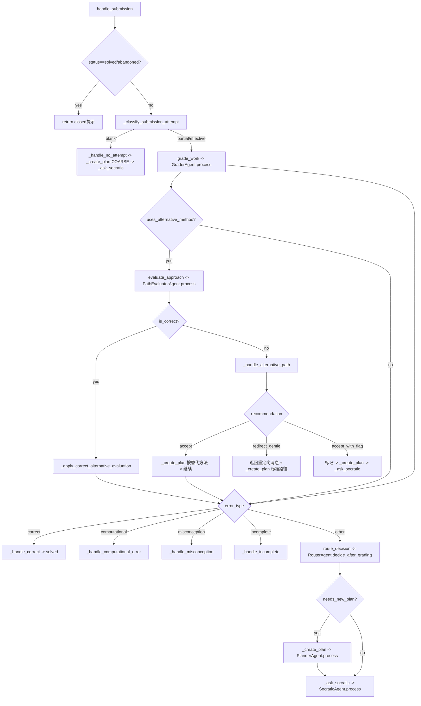
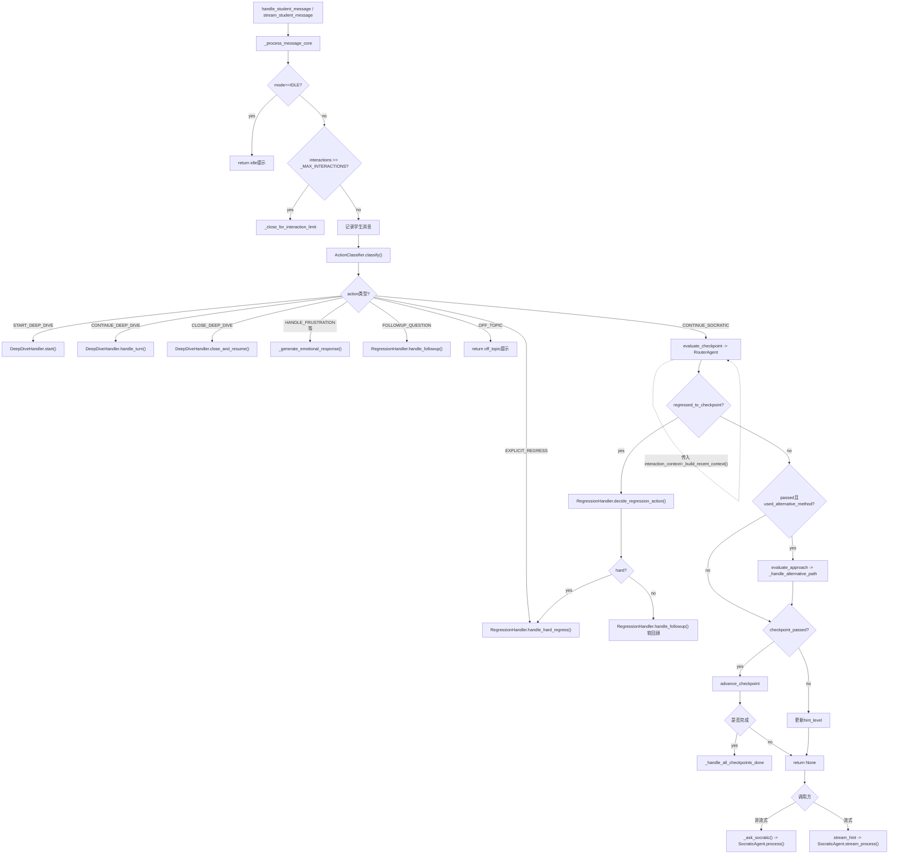
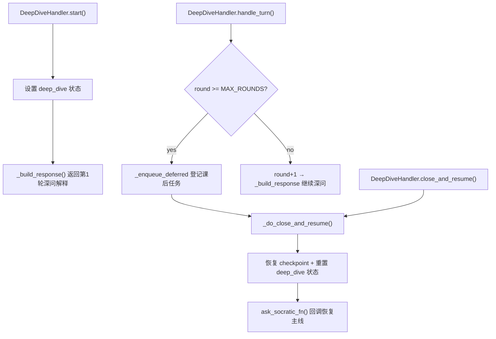
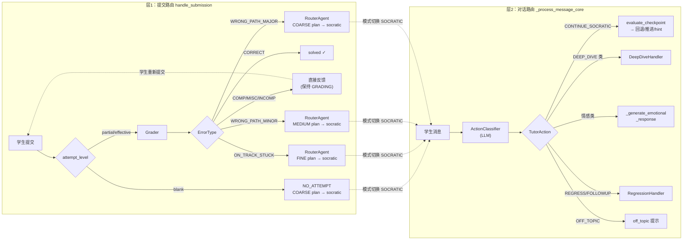
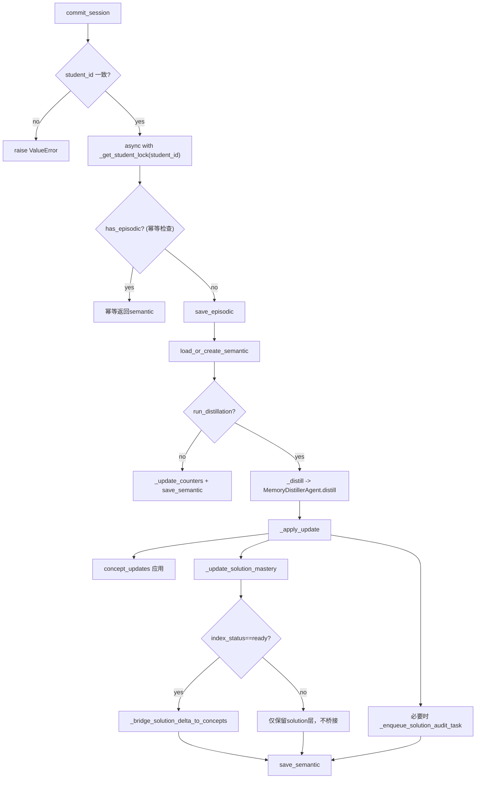

# DeepTutor 系统文档（重写版）

> 更新时间：2026-03-24（RAG 二阶段知识卡检索全链路接入 + ConceptRegistry + AuditStore + 双层 mastery）
> 审计范围：`agent/**/*.py`（Tutor / Review / Memory / Recommend / Progress）
> 文档目标：用"当前真实代码行为"描述系统，不混入未落地设计

---

## 目录

1. [系统目标与边界](#1-系统目标与边界)
2. [模块职责总览](#2-模块职责总览)
3. [核心数据契约](#3-核心数据契约)
4. [接口文档（Manager层）](#4-接口文档manager层)
5. [控制流描述（含工作流路径）](#5-控制流描述含工作流路径)
6. [Skill Registry 与 Agent 映射](#6-skill-registry-与-agent-映射)
7. [会话与存储生命周期](#7-会话与存储生命周期)
8. [架构耦合点评（业务视角）](#8-架构耦合点评业务视角)
9. [TODO List（代码审计）](#9-todo-list代码审计)
10. [代码索引](#10-代码索引)

---

## 1. 系统目标与边界

DeepTutor 的核心目标是形成一个可闭环的学习系统：

1. `Tutor` 负责做题现场的判题与引导。
2. `Review` 负责课后复盘与方法迁移。
3. `Memory` 负责跨会话记忆沉淀（concept + solution 分叉）。
4. `Recommend` 负责"下一步做什么"。
5. `Progress` 负责"今天做什么"和阶段总结。

当前明确边界：

1. 已实现二阶段 RAG 知识卡检索（MethodRouter → CardSelector → 消费方）。
2. 已实现审计任务持久化（`AuditStore` JSONL 追加 + 查询/统计接口）。
3. 已实现 ConceptRegistry 概念节点注册（YAML 加载 + 前置依赖 BFS 展开）。
4. 已实现双层 mastery（concept 维度 + method_slot 维度）。
5. 未实现"后台 RAG Worker 自动消费审计任务 → 运营闭环"（Phase G/H）。

---

## 2. 模块职责总览

| 模块 | 核心职责 | 状态持有 | 对外产物 |
|---|---|---|---|
| Tutor | 提交判题、苏格拉底推进、意图路由、深问子流程 | `TutorSession` | `export_session()` |
| Review | 错误回放、多解法演示、两阶段理解验证、重试信号 | `ReviewSession` | `close_session()/export_session()` |
| Knowledge | 二阶段 RAG 知识卡检索、概念注册、审计持久化 | `ConceptRegistry` + `AuditStore` | `CardRetrieveResult` / `RagAuditEntry` |
| Memory | 情节记忆入库、语义蒸馏、concept/solution/slot 三维度熟练度更新 | `SemanticMemory` + Episodic files | `get_semantic()/get_student_context()` |
| Recommend | 结合 session + memory 决策推荐类型，并查题库或降级 | 无长驻会话 | `Recommendation` |
| Progress | 遗忘曲线驱动计划 + 阶段总结 + next_review_at 回写 | 无长驻会话 | `TaskPlan` / `ProgressSummary` |

### 2.1 基础设施层 `agent/infra/`（2026-03-22 新建）

原项目所有模块通过 `from src.logging / src.config / src.services.*` 导入基础设施，但 `src/` 目录在本仓库中不存在。此前由 `debug_cli.py` 的 ~200 行 `sys.modules` hack 在运行时伪造整个 `src.*` 包树。

重构后，基础设施实现移入 `agent/infra/`，所有模块直接 `from agent.infra.* import`，不再依赖 `src`：

| 文件 | 替代的旧路径 | 提供的接口 |
|---|---|---|
| `agent/infra/logging.py` | `src.logging` | `get_logger(name)`, `LLMStats` |
| `agent/infra/config.py` | `src.config.settings` + `src.services.config` | `settings`, `get_agent_params(module)` |
| `agent/infra/llm.py` | `src.services.llm` | `complete()`, `stream()`, `get_llm_config()`, `configure()`, `get_token_limit_kwargs()`, `supports_response_format()` |
| `agent/infra/prompt.py` | `src.services.prompt` | `get_prompt_manager()` → `PromptManager.load_prompts()` |

`debug_cli.py` 的 bootstrap 从 ~200 行缩减至 ~40 行：
- Live 模式：调用 `infra_llm.configure()` 从环境变量读取 API 配置
- Mock 模式：将 `infra_llm.complete/stream` 替换为 noop

### 2.2 Tutor 子模块结构（2026-03-20 重构）

`TutorManager` 将三类专项逻辑拆分为独立子模块，通过 `ask_socratic_fn` 回调协作：

| 文件 | 类 | 职责 | 方法数 |
|---|---|---|---|
| `tutor_manager.py` | `TutorManager` | 会话生命周期、判题流程、消息核心逻辑、PathEvaluator、导出 | 41 |
| `action_classifier.py` | `ActionClassifier` | LLM 单次调用动作路由、极简 fallback | 4 |
| `deep_dive_handler.py` | `DeepDiveHandler` | 深问启动/轮次/超纲检测/收束恢复 | 11 |
| `regression_handler.py` | `RegressionHandler` | 追问检测、回退目标提取、硬回退/软回顾 | 7 |

流式与非流式共用 `_process_message_core()`，仅在最后一步（socratic hint）分叉：
- `handle_student_message`：调用 `_ask_socratic()` 返回完整 dict
- `stream_student_message`：调用 `_stream_hint` 逐 chunk yield

---

## 3. 核心数据契约

### 3.1 ProblemContext 输入兼容

`ProblemContext.from_dict()` 支持两类输入：

1. legacy：`problem_id/problem/answer/knowledge_cards`
2. unified：`question_id/stem/answer_schema/solutions/question_cards`

unified 关键行为（当前代码）：

1. 默认取 `solutions[0]` 作为注入解法（`_pick_solution`）。
2. 把 `slice.hint_pack(l1/l2/l3)` 合并到关联 `KnowledgeCard.hints`。
3. `answer_schema` 自动提取到 `answer`（`answer_text/reference_answer/correct/accepted`）。

### 3.2 Tutor 导出契约（Memory/Review 上游）

`TutorManager.export_session()` 输出核心字段分组：

1. 会话结果：`status/outcome/attempts/hints/checkpoints/error_types_seen`
2. 替代解法：`used_alternative_method/alternative_flagged/solution_id/solution_tags/index审计标记`
3. 深问信息：`deep_dive_count/deep_dive_topics/deferred_deep_dive_tasks`
4. 复盘输入：`error_details/struggle_checkpoints`

### 3.3 Review 导出契约

`ReviewChatManager.export_session()` 输出：

1. 复盘元信息：`original_tutor_session_id/student_method_used/methods_explored`
2. 行为结果：`retry_triggered/retry_method`
3. 学习质量：`understanding_summary`（method -> understood/partial/not_understood）

### 3.4 Memory 语义层核心结构

1. `concept_mastery[concept_id]`：Progress 直接消费。
2. `solution_mastery[solution_id]`：记录 question 下不同 solution 分叉掌握度。
3. `slot_mastery[slot_id]`：`MethodSlotMastery`（use_count / success_count / success_rate / last_used_at），记录标准化方法 slot 维度的掌握度。由 `episode.method_slot_matched` 自动驱动。
4. `pending_audit_tasks[]`：替代解法索引补齐任务池。审计条目同步持久化到 `AuditStore`（JSONL）。
5. `index_status`：`pending/ready/rejected`，决定是否允许 solution->concept bridge。

### 3.5 PathEvaluationResult

`PathEvaluatorAgent.process()` 返回：

| 字段 | 类型 | 说明 |
|---|---|---|
| `is_mathematically_valid` | bool | 替代方法数学上是否正确 |
| `pedagogical_alignment` | aligned/bypass/inferior | 教学对齐度 |
| `recommendation` | accept/redirect_gentle/accept_with_flag | 处置建议 |
| `student_approach_summary` | str | 对学生方法的一句话描述（内部用） |
| `student_method_name` | str | 方法简称如"配方法"（面向学生展示用，2026-03-22 新增） |
| `redirect_reason` | str? | redirect 时的说明 |
| `replan_start_from` | str? | accept 时从哪里开始重新规划 |

---

## 4. 接口文档（Manager层）

### 4.1 TutorManager

```python
create_session(problem_context, student_id=None, mastery_before=None) -> TutorSession
get_session(session_id) -> TutorSession | None
close_session(session_id, final_status=None) -> dict[str, Any]

async handle_submission(session_id, student_work) -> dict[str, Any]
async handle_student_message(session_id, student_message) -> dict[str, Any]
async stream_student_message(session_id, student_message) -> AsyncGenerator[str, None]

export_session(session_id) -> dict[str, Any]
```

### 4.2 ReviewChatManager

```python
create_session(problem_context, tutor_session_export=None, student_id=None) -> dict[str, Any]
get_session(session_id) -> ReviewSession
close_session(session_id) -> dict[str, Any]
export_session(session_id) -> dict[str, Any]

async chat(session_id, student_message) -> dict[str, Any]
```

### 4.3 MemoryManager

```python
async commit_session(student_id, episode, run_distillation=True) -> SemanticMemory

build_episodic_from_tutor(student_id, export) -> EpisodicMemory   # @staticmethod
build_episodic_from_review(student_id, export) -> EpisodicMemory  # @staticmethod

get_student_context(student_id, include_recent_episodes=True) -> str
get_semantic(student_id) -> SemanticMemory | None
get_recent_episodes(student_id, limit=10, source=None) -> list[EpisodicMemory]
```

### 4.4 RecommendManager

```python
async recommend_after_tutor(student_id, session_export, working_memory_limit=10) -> Recommendation
async recommend_after_review(student_id, session_export, working_memory_limit=10) -> Recommendation
```

### 4.5 ProgressManager

```python
async get_daily_plan(student_id, max_tasks=5, max_minutes=60, episode_window=20) -> TaskPlan
async get_summary(student_id, period="week", episode_limit=30) -> ProgressSummary

def update_next_review_dates(student_id) -> int
def get_overdue_concepts(student_id) -> list[dict]
```

---

## 5. 控制流描述（含工作流路径）

### 5.1 全链路数据飞轮

```text
ProblemContext
   |
   v
TutorManager ------------------------------> tutor_export
   |                                            |
   |                                            v
   |                                       MemoryManager
   |                                  (episodic + semantic)
   |                                     /             \
   v                                    /               \
ReviewChatManager ----review_export----/                 \----> ProgressManager
   |
   \---------------------------> RecommendManager
```

---

### 5.2 Tutor 提交流（`handle_submission`）

函数调用链（`agent/tutor/tutor_manager.py`）：

```text
handle_submission(session_id, student_work)
  ├─ _classify_submission_attempt(student_work)          # 规则分档：blank/partial/effective
  │
  ├─[blank] _handle_no_attempt(session)
  │           ├─ _create_plan(session, fake_result, COARSE)
  │           │    └─ skill: plan_guidance → PlannerAgent.process()
  │           └─ _ask_socratic(session, "[学生表示没有思路]")
  │                └─ skill: generate_hint → SocraticAgent.process()
  │
  ├─[partial/effective] skill: grade_work → GraderAgent.process()
  │
  ├─ [grader_result.uses_alternative_method?]
  │    └─ skill: evaluate_approach → PathEvaluatorAgent.process()
  │         ├─[is_correct=true]  _apply_correct_alternative_evaluation(session, path_result)
  │         └─[is_correct=false] _handle_alternative_path(session, grader_result, path_result, ...)
  │              ├─[ACCEPT]           _create_plan(按替代方法) → 继续 _ask_socratic
  │              ├─[REDIRECT_GENTLE]  返回重定向消息 + _create_plan(标准路径)
  │              └─[ACCEPT_WITH_FLAG] 标记 alternative_flagged → flag_msg(student_method_name) → _create_plan → _ask_socratic
  │
  ├─[is_correct]    _handle_correct(session)             → status="solved"
  ├─[COMPUTATIONAL] _handle_computational_error(session, grader_result)
  ├─[MISCONCEPTION] _handle_misconception(session, grader_result)
  ├─[INCOMPLETE]    _handle_incomplete(session, grader_result)
  │
  └─[其他 error_type]
       ├─ skill: route_decision → RouterAgent.decide_after_grading()
       ├─ [needs_new_plan?] _create_plan(session, grader_result, granularity)
       └─ _ask_socratic(session, submission_context)
```

控制流转移图：



---

### 5.3 Tutor 对话推进（`_process_message_core` 统一路径）

`handle_student_message` 和 `stream_student_message` 共用同一个决策核心 `_process_message_core`，消除了之前流式/非流式逻辑重复的问题。

调用入口（`agent/tutor/tutor_manager.py`）：

```text
handle_student_message(session_id, student_message)
  ├─ result = _process_message_core(session, student_message)
  ├─ [result != None] → return result                    # 早返回
  └─ [result == None] → _ask_socratic(session, message)  # 非流式 hint

stream_student_message(session_id, student_message)
  ├─ result = _process_message_core(session, student_message)
  ├─ [result != None] → yield result["message"]          # 早返回
  └─ [result == None] → stream_hint → yield chunks       # 流式 hint
```

`_process_message_core` 函数调用链（返回 dict 则早返回，返回 None 则继续到 socratic hint）：

```text
_process_message_core(session, student_message)
  ├─ [mode == IDLE?] → return idle 提示
  ├─ [interactions >= _MAX_INTERACTIONS?] → _close_for_interaction_limit
  ├─ session.add_interaction("student", student_message)
  │
  ├─ 1) ActionClassifier.classify(session, message)    # LLM 单次调用
  │    ├─ [START_DEEP_DIVE]    → DeepDiveHandler.start(session, message, decision)
  │    ├─ [CONTINUE_DEEP_DIVE] → DeepDiveHandler.handle_turn(session, message)
  │    ├─ [CLOSE_DEEP_DIVE]    → DeepDiveHandler.close_and_resume(session, message)
  │    ├─ [HANDLE_FRUSTRATION / HANDLE_ANSWER_REQ / HANDLE_CHALLENGE]
  │    │    → _generate_emotional_response(session, message, decision)
  │    ├─ [EXPLICIT_REGRESS]   → RegressionHandler.handle_hard_regress(...)
  │    ├─ [FOLLOWUP_QUESTION]  → RegressionHandler.handle_followup(...)
  │    ├─ [OFF_TOPIC]          → return off_topic 提示
  │    └─ [CONTINUE_SOCRATIC]  → fall through
  │
  ├─ 2) skill: evaluate_checkpoint → RouterAgent.evaluate_checkpoint()
  │    │    └─ 传入 interaction_context=_build_recent_context(session)
  │    │       供 LLM 判断提交/前序对话中已达成的 checkpoint 目标
  │    ├─ checkpoint.attempts += 1
  │    │
  │    ├─ 3) [regressed_to_checkpoint != None]
  │    │    └─ RegressionHandler.decide_regression_action(session, ...)
  │    │         ├─[hard] RegressionHandler.handle_hard_regress → _ask_socratic
  │    │         └─[soft] RegressionHandler.handle_followup（不改进度）
  │    │
  │    ├─ 4) [checkpoint_passed + used_alternative_method]  ← 触发条件 B
  │    │    ├─ skill: evaluate_approach → PathEvaluatorAgent.process()
  │    │    └─ _handle_alternative_path(session, ...)
  │    │
  │    ├─ 5) [checkpoint_passed]
  │    │    ├─ session.advance_checkpoint()
  │    │    └─ [全部完成?] _handle_all_checkpoints_done → return result
  │    │
  │    └─ [未通过] checkpoint.hint_level = evaluation.next_hint_level
  │
  └─ return None  → 调用方执行 _ask_socratic 或 stream_hint
```

控制流转移图：



---

### 5.4 Tutor 深问子流程（Deep Dive）

函数调用链（`agent/tutor/deep_dive_handler.py` — `DeepDiveHandler`）：

```text
DeepDiveHandler.start(session, student_message, intent_decision)
  ├─ session.deep_dive_active = True
  ├─ session.deep_dive_rounds = 1
  ├─ session.deep_dive_return_checkpoint = current_checkpoint
  ├─ session.deep_dive_topic = topic
  └─ _build_response（第一轮深问解释）

DeepDiveHandler.handle_turn(session, student_message)
  ├─ [round >= _DEEP_DIVE_MAX_ROUNDS]               # 规则护栏：轮次预算
  │    └─ _enqueue_deferred(预算超限) → _do_close_and_resume
  └─ round += 1 → _build_response（继续深问）
  注：回主线/已理解/超纲 等子路由已移至 ActionClassifier LLM 判断，
      分别映射为 CLOSE_DEEP_DIVE / OFF_TOPIC 等 action。

DeepDiveHandler.close_and_resume(session, student_message)      # 由 CLOSE_DEEP_DIVE action 触发
  └─ _do_close_and_resume(session, ...)

DeepDiveHandler._do_close_and_resume(session, closure_message, ...)
  ├─ session.current_checkpoint = deep_dive_return_checkpoint
  ├─ session.deep_dive_active = False
  ├─ session.deep_dive_rounds = 0
  └─ ask_socratic_fn(session, ...)                   # 通过回调恢复主线
```



---

### 5.5 Tutor 动作路由（LLM 主导）

函数调用链（`agent/tutor/action_classifier.py` — `ActionClassifier`）：

```text
ActionClassifier.classify(session, student_message)
  ├─ TutorContextBuilder.build(session)            # 构造 session_context
  ├─ skill: classify_action                        # LLM 单次调用
  │    └─ TutorActionClassifierAgent.classify_action()
  │         └─ _parse_action() → {primary_action, target_step, confidence, reason}
  └─ fallback（LLM 失败时）
       ├─ [deep_dive_active] → CONTINUE_DEEP_DIVE (conf=0.3)
       └─ [default]          → CONTINUE_SOCRATIC (conf=0.3)
```

LLM 可输出的动作枚举（`TutorAction`）：

| 动作 | 含义 |
|---|---|
| `continue_socratic` | 默认，继续苏格拉底引导 |
| `handle_frustration` | 学生挫败/焦虑 |
| `handle_answer_request` | 学生索要答案 |
| `handle_challenge` | 学生质疑题目 |
| `start_deep_dive` | 启动深问 |
| `continue_deep_dive` | 深问中继续 |
| `close_deep_dive` | 收束深问 |
| `followup_question` | 追问已完成步骤 |
| `explicit_regress` | 明确要求回退 |
| `off_topic` | 偏题 |

#### 5.5.1 路由总表

系统有两层路由，分别作用于提交阶段和对话阶段：

**层 1：提交路由（`handle_submission`）** — Grader 返回 `ErrorType` 后的分发

前 4 种类型由 `TutorManager` 硬编码分发，不经过 `RouterAgent`；后 4 种进入 `RouterAgent.decide_after_grading()`（纯规则，无 LLM）。

| ErrorType | 处理方式 | 模式切换 | 需新 Plan? | 引导粒度 | 反馈给学生? |
|---|---|---|---|---|---|
| `CORRECT` | `_handle_correct` → 标记 solved | → IDLE | — | — | ✗ |
| `COMPUTATIONAL` | `_handle_computational_error` → 直接纠正 | 保持 GRADING | ✗ | — | ✓ |
| `MISCONCEPTION` | `_handle_misconception` → 澄清概念 | 保持 GRADING | ✗ | — | ✓ |
| `INCOMPLETE` | `_handle_incomplete` → 追问补全 | 保持 GRADING | ✗ | — | ✓ |
| `NO_ATTEMPT` | `_handle_no_attempt` → 从审题开始 | → SOCRATIC | ✓ | COARSE (1) | ✗ |
| `ON_TRACK_STUCK` | `route_decision` → `_ask_socratic` | → SOCRATIC | ✓ | FINE (3) | ✗ |
| `WRONG_PATH_MINOR` | `route_decision` → `_ask_socratic` | → SOCRATIC | ✓ | MEDIUM (2) | ✗ |
| `WRONG_PATH_MAJOR` | `route_decision` → `_ask_socratic` | → SOCRATIC | ✓ | COARSE (1) | ✗ |

> 注：`NO_ATTEMPT` 不经过 Grader，由 `_classify_submission_attempt` 前置检测后直接处理。

**层 2：对话路由（`_process_message_core`）** — ActionClassifier LLM 返回 `TutorAction` 后的分发

| TutorAction | 处理方 | 返回值 | 是否早返回 |
|---|---|---|---|
| `CONTINUE_SOCRATIC` | `evaluate_checkpoint` → 回退/替代解法/推进 | `None`（fall-through 到 socratic hint） | ✗ |
| `START_DEEP_DIVE` | `DeepDiveHandler.start()` | `dict` | ✓ |
| `CONTINUE_DEEP_DIVE` | `DeepDiveHandler.handle_turn()` | `dict` | ✓ |
| `CLOSE_DEEP_DIVE` | `DeepDiveHandler.close_and_resume()` | `dict` | ✓ |
| `HANDLE_FRUSTRATION` | `_generate_emotional_response()` | `dict` | ✓ |
| `HANDLE_ANSWER_REQ` | `_generate_emotional_response()` | `dict` | ✓ |
| `HANDLE_CHALLENGE` | `_generate_emotional_response()` | `dict` | ✓ |
| `EXPLICIT_REGRESS` | `RegressionHandler.handle_hard_regress()` | `dict` | ✓ |
| `FOLLOWUP_QUESTION` | `RegressionHandler.handle_followup()` | `dict` | ✓ |
| `OFF_TOPIC` | 内联 off_topic 提示 | `dict` | ✓ |

**层 1 → 层 2 的衔接**：提交路由中 `NO_ATTEMPT` / `ON_TRACK_STUCK` / `WRONG_PATH_*` 切换到 SOCRATIC 模式后，后续学生消息进入层 2 路由。



---

### 5.6 Tutor 流式/非流式统一架构

重构前：`handle_student_message` 和 `stream_student_message` 各自维护完整的决策逻辑（~100 行重复代码），已导致过 PathEvaluator 流式路径漏调的 bug。

重构后：两者共用 `_process_message_core()`，仅在最终 hint 输出步骤分叉：

```text
stream_student_message(session_id, student_message)
  ├─ result = _process_message_core(session, student_message)   # 共用决策核心
  ├─ [result != None] → yield result["message"]                 # 早返回
  └─ [result == None]                                           # 流式 hint
       ├─ checkpoint = session.get_current_checkpoint()
       ├─ async for chunk in stream_hint(problem, checkpoint, history, message):
       │    yield chunk
       └─ session.add_interaction("tutor", full_response, metadata)
```

流式与非流式的决策路径在结构上不可能分叉——它们共享同一个函数。

### 5.6.1 Tutor 追问与回退（RegressionHandler）

函数调用链（`agent/tutor/regression_handler.py` — `RegressionHandler`）：

```text
RegressionHandler.handle_followup(session, message, target_checkpoint?, reason?, from_regression?) → dict
  └─ _resolve_followup_target → 展示目标 checkpoint 信息，不改进度

RegressionHandler.decide_regression_action(session, message, regressed_to, checkpoint) → (action, target)
  ├─ [显式回退] → ("hard", target)
  ├─ [attempts >= 3 或 hint_level >= 3 + attempts >= 2] → ("hard", target)
  └─ [其他] → ("soft", target)

RegressionHandler.handle_hard_regress(session, target, reason, message) → dict
  └─ session.regress_to(target) → ask_socratic_fn(session, ...)
```

> 注：原有的 `is_followup()` 和 `extract_explicit_regress_target()` 方法（含 `_FOLLOWUP_SIGNALS` / `_HARD_REGRESS_SIGNALS` 规则匹配）已移除，追问/回退意图识别已由 ActionClassifier LLM 路由统一处理。

---

### 5.7 Review 复盘流（`chat`）

函数调用链（`agent/review/review_chat_manager.py`）：

```text
chat(session_id, student_message)
  ├─ session.add_interaction("student", message)
  │
  ├─ [pending_verification?]
  │    ├─ _wants_to_interrupt_verification(message)       # 规则信号匹配
  │    │    └─ [打断] _clear_verification_state → 继续意图识别
  │    └─ [未打断] _handle_verification_response(session, message)
  │         ├─ [stage=="transfer"]
  │         │    ├─ skill: evaluate_understanding → ReviewChatAgent.evaluate_understanding()
  │         │    ├─ check.final_quality()                  # 两阶段融合
  │         │    └─ _clear_verification_state → 返回最终质量
  │         └─ [stage=="concept"]
  │              ├─ skill: evaluate_understanding
  │              ├─ [NOT_UNDERSTOOD] → _clear_verification_state → 提示回看
  │              └─ [UNDERSTOOD/PARTIAL] → 进入迁移阶段
  │                   ├─ skill: ask_transfer → ReviewChatAgent.ask_transfer()
  │                   └─ pending_verification_stage = "transfer"
  │
  ├─ skill: classify_intent → ReviewChatAgent.classify_intent()
  │    └─ 返回 (ReviewIntent, method_target)
  │
  ├─ [REPLAY_ERRORS] _handle_replay_errors(session, method_target)
  │    ├─ [无错误] → 返回"掌握得不错"
  │    ├─ [target_method 为空] → skill: enumerate_methods → MethodEnumeratorAgent.process()
  │    │    └─ 选第一个非学生方法；若全部相同则回退到第一个方法
  │    ├─ [target_method 未演示] → skill: solve_method → MethodSolverAgent.process()
  │    └─ skill: replay_errors → ReviewChatAgent.replay_errors()
  │
  ├─ [ENUMERATE_METHODS] _handle_enumerate(session)
  │    └─ skill: enumerate_methods → MethodEnumeratorAgent.process()
  │
  ├─ [SHOW_SOLUTION] _handle_show_solution(session, method_name, message)
  │    ├─ [method_name 不在已知列表]
  │    │    └─ skill: evaluate_approach → PathEvaluatorAgent.process()（验证数学有效性）
  │    ├─ skill: solve_method → MethodSolverAgent.process()
  │    ├─ skill: ask_understanding → ReviewChatAgent.ask_understanding()
  │    └─ 设置 pending_verification = method_name, stage = "concept"
  │
  ├─ [COMPARE_METHODS] _handle_compare(session, message)
  │    ├─ [已演示方法 < 2] → 补充演示（solve_method）
  │    └─ skill: respond_review → ReviewChatAgent.respond()
  │
  ├─ [RETRY_WITH_METHOD] _handle_retry_signal(session, method_name)
  │    └─ 返回 retry_signal（前端编排新 TutorSession）
  │
  ├─ [EXPLAIN_CONCEPT] _handle_explain_concept(session, message)
  │    └─ skill: respond_review（注入 knowledge_cards 上下文）
  │
  └─ [GENERAL] _handle_general(session, message)
       └─ skill: respond_review → ReviewChatAgent.respond()
```

关键状态机：

```text
SHOW_SOLUTION
  → pending_verification = method_name
  → stage = "concept"
  → 学生回答
     → evaluate_understanding
        → [NOT_UNDERSTOOD] → 清除验证状态 → 可继续自由对话
        → [UNDERSTOOD/PARTIAL]
           → ask_transfer → stage = "transfer"
           → 学生回答
              → evaluate_understanding → final_quality
              → 清除验证状态
```

---

### 5.8 Memory 提交流（水位门控）

函数调用链（`agent/memory/memory_manager.py`）：

```text
commit_session(student_id, episode, run_distillation=True)
  ├─ [student_id != episode.student_id?] → raise ValueError     ← 一致性校验
  ├─ [has_episodic?] → 幂等返回 semantic
  │
  ├─ store.save_episodic(episode)                                 # MemoryStore I/O
  │    └─ 原子写入 tmp → rename + _upsert_episodic_index
  ├─ store.load_or_create_semantic(student_id)
  │
  ├─ [run_distillation=false]
  │    └─ _update_counters(semantic, episode) → save_semantic
  │
  └─ [run_distillation=true]
       ├─ skill: distill_memory → MemoryDistillerAgent.distill()
       │    ├─ current_semantic.to_distill_snapshot(target_tags)   ← 任务快照
       │    ├─ assemble({episode, current_profile, current_mastery_summary}, MEMORY_DISTILL_POLICY)
       │    └─ 返回 MemoryUpdate
       ├─ _apply_update(semantic, episode, update)
       │    ├─ _update_counters(semantic, episode)
       │    │    └─ total_sessions++, total_hints_given+=, total_problems_solved+=
       │    │
       │    ├─ [alternative_flagged + used_alternative_method?]
       │    │    ├─ allowed_solution_concepts = set(episode.solution_tags)
       │    │    └─ [needs_audit 或 concepts 为空] _enqueue_solution_audit_task("solution_card_index")
       │    │
       │    ├─ [首次观察替代方法?]
       │    │    └─ _enqueue_solution_audit_task("new_method_rag")
       │    │
       │    ├─ for cu in update.concept_updates:
       │    │    └─ _apply_concept_delta(semantic, concept_id, delta, ...)
       │    │         └─ MasteryRecord: level clamp [0,1], practice_count++, error_count/consecutive_correct
       │    │
       │    ├─ [fallback: alternative + solved + 无 concept_update 被应用]
       │    │    └─ 对 solution_tags 做小幅正向 delta (+0.08)
       │    │
       │    ├─ _update_solution_mastery(semantic, episode, now)
       │    │    ├─ [source != TUTOR] → 跳过
       │    │    ├─ _estimate_solution_delta(episode) → 基于 outcome/hints/attempts
       │    │    ├─ _infer_solution_index_status(episode, linked_concepts)
       │    │    └─ 创建或更新 SolutionMasteryRecord
       │    │
       │    ├─ [solution index_status == "ready" + linked_concepts 非空]
       │    │    └─ _bridge_solution_delta_to_concepts(semantic, linked, delta, already_updated)
       │    │         └─ bridge_delta = clamp(solution_delta * 0.4, ±0.06)
       │    │
       │    ├─ [episode.method_slot_matched?]
       │    │    └─ slot_mastery[slot_id]: use_count++, [solved?] success_count++
       │    │
       │    ├─ update.method_observations → semantic.method_observations（保留最近20条）
       │    ├─ update.new_error_types → semantic.persistent_errors++
       │    └─ update.profile_summary / recent_focus → semantic 覆写
       │
       └─ store.save_semantic(semantic)
```



替代解法门控规则：

1. `alternative_flagged + used_alternative_method` 时，concept 更新限制在 `solution_tags`。
2. 若 `solution_tags` 缺失或需要审计，`index_status=pending`，禁止 bridge。
3. 首次观察新方法会追加 `new_method_rag` 审计任务。

---

### 5.9 Recommend 推荐流

函数调用链（`agent/recommend/recommend_manager.py` + `agent/recommend/agents/recommend_agent.py`）：

```text
recommend_after_tutor(student_id, session_export, ...)
recommend_after_review(student_id, session_export, ...)
  │
  ├─ _build_context(student_id, source, session_export, limit)
  │    ├─ memory.get_semantic(student_id)
  │    ├─ memory.get_recent_episodes(student_id, limit)
  │    └─ → RecommendContext
  │
  └─ _recommend(ctx)
       ├─ skill: decide_recommendation → RecommendAgent.decide(ctx)
       │    ├─ ctx.semantic_memory.to_recommend_snapshot(ctx.current_tags)  ← 任务快照
       │    ├─ assemble({student_profile, weak_concepts, recent_problems}, RECOMMEND_POLICY)
       │    ├─ _extract_outcome(ctx)                                  ← 已修复 gave_up 漏判
       │    │    └─ 同时检查 outcome + status，显式处理 gave_up/abandoned
       │    ├─ call_llm(user_prompt, system_prompt, json)
       │    ├─ _parse(response, ctx)
       │    │    └─ 解析 recommendation_type/target_tags/difficulty/explanation
       │    └─ [无 prompt 降级] _rule_based_decide(ctx)
       │         ├─ [review 来源] 按 understanding_quality 分档
       │         └─ [tutor 来源] 按 outcome + hints 分档
       │
       ├─ [REST / RETRY_WITH_METHOD / REVIEW_CONCEPT]
       │    └─ 直接返回 Recommendation（不查题库）
       │
       ├─ [需要题库] _build_query(decision, ctx) → ProblemQuery
       │    └─ ProblemBankBase.query(query)
       │
       └─ [题库为空] _fallback(ctx, decision, original_query)
            ├─ 放宽难度重试 → ProblemBankBase.query(relaxed_query)
            ├─ [仍空] ctx.get_weak_tags() → REVIEW_CONCEPT
            └─ [无薄弱点] → REST
```

---

### 5.10 Progress 计划与总结流

函数调用链（`agent/progress/progress_manager.py` + `agent/progress/ebbinghaus.py`）：

```text
get_daily_plan(student_id, max_tasks, max_minutes, episode_window)
  ├─ memory.get_semantic(student_id)
  ├─ memory.get_recent_episodes(student_id, limit=episode_window)
  ├─ [无 semantic] → 返回空计划（"先做一道题"）
  │
  ├─ rank_concepts_by_urgency(semantic.concept_mastery)            # ebbinghaus.py
  │    ├─ for each concept: build_decay_record(concept_id, record)
  │    │    ├─ compute_stability(consecutive_correct)              # BASE 1.5d + 0.8d/correct, max 30d
  │    │    ├─ compute_retention(record, now)                      # level × e^(-elapsed/stability)
  │    │    └─ → DecayRecord(retention, needs_review, next_review_at)
  │    └─ 过滤 retention < REVIEW_THRESHOLD(0.60)，按 retention 升序
  │
  └─ skill: plan_tasks → TaskPlannerAgent.plan(semantic, decay_due, recent, max_tasks, max_minutes)
       ├─ semantic.to_progress_snapshot()                              ← 任务快照
       ├─ _fmt_mastery: top5弱(by level) + top3高错(by error_count)
       ├─ _fmt_decay: top5 待复习
       ├─ _fmt_episodes: top5 近期会话
       ├─ assemble({long_term_profile, concept_mastery, decay_due, recent_episodes}, PROGRESS_POLICY)
       └─ → (list[DailyTask], plan_summary)

get_summary(student_id, period, episode_limit)
  ├─ memory.get_semantic(student_id)
  ├─ memory.get_recent_episodes(student_id, limit=episode_limit)
  ├─ _filter_episodes_by_period(episodes, period)                  ← 已实现时间窗过滤
  │    ├─ [week]     → cutoff = now - 7 days
  │    ├─ [month]    → cutoff = now - 30 days
  │    └─ [all_time] → 不过滤
  └─ skill: summarize_progress → ProgressSummaryAgent.summarize(student_id, semantic, episodes, period)
       ├─ semantic.to_progress_snapshot()                              ← 任务快照
       ├─ _fmt_mastery: top5弱(by level) + top3进步(by consecutive_correct)
       ├─ _fmt_episodes: top5 近期会话
       └─ assemble({long_term_profile, concept_mastery, recent_episodes}, PROGRESS_POLICY)

update_next_review_dates(student_id)
  ├─ memory.get_semantic(student_id)
  ├─ for each concept: next_review_date(record, target_retention=0.70)
  │    └─ days_until = -stability × ln(target/level)
  └─ memory.store.save_semantic(semantic)

get_overdue_concepts(student_id)
  ├─ memory.get_semantic(student_id)
  └─ rank_concepts_by_urgency → [{concept_id, retention, elapsed_days, priority}]
```

Ebbinghaus 当前硬编码参数：

| 参数 | 值 | 含义 |
|---|---|---|
| `BASE_STABILITY_DAYS` | 1.5 | 初始记忆稳定天数 |
| `STABILITY_INCREMENT` | 0.8 | 每次连续答对增加的天数 |
| `MAX_STABILITY_DAYS` | 30.0 | 稳定性上限 |
| `REVIEW_THRESHOLD` | 0.60 | 低于此保留率触发复习 |
| `URGENT_THRESHOLD` | 0.40 | 低于此保留率标记紧急 |

---

### 5.11 端到端 Live 测试验证（2026-03-22）

使用 `tools/auto_test.py` + SiliconFlow API（`Pro/zai-org/GLM-5`）完成的全链路验证，覆盖了 Tutor + Review 的完整生命周期。

**验证的完整调用链**：

```text
Phase 1: 创建会话
  TutorManager.create_session(problem) → TutorSession(mode=idle, status=active)

Phase 2: 提交含计算错误的解答
  handle_submission(session_id, student_work)
    → GraderAgent.process() → error_type=COMPUTATIONAL
    → _handle_computational_error() → 返回错误定位 + 修正建议
    → mode 回到 idle，等待重新提交

Phase 3: 提交不完整配方法（触发替代方法检测 + Socratic）
  handle_submission(session_id, student_work)
    → GraderAgent.process() → error_type=ON_TRACK_STUCK, uses_alternative_method=True
    → PathEvaluatorAgent.process() → ACCEPT_WITH_FLAG, method_name="配方法"
    → flag_msg 使用 student_method_name（简洁显示）
    → PlannerAgent.process() → 4 checkpoints
    → SocraticAgent.process() → 第一条引导 hint
    → mode=socratic, status=active

Phase 4: Socratic 对话 4 轮
  handle_student_message(session_id, msg) × 4
    → ActionClassifier.classify() → continue_socratic
    → RouterAgent.evaluate_checkpoint(interaction_context=recent_history)
      → checkpoint_passed=true（利用对话上下文识别已达成的 checkpoint）
    → session.advance_checkpoint()
    → SocraticAgent.process() → 下一条 hint
    → Round 4: _handle_all_checkpoints_done() → status=solved, mode=idle

Phase 5: Review 复盘
  ReviewChatManager.create_session(problem, tutor_export)
    → 自动承接 error_snapshots, student_method_used
    → 生成开场白

  chat(session_id, "这道题还有哪些其他解法？")
    → ReviewChatAgent.classify_intent() → ENUMERATE_METHODS
    → MethodEnumeratorAgent.process() → 5 种解法

  chat(session_id, "因式分解法和求根公式法哪个更好？")
    → ReviewChatAgent.classify_intent() → COMPARE_METHODS
    → MethodSolverAgent.process() × 2（补充演示）
    → ReviewChatAgent.respond() → 方法对比回复
```

**验证结果**：所有 checkpoint 正确推进（4/4），会话正确终结（solved），Review 正确承接 Tutor 数据。完整日志见 `test_log.md`。

### 5.12 对话上下文管理（Session → Agent 的信息流）

#### 5.12.1 TutorSession 的 interaction_history 结构

`TutorSession.interaction_history` 是一个无界增长的 `list[dict]`，每条记录格式：

```python
{
    "role": "student" | "tutor" | "system",
    "content": str,                    # 消息全文（无截断）
    "timestamp": float,                # datetime.now().timestamp()
    "metadata": {
        "type": str,                   # socratic / deep_dive / frustration / ...
        "checkpoint_index": int,       # 当前 checkpoint 编号
        "hint_level": int,             # 1-3
        "round": int,                  # 深问轮次
        "attempt": int,                # 提交尝试次数
    }
}
```

写入点（`add_interaction` 调用位置）：

| 调用方 | role | 触发时机 |
|---|---|---|
| `_process_message_core` | student | 每次学生消息 |
| `_ask_socratic` | tutor | 非流式 hint |
| `stream_student_message` | tutor | 流式 hint（完整拼接后） |
| `_generate_emotional_response` | tutor | 情绪/索要答案/质疑等特殊回复 |
| `_handle_submission_result` | system | 提交批改结果 |
| `DeepDiveHandler` | tutor | 深问回复 |
| `RegressionHandler` | tutor | 回退/追问回复 |

#### 5.12.2 各 Agent 的上下文消费方式

**核心问题：没有统一的上下文管理层，各 Agent 各自截取，策略不一致。**

| Agent | 接收的上下文 | 截取策略 | 截取位置 | 信息重叠 |
|---|---|---|---|---|
| **SocraticAgent** | `interaction_history` 全量传入 | Agent 内部 `[-6:]` | `socratic_agent.py:49 _format_history` | — |
| **ActionClassifier** | `interaction_history` 全量传入 + `session_context` | Agent 内部 `[-6:]` | `intent_classifier_agent.py:91` | session_context 与 history metadata 重叠（进度、尝试次数） |
| **RouterAgent** (checkpoint eval) | `passed_checkpoints_history` + `interaction_context` + `student_response` | `_build_recent_context` 取 `[-6:]`；passed_history **无上限** | `tutor_manager.py:885, 869` | — |
| **GraderAgent** | 仅 `student_work` + `problem_context`（`intended_methods` / `common_mistakes` top-k） | 无历史；整 prompt 由 `GRADER_POLICY` 仲裁 | `grader_agent.py` | 无问题 |
| **PlannerAgent** | `error_description` + `problem_context`（预算化：`selected_methods` top-3、`planning_hints` top-3 无 slice、`answer_outline` 截断） | 无历史；整 prompt 由 `PLANNER_POLICY` 仲裁 | `planner_agent.py` | 无问题 |
| **PathEvaluatorAgent** | `student_approach` + `student_work_excerpt`（≤500 字截断）+ `target_skills`（卡片标题+核心技能）+ `alignment_constraints`（每卡 1 条易错点） | 无历史；整 prompt 由 `PATH_EVALUATOR_POLICY` 仲裁 | `path_evaluator_agent.py` | 无问题 |

**Review 模块**（`ReviewChatManager` 通过 `session.get_recent_history()` 统一取 `[-6:]`）：

| Agent | 接收的上下文 | 截取策略 |
|---|---|---|
| **ReviewChatAgent.classify_intent** | `interaction_history` + `session_context`（k=v 格式） | `[-4:]` |
| **ReviewChatAgent.respond** | `interaction_history` + `context_str` | `[-6:]` |
| **ReviewChatAgent.replay_errors** | `interaction_history` + 错误/挣扎数据 | `[-4:]` |
| **ReviewChatAgent.ask_understanding** | `interaction_history` | `[-4:]` |
| **ReviewChatAgent.evaluate_understanding** | `interaction_history` | 取决于方法实现 |
| **MethodEnumeratorAgent** | `problem` + `card_titles`（top-k，替代全量 `knowledge_hints`） | 无历史 |
| **MethodSolverAgent** | `problem` + `method_guidance`（方法匹配 1-2 条提示 + 1 条易错，替代全量 `knowledge_hints` + `common_mistakes`） | 无历史 |

**Review handler 上下文裁剪**：

| Handler | 裁剪规则 |
|---|---|
| `_handle_compare` | 最多比较 2 个方法，每个只保留 `key_insight` / `step_count` / `comparison_note`，附 `context_signature` |
| `_handle_explain_concept` | 最多 2 张卡，每张只保留标题 + 1 条通性通法 + 1 条提示 + 1 条易错，附 `context_signature` |

**Memory / Progress / Recommend 模块**：

| Agent | 接收的上下文 | 投影方式 |
|---|---|---|
| **MemoryDistillerAgent** | `to_distill_snapshot(target_tags)` + `current_mastery_summary` | `MEMORY_DISTILL_POLICY` 仲裁 |
| **ProgressSummaryAgent** | `to_progress_snapshot()` + mastery top5弱+top3进步 + episodes ≤5 | `PROGRESS_POLICY` 仲裁 |
| **TaskPlannerAgent** | `to_progress_snapshot()` + mastery top5弱+top3高错 + decay ≤5 + episodes ≤5 | `PROGRESS_POLICY` 仲裁 |
| **RecommendAgent** | `to_recommend_snapshot(current_tags)` + weak_concepts ≤4 | `RECOMMEND_POLICY` 仲裁 |

#### 5.12.3 上下文构建函数

```text
TutorManager._build_recent_context(session, max_entries=6)
  ├─ session.interaction_history[-6:]
  ├─ 每条 content 截取前 200 字符
  └─ 输出格式："{角色}：{内容}\n..."
     用于 RouterAgent.evaluate_checkpoint 的 interaction_context 参数

TutorManager._build_passed_history(session)
  ├─ 遍历 session.solution_plan.checkpoints[:current_checkpoint]
  └─ 输出格式："Checkpoint {n}: {description}\n..."
     ⚠ 无上限，随 checkpoint 推进线性增长

TutorContextBuilder.build(session)
  ├─ 输出格式：稳定 key-value（mode=socratic\ncheckpoint.current=2\n...）
  ├─ 字段：mode / deep_dive / checkpoint.{current,total,attempts,hint_level,passed}
  ├─ 字段：total_hints / total_attempts / last_error_type / alternative_method
  └─ 已通过步骤只保留编号（不含完整 description）
     ✓ 已消除与 interaction_history metadata 的信息重叠

ReviewContextBuilder.build(session)
  ├─ 输出格式：稳定 key-value（mode=free_review/verification\n...）
  ├─ 字段：mode / verification.stage / verification.method / known_methods（最多 4 个）
  ├─ 字段：last_demo_method / last_action_type / errors / struggle_points / student_method
  └─ ✓ 与 TutorContextBuilder 对齐的 k=v 格式

SemanticMemory 任务快照（替代 to_context_string() 的全量输出）：
  ├─ to_distill_snapshot(tags)    — MemoryDistiller 专用：画像[:120] + 方法偏好[:3] + 高频错误[:3]
  ├─ to_progress_snapshot()       — Progress/TaskPlanner 专用：弱点[:5] + 错误模式[:3] + 学习统计
  └─ to_recommend_snapshot(tags)  — Recommend 专用：当前题相关弱点优先[:4] + 偏好[:3] + 高频错误[:2]

SocraticAgent._format_history(history, last_n=6)
  ├─ history[-6:]
  └─ 输出格式："[{角色}]: {全文内容}\n..."
     ⚠ content 未截断，长回复原样注入

TutorActionClassifierAgent._fmt_rich_history(history[-6:])
  ├─ 带 metadata 标注（checkpoint=, attempt=, hint=, round=）
  └─ 输出格式："学生 [checkpoint=2, attempt=1]：{全文}\n导师 [socratic, hint=2]：{全文}\n..."
     ⚠ content 未截断
```

#### 5.12.4 上下文管理的已知问题

**问题 A：注意力稀释风险**

各 Agent 虽然截取最近 4-6 条对话，但这些条目的 content 字段没有长度限制。一条 tutor 回复可能有 300-500 字，6 条对话 = 2000-3000 字的 `chat_history` 注入 prompt。加上 `problem`（题目原文）、`checkpoint_description`、`guiding_question`，单次 prompt 可达 4000-5000 字，真正有决策价值的信号（学生最新回答 + 当前 checkpoint 目标）被稀释。

**问题 B：隐式截断 vs 显式截断**

- SocraticAgent 和 ActionClassifier 接收全量 `interaction_history`，在 Agent 内部做 `[-6:]` 截取。调用方（TutorManager）对截取策略不可控，也无法感知。
- RouterAgent 的 `_build_recent_context` 在 TutorManager 侧截取（显式），这是更好的模式。
- 两种模式混用导致"谁负责截取"不清晰。

**问题 C：passed_checkpoints_history 无上限**

`_build_passed_history` 输出所有已通过 checkpoint 的完整描述。一道题如果有 8 个 checkpoint，到最后一步时会注入 7 条完整的 checkpoint 描述（每条 20-50 字），占用 150-350 字。对于 checkpoint 评估来说，这些信息的价值远低于"学生刚才说了什么"。

**问题 D：无摘要压缩机制**

当前是纯滑动窗口（硬截断最近 N 条），早期对话直接丢弃。没有"将前 N 轮压缩为一句摘要"的机制。在需要跨多轮追踪学生思路演变的场景下（如学生从错误方法逐步修正），硬截断可能丢失关键的思路转变信号。

**问题 E：ActionClassifier 上下文冗余**

ActionClassifier 同时接收：
1. `interaction_history[-6:]`（含 metadata 中的 checkpoint、attempt、hint_level 信息）
2. `session_context`（TutorContextBuilder 输出，含 checkpoint 进度、尝试次数、批改结果）

两者在"当前进度"和"尝试次数"上高度重叠。LLM 看到同一信息的两种表述，可能导致决策混乱。

#### 5.12.5 建议改进方向

| 改进项 | 描述 | 优先级 | 状态 |
|---|---|---|---|
| 统一上下文管理层 | ~~新建 `ContextWindowManager`~~ → 已建立 `agent/context_governance/` | P1 | ✅ 已实现 |
| Prompt token 预算控制 | `budget_policy.py` 集中维护预算，`assembler.py` 按优先级裁剪 | P1 | ✅ 已实现 |
| PlannerAgent 输入投影 | `selected_methods` top-3、`planning_hints` 无 slice、`answer_outline` 截断 | P1 | ✅ 已实现 |
| PathEvaluatorAgent 输入投影 | `target_skills` + `alignment_constraints` 替代全量 hints/mistakes | P1 | ✅ 已实现 |
| GraderAgent 输入投影 | `intended_methods` / `common_mistakes` top-k + `GRADER_POLICY` 仲裁 | P1 | ✅ 已实现 |
| TutorContextBuilder 结构化 | 输出改为稳定 key-value 格式，已通过步骤只保留编号 | P1 | ✅ 已实现 |
| ReviewContextBuilder 结构化 | 输出改为稳定 k=v 格式（mode/verification.stage/known_methods 等），与 TutorContextBuilder 对齐 | P1 | ✅ 已实现 |
| ProblemContext 预算化 helper | `get_hints_for_llm()` 等 4 个 top-k 方法 | P1 | ✅ 已实现 |
| Review compare/explain 裁剪 | compare 限 2 方法 + key_insight/step_count/comparison_note；explain 限 2 卡 + 1 通法/1 提示/1 易错 | P1 | ✅ 已实现 |
| MethodEnumerator/Solver 投影 | Enumerator 改用 `card_titles`；Solver 改用 `method_guidance`（1-2 条提示 + 1 条易错） | P1 | ✅ 已实现 |
| SemanticMemory 任务快照 | `to_distill_snapshot()` / `to_progress_snapshot()` / `to_recommend_snapshot()` 替代 `to_context_string()` | P1 | ✅ 已实现 |
| Memory/Progress/Recommend 投影 | MemoryDistiller / ProgressSummary / TaskPlanner / Recommend 全部接入 assembler + 任务快照 | P1 | ✅ 已实现 |
| Projection Registry | `projection_registry.py` 定义 7 类 Agent 的 projection 协议（允许字段/可空/降级/版本号） | P1 | ✅ 已实现 |
| 决策型 prompt 精简 | `task_planner_agent.yaml` / `recommend_agent.yaml` system + template 压缩；`planner` / `path_evaluator` 已满足标准 | P1 | ✅ 已实现 |
| 调用方侧截取 | TutorManager `_get_recent_history()` 统一截取 `[-6:]` + 150 字 | P1 | ✅ 已实现 |
| content 截断 | `_format_history` / `_fmt_rich_history` 中 content 截取前 150 字 | P1 | ✅ 已实现 |
| passed_history 精简 | `_build_passed_history` 改为紧凑格式 `已通过: 1.xxx 2.xxx` | P2 | ✅ 已实现 |
| 滑动窗口+摘要 | 超过 N 轮后，将早期对话压缩为一句摘要，保留最近 3-4 轮原文 | P2 | 待实现 |
| 消除 ActionClassifier 冗余 | session_context 已改为 key-value，与 history metadata 的重叠已大幅减少 | P2 | 部分完成 |
| 替代解法知识卡检索 | 二阶段 RAG（MethodRouter → CardSelector）为 Planner/Review/Recommend 补充卡片 | P1 | ✅ 已实现 |

> 完整的上下文优化方案详见 [`AGENT_CONTEXT_OPTIMIZATION_DESIGN.md`](./doc/context/AGENT_CONTEXT_OPTIMIZATION_DESIGN.md)（含 Phase 0-5 实施计划、Context Governance Layer、知识卡 RAG 检索设计、评审备注）。

#### 5.12.6 Context Governance Layer（2026-03-23 新增）

位置：`agent/context_governance/`

| 模块 | 职责 |
|---|---|
| `budget_policy.py` | 集中维护预算常量（`FieldBudget`）和 7 个 Agent 的整 prompt 优先级策略（`BudgetPolicy`） |
| `assembler.py` | 统一返回结构 `ContextAssemblyResult`（payload + token_estimate + coverage_status + warnings + dropped_fields） |
| `projection_registry.py` | 7 类 Agent 的 projection 协议（`ProjectionSpec` / `FieldSpec` / `DegradationStrategy`），`validate()` 校验、`get_projection()` 查询 |
| `signature.py` | 基于 key-value 生成稳定 16 位 hex 签名，供缓存和诊断 |
| `telemetry.py` | 组装埋点：裁剪前后字段数、字符数、token 估算、降级状态 |

整 prompt 预算仲裁流程：

```text
各 Agent 调用点
  ↓ 用预算化 helper 构建候选 payload
  ↓ assemble(candidate, policy)
  ├─ 按 policy.fields_priority 从低优先级开始裁剪
  ├─ 超预算时先缩 supplementary_cards → 再缩 hints → 最后才缩 target_cards
  └─ 输出 ContextAssemblyResult
      ├─ coverage_status: full | partial | degraded
      ├─ dropped_fields: 被裁掉的字段列表
      └─ warnings: concept_link_missing / alias_ambiguous 等
```

`ProblemContext` 预算化 helper（`agent/tutor/data_structures.py`）：

| 方法 | 作用 | 默认预算 |
|---|---|---|
| `get_methods_for_llm()` | 去重后 top-k 方法 | max=4, 120 字 |
| `get_hints_for_llm()` | per-card top-k 提示，默认跳过 slice 级 | max=4, 240 字 |
| `get_common_mistakes_for_llm()` | per-card top-k 易错点 | max=4, 240 字 |
| `get_card_titles_for_llm()` | top-k 卡片标题 | max=3 |

旧 helper（`get_hints_summary()` 等）保留兼容，新代码一律使用预算版。

#### 5.12.7 Knowledge 子系统（二阶段 RAG 知识卡检索）（2026-03-24 新增）

位置：`agent/knowledge/`

**整体架构**：

```text
TutorManager / ReviewChatManager / RecommendManager
  ↓ CardRetriever.retrieve(request)
  ├─ Stage 1: MethodRouterAgent — 从 method_catalog 选 slot
  ├─ Stage 2: CardSelectorAgent — 从候选卡片中选最终卡
  ├─ audit_entries 自动持久化到 AuditStore (JSONL)
  └─ 返回 CardRetrieveResult (retrieved_cards + audit_entries)
```

| 模块 | 职责 |
|---|---|
| `card_retriever.py` | 编排 MethodRouter → CardSelector 两阶段管线，收集审计条目 |
| `card_store.py` | `FileCardStore` — 从 `content/knowledge_cards/` 加载 `PublishedKnowledgeCard` |
| `card_index.py` | `MethodCardIndex` — 维护 slot→card 倒排索引 |
| `method_catalog.py` | `MethodCatalog` — 加载 `content/method_catalog/` 的方法目录 |
| `concept_registry.py` | `ConceptRegistry` — 从 `content/concepts/` 加载概念节点，支持前置依赖 BFS 展开 |
| `audit_store.py` | `AuditStore` — JSONL 追加持久化 `RagAuditEntry`，支持 query/stats |
| `factory.py` | `build_card_retriever()` — 组装 CardRetriever 实例（含 AuditStore） |
| `agents/method_router_agent.py` | Stage 1: 根据题目 + 学生方法从 method_catalog 选 slot |
| `agents/card_selector_agent.py` | Stage 2: 从候选卡片中选最终卡片 |

**消费方接入**：

| 消费方 | 触发条件 | 使用方式 |
|---|---|---|
| Planner | ACCEPT / ACCEPT_WITH_FLAG | `supplementary_cards` 注入规划上下文 |
| Review `explain_concept` | 用户请求概念解释 | 检索相关卡片作为解释素材 |
| Recommend | REVIEW_CONCEPT 推荐类型 | 检索薄弱方法对应卡片，判断素材覆盖度 |

**ConceptRegistry 概念节点**（`content/concepts/<chapter>/<topic>.yaml`）：

| 字段 | 说明 |
|---|---|
| `concept_id` | 唯一标识（如 `concept_ellipse_definition`） |
| `name` / `chapter` / `topic` | 基本信息 |
| `difficulty` | 1-3 难度等级 |
| `prerequisites` | 前置概念 ID 列表（支持 BFS 展开） |
| `related_slots` | 关联方法 slot ID |
| `related_card_ids` | 关联知识卡 ID |

**双层 mastery**：

- `concept_mastery[concept_id]` — `MasteryRecord`，由 MemoryDistiller LLM 驱动。
- `slot_mastery[slot_id]` — `MethodSlotMastery`，由 `episode.method_slot_matched` 自动驱动（use_count / success_count / success_rate）。
- `SemanticMemory.get_weak_slots(threshold)` / `get_strong_slots(threshold)` 查询方法维度薄弱/掌握良好的 slot。

---

## 6. Skill Registry 与 Agent 映射

### 6.1 Tutor SkillRegistry

位置：`agent/tutor/skills/registry.py`

| Skill 名称 | Agent 类 | 方法 | 类型 |
|---|---|---|---|
| `grade_work` | `GraderAgent` | `.process()` | LLM |
| `plan_guidance` | `PlannerAgent` | `.process()` | LLM |
| `generate_hint` | `SocraticAgent` | `.process()` | LLM |
| `stream_hint` | `SocraticAgent` | `.stream_process()` | LLM streaming |
| `evaluate_approach` | `PathEvaluatorAgent` | `.process()` | LLM |
| `evaluate_checkpoint` | `RouterAgent` | `.evaluate_checkpoint()` | LLM |
| `route_decision` | `RouterAgent` | `.decide_after_grading()` | 规则（wrapped async） |
| `classify_action` | `TutorActionClassifierAgent` | `.classify_action()` | LLM |
| `retrieve_cards` | `CardRetriever` | `.retrieve()` | LLM（二阶段 RAG） |

### 6.2 Review SkillRegistry

位置：`agent/review/skills/registry.py`

| Skill 名称 | Agent 类 | 方法 | 类型 |
|---|---|---|---|
| `evaluate_approach` | 注入自 Tutor / 或 `_fallback_evaluate_approach` | — | LLM 或 fallback |
| `enumerate_methods` | `MethodEnumeratorAgent` | `.process()` | LLM |
| `solve_method` | `MethodSolverAgent` | `.process()` | LLM |
| `classify_intent` | `ReviewChatAgent` | `.classify_intent()` | LLM |
| `respond_review` | `ReviewChatAgent` | `.respond()` | LLM |
| `replay_errors` | `ReviewChatAgent` | `.replay_errors()` | LLM |
| `ask_understanding` | `ReviewChatAgent` | `.ask_understanding()` | LLM |
| `ask_transfer` | `ReviewChatAgent` | `.ask_transfer()` | LLM |
| `evaluate_understanding` | `ReviewChatAgent` | `.evaluate_understanding()` | LLM |

### 6.3 Memory SkillRegistry

位置：`agent/memory/skills/registry.py`

| Skill 名称 | Agent 类 | 方法 | 类型 |
|---|---|---|---|
| `distill_memory` | `MemoryDistillerAgent` | `.distill()` | LLM |

### 6.4 Recommend SkillRegistry

位置：`agent/recommend/skills/registry.py`

| Skill 名称 | Agent 类 | 方法 | 类型 |
|---|---|---|---|
| `decide_recommendation` | `RecommendAgent` | `.decide()` | LLM |

### 6.5 Progress SkillRegistry

位置：`agent/progress/skills/registry.py`

| Skill 名称 | Agent 类 | 方法 | 类型 |
|---|---|---|---|
| `plan_tasks` | `TaskPlannerAgent` | `.plan()` | LLM |
| `summarize_progress` | `ProgressSummaryAgent` | `.summarize()` | LLM |

---

## 7. 会话与存储生命周期

### 7.1 Session 快照

| 对象 | 存储路径 | TTL |
|---|---|---|
| TutorSession | `data/sessions/tutor/{session_id}.pkl` | active 6h / closed 30min |
| ReviewSession | `data/sessions/review/{session_id}.pkl` | active 6h / closed 30min |

### 7.2 Memory 持久化

| 对象 | 存储路径 | 特性 |
|---|---|---|
| EpisodicMemory | `data/memory/{student_id}/episodic/{memory_id}.json` | 幂等ID，附带 `_index.json` |
| SemanticMemory | `data/memory/{student_id}/semantic.json` | 原子写覆盖 |

`MemoryStore` 关键实现细节：
- `save_episodic/save_semantic` 均先写 `.tmp` 再 `rename`（原子写，防中断损坏）。
- `list_episodic` 优先走 `_index.json` 快路径；索引缺失时 fallback 到全量扫描并重建。
- `episodic_count` 排除 `_index.json`（2026-03-20 修复）。

---

## 8. 架构耦合点评（业务视角）

### 8.1 已控制住的耦合

1. 模块间用 `export dict` + `build_episodic_*` 交互，避免强依赖对象引用。
2. SkillRegistry 把 LLM 调用封装为无状态 skill，便于跨模块复用（如 Tutor 的 `evaluate_approach` 注入 Review）。
3. `solution_mastery` 与 `concept_mastery` 用 `index_status` 做门控，避免错误桥接污染。
4. `commit_session` 强制校验 `student_id` 一致性，防止跨学生数据污染（2026-03-20 修复）。
5. **TutorManager 子模块拆分**（2026-03-20 重构）：
   - `ActionClassifier`、`DeepDiveHandler`、`RegressionHandler` 通过 `ask_socratic_fn` 回调与 TutorManager 协作，无反向依赖。
   - 流式/非流式共用 `_process_message_core()`，消除了决策逻辑重复（此前已导致 PathEvaluator 流式 bug）。
   - TutorManager 从 68 个方法 / 2023 行缩减至 41 个方法 / 1259 行。
6. **`src.*` 依赖清除**（2026-03-22 重构）：
   - 所有模块的 `from src.*` import 替换为 `from agent.*`，基础设施实现移入 `agent/infra/`。
   - `debug_cli.py` 不再需要伪造 `src.*` 包树（~200 行 `sys.modules` hack → ~40 行）。
   - IDE 可正常解析所有 import 路径，支持跳转和补全。

### 8.2 仍然偏强的耦合点

1. Tutor 的 `deep_dive_*` 字段虽然导出，但当前 Memory 的 episodic 结构未承接这些字段。
2. `ProblemContext.from_unified_question` 默认取 `solutions[0]`，未优先选 `is_standard=true`。
3. `question_cards.relation`（target/background/prereq）未被下游区分使用，基本按全量 tags 进入 Tutor/Memory。

### 8.3 架构审计（2026-03-22）

对 Tutor 完整调用链和 Review + Skill 架构进行深度审计，发现以下问题：

#### P0 — 性能瓶颈（直接影响用户体验）

1. **串行 LLM 调用链过长**
   - 提交流：`ActionClassifier → Grader → (PathEvaluator) → Router.evaluate_checkpoint` = 3-4 次串行调用
   - 消息流：`ActionClassifier → Router.evaluate_checkpoint → SocraticAgent` = 3 次串行调用
   - 每次调用 ~3-5s（SiliconFlow GLM-5），一轮交互最长 **15-20s**
   - 建议：ActionClassifier 和 Grader 可并行；或将 ActionClassifier 合并进 Router

2. **上下文重复构建，无请求级缓存**
   - `_build_recent_context()`、`_build_passed_history()` 在同一请求中被多次调用，每次重新遍历 `interaction_history`
   - 建议：请求级缓存（一次构建，多处使用）

#### P1 — 结构性问题（增加维护成本）

3. **SkillRegistry 重复实现**
   - `TutorSkillRegistry` 和 `ReviewSkillRegistry` 代码几乎一样（注册、分发、权限检查），5 个模块各实现一遍
   - 建议：抽取通用 `BaseSkillRegistry`，子类只定义 skill 映射

4. **ReviewChatManager.chat() 过于庞大**
   - 一个方法内 9 个 action 分支路由，职责过重
   - 建议：每个 action handler 独立方法（已部分拆分），`chat()` 只做分发

5. **替代解法双重评估**
   - 提交流中 Grader 返回 `uses_alternative_method=True` → 触发 PathEvaluator
   - 消息流中 Router 也可能返回 `used_alternative_method=True` → 再次触发 PathEvaluator
   - 同一种方法可能被评估两次
   - 建议：PathEvaluator 结果缓存到 session，同一方法不重复评估

6. **TutorSession 存在死字段**
   - `sub_plans`、`active_sub_problem` 已定义但从未写入
   - 建议：删除，需要时再加

7. **ReviewSession 验证状态碎片化**
   - `_pending_verification`、`_pending_verification_problem` 等私有字段通过 `getattr` 访问
   - 建议：封装为 `VerificationState` 数据类

#### P1 — 对话上下文管理（注意力稀释风险，详见 5.12）

8. **各 Agent 上下文截取策略不统一**
   - SocraticAgent、ActionClassifier 接收全量 `interaction_history`，在 Agent 内部 `[-6:]` 隐式截取
   - RouterAgent 的 `_build_recent_context` 在 TutorManager 侧显式截取
   - "谁负责截取"不清晰，未来易出错

9. **history content 无长度限制**
   - 每条 tutor 回复 300-500 字，6 条 = 2000-3000 字注入 prompt
   - `_format_history` 和 `_fmt_rich_history` 均不截断 content 字段
   - 真正有决策价值的信号被大量历史文本稀释

10. **passed_checkpoints_history 线性增长无上限**
    - `_build_passed_history` 输出所有已通过 checkpoint 的完整描述
    - 8 个 checkpoint 的题目，到最后一步时注入 7 条完整描述

11. **ActionClassifier 上下文冗余**
    - 同时接收 `interaction_history[-6:]`（含 metadata）和 `session_context`（TutorContextBuilder）
    - 两者在进度、尝试次数上高度重叠，可能干扰 LLM 路由决策

12. **无摘要压缩机制**
    - 纯硬截断，早期对话直接丢弃
    - 跨多轮追踪学生思路演变时可能丢失关键转变信号

#### P2 — 设计隐患（目前可控，长期需关注）

13. **Prompt 无 token 预算控制**
    - `interaction_history` 和 `passed_checkpoints_history` 持续增长，无截断策略
    - 长对话场景可能超出模型 context window

14. **ActionClassifier 输出无校验**
    - 返回的 `target_step` 可能越界，`action` 值可能与 `is_correct` 矛盾
    - 下游代码做了兜底但缺乏显式校验

15. **Agent 全量初始化，无懒加载**
    - `TutorManager.__init__` 中 5 个 Agent 全部实例化，即使 PathEvaluator 很少被调用
    - 建议：懒加载，首次使用时再创建

16. **Review 模块硬耦合 Tutor 的 SkillRegistry**
    - `ReviewChatManager` 直接 import `TutorSkillRegistry` 的类型
    - 建议：通过接口或协议类解耦

---

### 8.4 教育业务边界覆盖度

已覆盖：

1. 做题中追问、软回顾、硬回退。
2. 多意图同句（primary + secondary）。
3. 深问插入主线、超纲收束、课后任务入队。
4. 替代方法接受/重定向/接受但不强化（流式与非流式已对齐）。
5. 复盘中的理解验证与迁移验证（两阶段）。
6. 推荐中 `gave_up` 正确映射为降难度推荐。
7. 进展报告按 `period=week/month` 真实过滤时间窗。
8. Checkpoint 评估带对话上下文（`interaction_context`），解决提交已覆盖的 checkpoint 无法推进的问题（2026-03-22）。
9. PathEvaluator 面向学生的消息使用 `student_method_name`（简称），不再泄露内部长描述（2026-03-22）。
10. 端到端 Live LLM 测试验证全链路（Tutor 判题→Socratic 4 轮→solved→Review 复盘，2026-03-22）。
11. `src.*` 依赖全量清除，基础设施移入 `agent/infra/`，IDE 可正常解析所有 import（2026-03-22）。

已修复（会话生命周期护栏）：

1. ~~Tutor 终态会话无保护~~ → 2026-03-21 修复，新增 `status` 前置检查。
2. ~~Tutor 完成后 mode 未重置~~ → 2026-03-21 修复，`_handle_all_checkpoints_done()` 同时重置 mode。
3. ~~Review 关闭后可继续对话~~ → 2026-03-21 修复，`chat()` 新增 status 检查。
4. ~~无最大轮次限制~~ → 2026-03-21 修复，Tutor 200 / Review 120。

已修复（数据完整性）：

5. ~~Memory 并发写竞争~~ → 2026-03-21 修复，per-student `asyncio.Lock`。

未覆盖——数据完整性：

6. **Session 持久化失败无恢复**：`_save_session_snapshot()` 写入失败时仅 warning 日志。内存中的 session 继续被修改，后续保存可能持续失败，造成内存与磁盘状态漂移。
7. **Pickle 序列化版本兼容**：dataclass 字段变更后旧 `.pkl` 文件反序列化可能失败或字段缺失，无版本号或迁移机制。

未覆盖——业务语义：

8. ~~后台自动 RAG 索引与审计闭环~~ → 2026-03-24 部分完成：`AuditStore` JSONL 持久化 + query/stats 已实现；自动消费→运营闭环待 Phase G/H。
9. 深问学习结果未写入 EpisodicMemory（`build_episodic_from_tutor` 忽略 `deep_dive_*` 字段）。
10. 学生连续空白提交的循环保护（无 `blank_attempt_count` 限制）。
11. `level=0` 知识点在 Ebbinghaus 中的死角处理。
12. 多问小题（`sub_plans`）空挂。
13. `ProblemContext.from_unified_question` 默认取 `solutions[0]`，未优先选 `is_standard=true`。
14. `question_cards.relation`（target/background/prereq）未被下游区分使用。

已修复（LLM 容错可观测性）：

15. ~~ActionClassifier fallback 无感知~~ → 2026-03-21 修复，返回 `is_fallback` 字段。
16. **LLM 响应 schema 异常静默吞没**：`_parse_action()` 将任何无法匹配 `TutorAction` 枚举的值静默替换为 `CONTINUE_SOCRATIC`，不上报异常或指标。

---

## 9. TODO List（代码审计）

> 完整状态追踪见 `TODO_LOG.md`。本节仅列出未完成项。

### P0（高优先）

- [x] **Tutor 终态会话保护**（2026-03-21 修复）。
  - `handle_submission()` / `handle_student_message()` / `stream_student_message()` 新增 `status in ("solved", "abandoned")` 前置检查，终态会话返回提示而非继续处理。

- [x] **Tutor 完成后 mode 未重置**（2026-03-21 修复）。
  - `_handle_all_checkpoints_done()` 和 `_handle_correct()` 在设 `status="solved"` 同时设 `session.mode = TutorMode.IDLE`。

- [x] ~~后台 RAG Worker 未实现~~（2026-03-24 部分完成）。
  - 已完成：`AuditStore` JSONL 持久化（`data/rag_audit/entries.jsonl`）、`query()`/`stats()` 查询接口、CardRetriever 自动写入。
  - 剩余：自动消费审计任务 → 目录补充 → 自动生效的运营闭环（Phase G/H）。

### P1（中优先）

- [x] **Review 关闭后可继续对话**（2026-03-21 修复）。
  - `chat()` 入口新增 `session.status == "closed"` 前置检查。

- [x] **无最大轮次限制**（2026-03-21 修复）。
  - Tutor `_MAX_INTERACTIONS=200`（在 `_process_message_core` 入口检查）。
  - Review `_MAX_INTERACTIONS=120`（在 `chat()` 入口检查）。

- [x] **Memory 并发写竞争**（2026-03-21 修复）。
  - `commit_session()` 通过 per-student `asyncio.Lock` 串行化 read-modify-write，防止并发 commit 丢失更新。

- [ ] Memory 的 deferred concept replay 未落地。
  - 现状：`index_status=pending` 期间禁止 bridge，但 pending->ready 后历史增量未回放。

- [ ] Tutor deep_dive 导出信息未写入 EpisodicMemory。
  - 现状：`deep_dive_*` 字段在 `build_episodic_from_tutor` 被忽略。

- [x] **LLM fallback 无可观测性**（2026-03-21 修复）。
  - ActionClassifier 返回 `is_fallback: bool` 字段，正常路由 `False`、降级 `True`。
  - Review classify_intent fallback 日志级别从 `debug` 提升至 `warning`。

### P1（中优先 — 新增）

- [ ] **Planner 未感知学生已完成步骤**。
  - 现状：ACCEPT_WITH_FLAG 后 `_create_plan` 从方法第一步创建 checkpoint，即使学生提交中已完成早期步骤。当前通过 `interaction_context` 缓解（checkpoint 评估可见提交），但首轮仍需额外一次 LLM 调用来"跳过"已完成 checkpoint。
  - 建议：在 `_create_plan` 后增加 `_pre_advance_checkpoints(session, student_submission)` 批量跳过已完成的 checkpoint。

- [ ] **LLM 串行调用链过长 / 延迟过高**（架构审计 8.3 #1）。
  - 现状：Phase 3 的 `handle_submission`（Grader + PathEvaluator + Planner + Socratic = 4 次 LLM）耗时 247s，平均每次 ~60s。提交流 3-4 次串行，消息流 3 次串行。
  - 建议：1) ActionClassifier 与 Grader 并行化；2) 或将 ActionClassifier 合并进 Router；3) 增加超时 + 重试策略。

- [ ] **上下文重复构建无请求级缓存**（架构审计 8.3 #2）。
  - 现状：`_build_recent_context()`、`_build_passed_history()` 在同一请求中被多次调用，每次重新遍历 `interaction_history`。
  - 建议：引入请求级缓存，一次构建多处使用。

- [ ] **SkillRegistry 5 个模块重复实现**（架构审计 8.3 #3）。
  - 现状：`TutorSkillRegistry` 和 `ReviewSkillRegistry` 等代码几乎一样（注册、分发、权限检查）。
  - 建议：抽取通用 `BaseSkillRegistry`，子类只定义 skill 映射。

- [ ] **ReviewChatManager.chat() 过于庞大**（架构审计 8.3 #4）。
  - 现状：一个方法内 9 个 action 分支路由，职责过重。
  - 建议：每个 action handler 独立方法，`chat()` 只做分发。

- [ ] **替代解法双重评估**（架构审计 8.3 #5）。
  - 现状：提交流和消息流都可能触发 PathEvaluator，同一方法可能被评估两次。
  - 建议：PathEvaluator 结果缓存到 session，同一方法不重复评估。

- [ ] **ReviewSession 验证状态碎片化**（架构审计 8.3 #7）。
  - 现状：`_pending_verification` 等私有字段通过 `getattr` 访问，缺乏类型安全。
  - 建议：封装为 `VerificationState` 数据类。

- [ ] **统一上下文截取策略**（架构审计 8.3 #8，详见 5.12.4 问题 B）。
  - 现状：SocraticAgent/ActionClassifier 在 Agent 内部隐式截取 `[-6:]`，RouterAgent 在 TutorManager 侧显式截取，两种模式混用。
  - 建议：统一在 TutorManager 侧截取后传入，Agent 不再接收全量 history。

- [ ] **history content 长度限制**（架构审计 8.3 #9，详见 5.12.4 问题 A）。
  - 现状：`_format_history` / `_fmt_rich_history` 不截断 content，长回复原样注入 prompt，6 条可达 2000-3000 字。
  - 建议：content 截取前 150 字，或引入 token 预算。

- [ ] **ActionClassifier 上下文冗余消除**（架构审计 8.3 #11，详见 5.12.4 问题 E）。
  - 现状：同时接收 `interaction_history[-6:]` 和 `session_context`，进度/尝试次数信息重叠。
  - 建议：合并为单一信息源或去重。

- [ ] **Checkpoint 无法批量推进**。
  - 现状：每次 `_process_message_core` 最多推进一个 checkpoint。如果学生一次回答覆盖了多个 checkpoint，需要多轮对话才能逐个通过。
  - 建议：在 checkpoint_passed 后循环检查后续 checkpoint 是否也已在上下文中被覆盖，一次推进多个。

- [ ] **学生连续空白提交无限制**。
  - 现状：`_classify_submission_attempt` 返回 `blank` 后调用 `_handle_no_attempt`，每次创建新的 plan。无 `blank_attempt_count` 累计，学生可无限发空白提交。
  - 建议：在 session 中记录连续空白提交次数，超过阈值（如 3 次）后返回引导消息而非重复创建 plan。

### P2（中低优先）

- [ ] `ProblemContext.from_unified_question` 默认取 `solutions[0]`。
  - 建议优先 `is_standard=true`，降低题库顺序漂移风险。

- [ ] `question_cards.relation`（target/background/prereq）未被下游区分使用。
  - 现状：基本按全量 tags 进入 Tutor/Memory。

- [ ] Session 持久化失败无恢复机制。
  - 现状：`_save_session_snapshot()` 写入失败仅 warning 日志，内存状态继续演进。
  - 建议：连续写入失败时标记 session 为 degraded，或尝试备用路径。

- [ ] Pickle 序列化版本兼容性。
  - 现状：dataclass 字段变更后旧 `.pkl` 反序列化失败，无版本号或迁移。
  - 建议：加 `_VERSION` 字段，load 时做兼容性检查。

- [ ] `level=0` 知识点在 Ebbinghaus 中的死角处理。
  - 现状：`compute_retention` 输入 level=0 时返回 0，永远低于 `REVIEW_THRESHOLD`，但无学习历史可供规划。

- [ ] TutorSession 死字段清理（`sub_plans`、`active_sub_problem`）（架构审计 8.3 #6）。
  - 现状：数据结构有字段但从未写入，增加理解成本。
  - 建议：删除，需要时再加。

- [x] Prompt 无 token 预算控制（架构审计 8.3 #13）。
  - ~~现状：无截断策略。~~
  - 已实现：`agent/context_governance/` 全量完成（Step 1-6）。`budget_policy.py` 7 套策略 + `assembler.py` 按优先级裁剪 + `projection_registry.py` 7 类 projection 协议。全部 Agent 已接入：Planner / PathEvaluator / Grader / MethodEnumerator / MethodSolver / MemoryDistiller / ProgressSummary / TaskPlanner / Recommend。决策型 prompt 已精简。

- [ ] passed_checkpoints_history 精简（5.12.4 问题 C）。
  - 现状：`_build_passed_history` 输出所有已通过 checkpoint 的完整 description，线性增长无上限。
  - 建议：只传"已通过: 1.因式分解 2.合并同类项"，不传完整描述。

- [ ] 滑动窗口+摘要机制（5.12.4 问题 D）。
  - 现状：纯硬截断最近 N 条，早期对话直接丢弃，无压缩摘要。
  - 建议：超过 N 轮后将早期对话压缩为一句摘要，保留最近 3-4 轮原文。

- [ ] ActionClassifier 输出无校验（架构审计 8.3 #14）。
  - 现状：`target_step` 可能越界，`action` 与 `is_correct` 可能矛盾，下游做兜底但无显式校验。

- [ ] Agent 全量初始化无懒加载（架构审计 8.3 #15）。
  - 现状：`TutorManager.__init__` 中 5 个 Agent 全部实例化，即使 PathEvaluator 很少被调用。
  - 建议：懒加载，首次使用时再创建。

- [ ] Review 模块硬耦合 Tutor SkillRegistry（架构审计 8.3 #16）。
  - 现状：`ReviewChatManager` 直接 import Tutor 的 SkillRegistry 类型。
  - 建议：通过接口或协议类解耦。

### 已修复项（2026-03-20 / 2026-03-21 / 2026-03-22）

| 修复 | 位置 | 原问题 |
|---|---|---|
| `stream_student_message` PathEvaluator 对齐 | `tutor_manager.py` | 流式路径未调用替代方法评估 |
| `_extract_outcome` gave_up 漏判 | `recommend_agent.py` | 放弃学生得不到降难度推荐 |
| `get_summary` period 时间窗过滤 | `progress_manager.py` | week/month 不按真实时间过滤 |
| `_handle_replay_errors` target_method 回退 | `review_chat_manager.py` | 所有方法=学生方法时 target 为 None |
| `commit_session` student_id 校验 | `memory_manager.py` | 参数错位导致跨学生污染 |
| `episodic_count` 排除索引文件 | `memory_store.py` | 计数多 1 |
| `_build_passed_history` checkpoint 过滤 | `tutor_manager.py` | cp.index vs 列表位置不匹配 |
| TutorManager 子模块拆分 | `deep_dive_handler.py` / `regression_handler.py` / `action_classifier.py` | God Object (68 方法/2023 行)，流式/非流式逻辑重复 |
| IntentDetector 迁移清理 | `intent_detector.py`（删除）/ `data_structures.py` / `skills/registry.py` / `agents/__init__.py` | 旧 hybrid 路由已被 ActionClassifier 替代，残留死代码清理 |
| **Checkpoint 评估缺少对话上下文** (2026-03-22) | `router_agent.py` / `router_agent.yaml` / `tutor_manager.py` | `evaluate_checkpoint` 只看 `student_response`，提交中已完成的 checkpoint 无法推进（Live 测试 0/5 卡死） |
| **flag_msg 泄露 PathEvaluator 内部描述** (2026-03-22) | `tutor_manager.py` / `path_evaluator_agent.py` / `data_structures.py` / `path_evaluator_agent.yaml` | ACCEPT_WITH_FLAG 消息显示"学生尝试使用配方法求解，但在配方步骤卡住..."而非"配方法" |
| **`src.*` 依赖全量清除** (2026-03-22) | `agent/infra/`（新建 4 文件）+ 全部 32 个 `.py` 文件 import 重写 + `debug_cli.py` bootstrap 缩减 | 所有模块 `from src.*` 导入虚拟包，`src/` 目录不存在，靠 debug_cli ~200 行 `sys.modules` hack 支撑。重构为 `agent/infra/` 自包含基础设施层，import 统一改为 `from agent.*`，bootstrap 从 ~200 行缩至 ~40 行 |

---

## 附：本版重写说明

本版相对旧版文档做了以下修正：

1. 所有控制流补充到函数级别（调用链 + 文件路径），可直接定位代码。
2. 新增 Skill Registry 与 Agent 映射表（第 6 节），明确每个 skill 背后的 agent 和方法。
3. 同步 2026-03-20 的 7 项 bug 修复，更新受影响的流程描述和 TODO 状态。
4. 移除已修复但文档仍残留的旧问题描述，补充当前真实风险项。
5. **TutorManager 重构**（2026-03-20）：
   - 新增 2.2 子模块结构表（原 2.1，因 infra 层新增而重编号）。
   - 5.3 重写为 `_process_message_core` 统一路径，替换原来分离的 handle/stream 描述。
   - 5.4 文件路径更新为 `deep_dive_handler.py`。
   - 5.5 文件路径更新为 `action_classifier.py`。
   - 5.6 重写为统一架构说明，删除原流式路径独立描述。
   - 新增 5.6.1 RegressionHandler 调用链。
   - 8.1 新增子模块拆分为已控制耦合点。
6. **业务流程审计**（2026-03-21）：
   - 8.3 重写为分类式缺口清单（会话生命周期 / 数据完整性 / 业务语义 / LLM 容错）。
   - 9 新增 P0×2（终态保护、mode 重置）、P1×4（Review 关闭、轮次限制、并发写、fallback 可观测）、P2×2（持久化恢复、Pickle 版本）。
   - 已修复表追加 IntentDetector 迁移清理。
   - 修正残留的 `intent_detector.py` 文件引用。
7. **Checkpoint 推进 + PathEvaluator 展示修复 + Live 端到端验证**（2026-03-22）：
   - 3 新增 3.5 PathEvaluationResult 字段表（含 `student_method_name`）。
   - 5.3 checkpoint 评估调用链新增 `interaction_context` 参数说明。
   - 5.11 新增端到端 Live 测试验证章节（完整的 7 阶段调用链记录）。
   - 8.3 已覆盖列表新增 3 项（checkpoint 上下文、method_name 展示、Live 测试）。
   - 9 P1 新增 4 项（Planner 未感知已完成步骤、LLM 延迟、批量推进、空白提交限制）；P2 新增 2 项（level=0 死角、sub_plans 空挂）。
   - 已修复表新增 2 项（checkpoint 上下文、flag_msg 泄露）。
   - `tools/auto_test.py` — 端到端自动化测试脚本，完整日志输出到 `test_log.md`。
8. **架构审计 + 对话上下文管理**（2026-03-22）：
   - 5.12 新增对话上下文管理章节（Session → Agent 信息流）：
     - 5.12.1 interaction_history 数据结构与写入点。
     - 5.12.2 各 Agent 上下文消费方式对照表（Tutor 6 个 Agent + Review 5 个 skill）。
     - 5.12.3 上下文构建函数调用链（`_build_recent_context` / `_build_passed_history` / `TutorContextBuilder` / `_format_history` / `_fmt_rich_history`）。
     - 5.12.4 五个已知问题（注意力稀释、隐式截断、passed_history 无上限、无摘要压缩、ActionClassifier 冗余）。
     - 5.12.5 改进方向表。
   - 8.3 新增架构审计章节，16 个问题分 P0/P1/P2 三级：
     - P0（2 项）：串行 LLM 调用链、上下文重复构建无缓存。
     - P1 结构性（5 项）：SkillRegistry 重复、ReviewChat 庞大、PathEvaluator 双重评估、死字段、验证状态碎片化。
     - P1 上下文管理（5 项）：截取策略不统一、content 无长度限制、passed_history 无上限、ActionClassifier 冗余、无摘要压缩。
     - P2（4 项）：token 预算、输出校验、懒加载、硬耦合。
   - 原 8.3 教育业务边界覆盖度重编号为 8.4。
   - 9 TODO 新增：P1 +10 项，P2 +8 项（含上下文管理相关）。
9. **RAG 二阶段知识卡检索 + Phase D/E**（2026-03-24）：
   - 新建 `agent/knowledge/` 子系统：`CardRetriever`（二阶段管线）、`FileCardStore`（YAML 卡片加载）、`MethodCatalog`、`MethodCardIndex`、`ConceptRegistry`（概念节点 + BFS 前置依赖）、`AuditStore`（JSONL 持久化）。
   - `MethodRouterAgent` + `CardSelectorAgent` 两阶段 LLM 检索。
   - Tutor SkillRegistry 注册 `retrieve_cards`；TutorManager 在 ACCEPT/ACCEPT_WITH_FLAG 时触发 RAG。
   - Planner 消费 `supplementary_cards`；Review `explain_concept` + Recommend `REVIEW_CONCEPT` 接入 CardRetriever。
   - Memory：`EpisodicMemory` 新增 `method_slot_matched`；`SemanticMemory` 新增 `slot_mastery`（`MethodSlotMastery`）+ `get_weak_slots()`/`get_strong_slots()`。MemoryManager `_apply_update()` 自动更新 slot mastery。
   - GraderAgent 新增 `_trim_student_work()`（800 字截断）。
   - 椭圆 7 张知识卡（`content/knowledge_cards/解析几何/`）+ 6 个概念节点（`content/concepts/解析几何/椭圆.yaml`）。
   - Phase 0 快赢项：content 截断 150 字、`_get_recent_history()` 统一 `[-6:]`、`_build_passed_history` 紧凑格式、请求级缓存、PathEvaluator 结果缓存。
   - 1.0 边界说明更新；2.0 新增 Knowledge 模块行；3.4 新增 `slot_mastery` + `AuditStore`；5.12.7 新增 Knowledge 子系统章节。
   - 6.1 新增 `retrieve_cards` skill；8.4 / 9.0 审计闭环状态更新；10.8 新增 Knowledge 模块代码索引。
10. **Context Governance Layer 全量完成（Step 1-6）**（2026-03-23）：
   - **Step 1**: 新建 `agent/context_governance/` 模块（`budget_policy.py` / `assembler.py` / `signature.py` / `telemetry.py`）。`ContextAssemblyResult` 统一返回结构。`BudgetPolicy` 定义 7 套策略。
   - **Step 2**: `ProblemContext` 新增 4 个预算化 helper + slice hint 分离。
   - **Step 3**: Tutor Agent 投影改造 — Planner（`selected_methods` top-3 + `PLANNER_POLICY`）、PathEvaluator（`target_skills` + `alignment_constraints` + `PATH_EVALUATOR_POLICY`）、Grader（`intended_methods` / `common_mistakes` top-k + `GRADER_POLICY`）、TutorContextBuilder（k=v 格式）。Review Agent 投影改造 — MethodEnumerator（`card_titles` 替代 `knowledge_hints`）、MethodSolver（`method_guidance` 替代全量 hints+mistakes）。
   - **Step 4**: ReviewContextBuilder 改为 k=v 格式（mode/verification.stage/known_methods 等）。compare_methods 限 2 方法 + `context_signature`。explain_concept 限 2 卡 + 1 通法/1 提示/1 易错。
   - **Step 5**: `SemanticMemory` 新增 3 个任务快照方法（`to_distill_snapshot` / `to_progress_snapshot` / `to_recommend_snapshot`）替代 `to_context_string()`。MemoryDistiller / ProgressSummary / TaskPlanner / Recommend 全部接入 assembler + 任务快照。
   - **Step 6**: `projection_registry.py` — 7 类 Agent 的 `ProjectionSpec` / `FieldSpec` / `DegradationStrategy` 协议 + `validate()` 校验。决策型 prompt 精简：`task_planner_agent.yaml`（4 条规则 + 单行 task_type 枚举）、`recommend_agent.yaml`（3 条原则 + 紧凑决策参考）。
   - 5.12 更新：上下文消费方式对照表（新增 Review/Memory/Progress/Recommend 全 Agent）、构建函数链（新增 ReviewContextBuilder + SemanticMemory 快照）、改进方向表（+8 项已完成）。
   - 10.2 代码索引新增 `ProjectionSpec`。
   - 设计文档迁移至 `doc/context/` 和 `doc/rag_card/` 目录，交叉引用更新为相对路径。
10. **`src.*` 依赖全量清除**（2026-03-22）：
   - 新建 `agent/infra/` 基础设施层（4 文件：`logging.py` / `config.py` / `llm.py` / `prompt.py`）。
   - 32 个 `.py` 文件的 `from src.*` import 全部重写为 `from agent.*`。
   - `debug_cli.py` bootstrap 从 ~200 行 `sys.modules` hack 缩减至 ~40 行。
   - `agent/__init__.py` 移除 `agent.chat` 硬依赖（改为 try/except）。
   - 2.1 新增基础设施层文档（替代关系表 + bootstrap 行为说明）。
   - 原 2.1 Tutor 子模块结构重编号为 2.2。
11. **代码索引全量校准 + 幽灵方法清理**（2026-03-23）：
   - 10.3 数据结构行号全量修正（`data_structures.py` 因新增 `PedagogicalAlignment` 等类型导致整体偏移 ~90 行）。
   - 10.3 Agent 行号修正：`GraderAgent` `:20→:22`、`PlannerAgent` `:25→:30`、`PathEvaluatorAgent` `:31→:37`、`TutorContextBuilder` `:16→:15`。
   - 10.4 Review 行号修正：`ReviewChatManager` `:45→:46`、`chat()` `:217→:218`、`export_session()` `:117→:118`。
   - 10.5/10.6/10.7 行号修正：`MemoryDistillerAgent` `:28→:30`、`RecommendAgent` `:22→:24`、`TaskPlannerAgent` `:31→:33`、`ProgressSummaryAgent` `:22→:24`。
   - 10.3 新增 `PedagogicalAlignment` 枚举索引条目。
   - 2.2 方法计数修正：TutorManager `38→41`（新增替代方法管理 helper）、DeepDiveHandler `14→11`、RegressionHandler `10→7`。
   - 5.6.1 移除幽灵方法 `is_followup()` / `extract_explicit_regress_target()` 及 `_FOLLOWUP_SIGNALS` / `_HARD_REGRESS_SIGNALS`（已由 ActionClassifier LLM 路由替代）。
   - 8.1 TutorManager 行数修正 `1239→1259`。

---

## 10. 代码索引

> 点击文件链接可在 Markdown 预览中跳转到源文件；行号供编辑器内 `Ctrl+G` 快速定位。

### 10.1 基础设施层

| 组件 | 文件 | 行号 | 说明 |
|---|---|---|---|
| `BaseAgent` | [`agent/base_agent.py`](./agent/base_agent.py) | `:31` | 所有 Agent 的抽象基类 |
| `LLMConfig` | [`agent/infra/llm.py`](./agent/infra/llm.py) | `:14` | LLM 连接配置 |
| `complete()` / `stream()` | [`agent/infra/llm.py`](./agent/infra/llm.py) | — | 异步 LLM 调用入口 |
| `Settings` | [`agent/infra/config.py`](./agent/infra/config.py) | `:20` | 全局设置单例 |
| `get_agent_params()` | [`agent/infra/config.py`](./agent/infra/config.py) | — | 按模块加载 `agents.yaml` 参数 |
| `LLMStats` | [`agent/infra/logging.py`](./agent/infra/logging.py) | `:25` | LLM 调用统计 |
| `PromptManager` | [`agent/infra/prompt.py`](./agent/infra/prompt.py) | `:12` | YAML prompt 加载器 |

### 10.2 Context Governance 模块

| 组件 | 文件 | 说明 |
|---|---|---|
| `BudgetPolicy` | [`agent/context_governance/budget_policy.py`](./agent/context_governance/budget_policy.py) | 预算常量 + 7 个 Agent 的整 prompt 优先级策略 |
| `ContextAssemblyResult` | [`agent/context_governance/assembler.py`](./agent/context_governance/assembler.py) | 统一返回结构（payload + coverage + warnings + dropped） |
| `assemble()` | 同上 | 按优先级裁剪候选 payload |
| `ProjectionSpec` | [`agent/context_governance/projection_registry.py`](./agent/context_governance/projection_registry.py) | 7 类 Agent 的 projection 协议（允许字段 / 可空语义 / 降级策略 / 版本号） |
| `context_signature()` | [`agent/context_governance/signature.py`](./agent/context_governance/signature.py) | 稳定 hex 签名（缓存 / 诊断） |
| `log_assembly()` | [`agent/context_governance/telemetry.py`](./agent/context_governance/telemetry.py) | 组装观测埋点 |

### 10.3 Tutor 模块

#### Manager 与子模块

| 组件 | 文件 | 行号 | 说明 |
|---|---|---|---|
| `TutorManager` | [`agent/tutor/tutor_manager.py`](./agent/tutor/tutor_manager.py) | `:48` | 双模式辅导协调器 |
| ├ `create_session()` | 同上 | `:128` | 创建会话 |
| ├ `get_session()` | 同上 | `:151` | 获取/恢复会话 |
| ├ `close_session()` | 同上 | `:162` | 关闭会话 |
| ├ `handle_submission()` | 同上 | `:184` | 提交判题主入口 |
| ├ `handle_student_message()` | 同上 | `:274` | 对话推进（非流式） |
| ├ `stream_student_message()` | 同上 | `:296` | 对话推进（流式） |
| ├ `_process_message_core()` | 同上 | `:340` | 统一决策核心 |
| └ `export_session()` | 同上 | `:1051` | 会话导出 |
| `ActionClassifier` | [`agent/tutor/action_classifier.py`](./agent/tutor/action_classifier.py) | `:18` | LLM 动作路由 |
| `DeepDiveHandler` | [`agent/tutor/deep_dive_handler.py`](./agent/tutor/deep_dive_handler.py) | `:27` | 深问子流程管理 |
| `RegressionHandler` | [`agent/tutor/regression_handler.py`](./agent/tutor/regression_handler.py) | `:28` | 追问与回退 |
| `TutorContextBuilder` | [`agent/tutor/context_builder.py`](./agent/tutor/context_builder.py) | `:15` | session → prompt 上下文构造 |
| `SkillRegistry` | [`agent/tutor/skills/registry.py`](./agent/tutor/skills/registry.py) | `:37` | Tutor skill 注册表 |

#### Agent 层

| 组件 | 文件 | 行号 | 说明 |
|---|---|---|---|
| `GraderAgent` | [`agent/tutor/agents/grader_agent.py`](./agent/tutor/agents/grader_agent.py) | `:22` | 批改判分 |
| `PlannerAgent` | [`agent/tutor/agents/planner_agent.py`](./agent/tutor/agents/planner_agent.py) | `:30` | 引导计划生成 |
| `SocraticAgent` | [`agent/tutor/agents/socratic_agent.py`](./agent/tutor/agents/socratic_agent.py) | `:17` | 苏格拉底提示生成 |
| `RouterAgent` | [`agent/tutor/agents/router_agent.py`](./agent/tutor/agents/router_agent.py) | `:29` | 路由决策 + checkpoint 评估 |
| `PathEvaluatorAgent` | [`agent/tutor/agents/path_evaluator_agent.py`](./agent/tutor/agents/path_evaluator_agent.py) | `:37` | 替代解法评估 |
| `TutorActionClassifierAgent` | [`agent/tutor/agents/intent_classifier_agent.py`](./agent/tutor/agents/intent_classifier_agent.py) | `:24` | 对话意图分类（LLM） |

#### 数据结构

| 组件 | 文件 | 行号 | 说明 |
|---|---|---|---|
| `ProblemContext` | [`agent/tutor/data_structures.py`](./agent/tutor/data_structures.py) | `:40` | 题目上下文输入 |
| `TutorSession` | 同上 | `:550` | 会话状态容器 |
| `GraderResult` | 同上 | `:507` | 批改输出 |
| `SolutionPlan` | 同上 | `:495` | 引导计划（含 checkpoints） |
| `Checkpoint` | 同上 | `:480` | 单个引导节点 |
| `RouterDecision` | 同上 | `:535` | 路由决策输出 |
| `CheckpointEvaluation` | 同上 | `:522` | checkpoint 通过判定输出 |
| `PedagogicalAlignment` | 同上 | `:376` | 教学对齐度枚举（aligned/bypass/inferior） |
| `AlternativeRecommendation` | 同上 | `:389` | 替代解法处置建议枚举 |
| `PathEvaluationResult` | 同上 | `:403` | 替代解法评估输出 |
| `TutorMode` | 同上 | `:418` | 辅导模式枚举（SOCRATIC/GRADING/IDLE） |
| `ErrorType` | 同上 | `:425` | 错误类型枚举（8 种） |
| `TutorAction` | 同上 | `:449` | 对话动作枚举（10 种） |
| `GranularityLevel` | 同上 | `:463` | 引导粒度枚举（COARSE/MEDIUM/FINE） |

### 10.4 Review 模块

| 组件 | 文件 | 行号 | 说明 |
|---|---|---|---|
| `ReviewChatManager` | [`agent/review/review_chat_manager.py`](./agent/review/review_chat_manager.py) | `:46` | 复盘对话管理器 |
| ├ `chat()` | 同上 | `:218` | 对话主入口 |
| └ `export_session()` | 同上 | `:118` | 会话导出 |
| `ReviewChatAgent` | [`agent/review/agents/review_chat_agent.py`](./agent/review/agents/review_chat_agent.py) | `:29` | 复盘对话 Agent（含 5 个 skill 方法） |
| `MethodEnumeratorAgent` | [`agent/review/agents/method_enumerator_agent.py`](./agent/review/agents/method_enumerator_agent.py) | `:20` | 多解法枚举 |
| `MethodSolverAgent` | [`agent/review/agents/method_solver_agent.py`](./agent/review/agents/method_solver_agent.py) | `:20` | 单解法求解 |
| `ReviewSession` | [`agent/review/data_structures.py`](./agent/review/data_structures.py) | `:186` | 复盘会话状态 |

### 10.5 Memory 模块

| 组件 | 文件 | 行号 | 说明 |
|---|---|---|---|
| `MemoryManager` | [`agent/memory/memory_manager.py`](./agent/memory/memory_manager.py) | `:38` | 记忆管理器 |
| ├ `commit_session()` | 同上 | `:89` | 提交会话记忆（带 Lock） |
| └ `get_student_context()` | 同上 | `:159` | 获取学生上下文 |
| `MemoryDistillerAgent` | [`agent/memory/agents/memory_distiller_agent.py`](./agent/memory/agents/memory_distiller_agent.py) | `:30` | LLM 语义蒸馏 |
| `MemoryStore` | [`agent/memory/memory_store.py`](./agent/memory/memory_store.py) | `:31` | 持久化存储层 |
| `EpisodicMemory` | [`agent/memory/data_structures.py`](./agent/memory/data_structures.py) | `:42` | 情节记忆 |
| `SemanticMemory` | 同上 | `:187` | 语义画像（含 3 个任务快照 + `slot_mastery` 双层 mastery） |
| `MethodSlotMastery` | 同上 | — | 方法 slot 维度掌握度（use_count / success_count / success_rate） |

### 10.6 Recommend 模块

| 组件 | 文件 | 行号 | 说明 |
|---|---|---|---|
| `RecommendManager` | [`agent/recommend/recommend_manager.py`](./agent/recommend/recommend_manager.py) | `:35` | 推荐管理器 |
| ├ `recommend_after_tutor()` | 同上 | `:70` | Tutor 后推荐 |
| └ `recommend_after_review()` | 同上 | `:91` | Review 后推荐 |
| `RecommendAgent` | [`agent/recommend/agents/recommend_agent.py`](./agent/recommend/agents/recommend_agent.py) | `:24` | 推荐决策 Agent |
| `Recommendation` | [`agent/recommend/data_structures.py`](./agent/recommend/data_structures.py) | `:117` | 推荐结果 |

### 10.7 Progress 模块

| 组件 | 文件 | 行号 | 说明 |
|---|---|---|---|
| `ProgressManager` | [`agent/progress/progress_manager.py`](./agent/progress/progress_manager.py) | `:30` | 计划与总结管理器 |
| `TaskPlannerAgent` | [`agent/progress/agents/task_planner_agent.py`](./agent/progress/agents/task_planner_agent.py) | `:33` | 任务规划 Agent |
| `ProgressSummaryAgent` | [`agent/progress/agents/progress_summary_agent.py`](./agent/progress/agents/progress_summary_agent.py) | `:24` | 阶段总结 Agent |

### 10.8 Knowledge 模块

| 组件 | 文件 | 说明 |
|---|---|---|
| `CardRetriever` | [`agent/knowledge/card_retriever.py`](./agent/knowledge/card_retriever.py) | 二阶段 RAG 管线编排（MethodRouter → CardSelector） |
| `FileCardStore` | [`agent/knowledge/card_store.py`](./agent/knowledge/card_store.py) | YAML 文件加载 `PublishedKnowledgeCard` |
| `MethodCardIndex` | [`agent/knowledge/card_index.py`](./agent/knowledge/card_index.py) | slot → card 倒排索引 |
| `MethodCatalog` | [`agent/knowledge/method_catalog.py`](./agent/knowledge/method_catalog.py) | 方法目录加载（`content/method_catalog/`） |
| `ConceptRegistry` | [`agent/knowledge/concept_registry.py`](./agent/knowledge/concept_registry.py) | 概念节点注册 + BFS 前置依赖展开 |
| `AuditStore` | [`agent/knowledge/audit_store.py`](./agent/knowledge/audit_store.py) | JSONL 审计条目持久化 + query/stats |
| `MethodRouterAgent` | [`agent/knowledge/agents/method_router_agent.py`](./agent/knowledge/agents/method_router_agent.py) | Stage 1: 选方法 slot |
| `CardSelectorAgent` | [`agent/knowledge/agents/card_selector_agent.py`](./agent/knowledge/agents/card_selector_agent.py) | Stage 2: 选知识卡 |
| `build_card_retriever()` | [`agent/knowledge/factory.py`](./agent/knowledge/factory.py) | 组装工厂（含 AuditStore 注入） |
