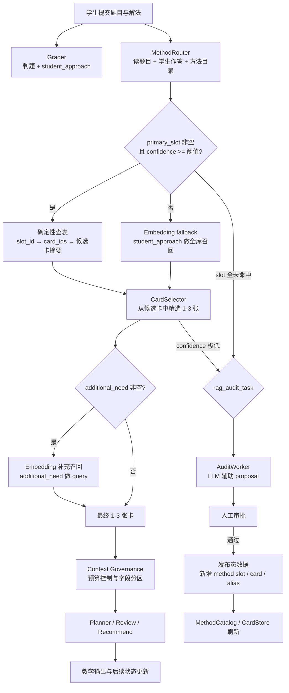

# RAG 实施计划与二阶段检索架构

更新时间：2026-03-24

关联文档：
- `RAG_PLANNING_3.md` — 总纲、阶段顺序与关键里程碑
- `RAG_SCHEMA_V3.md` — 正式内容源、DDL、发布态约束；与其他文档冲突时优先采用
- `KNOWLEDGE_API_CONTRACT_V2.md` — `MethodRouter` / `CardSelector` / `CardRetriever` 运行时契约；新实现优先采用
- `METHOD_CATALOG_CONTRACT_V2.md` — 方法目录、`question -> topic` 解析与 slot 规范；新实现优先采用
- `RAG_EVAL_AND_GATING_V2.md` — v2 覆盖率、离线评测、shadow/gray 门禁；新实现优先采用
- `DATA_MODEL_CONVERGENCE.md` — 数据模型语义边界与收敛原则
- `RAG_RETRIEVAL_DESIGN.md` — CardRetriever 两阶段检索设计（旧方案，已被本文档取代）
- `KNOWLEDGE_API_CONTRACT.md` — 旧版 `knowledge_point_tags` 契约（仅供历史参考）
- `RAG_EVAL_AND_GATING.md` — 旧版门禁口径（仅供历史参考）
- `AUDIT_OPERATIONS_DESIGN.md` — 全局审计流、proposal 与运营闭环
- `confused.md` — 公式主导场景疑点记录与路线选择分析

---

## 本文档回答的问题

本文档只回答两件事：

1. 这套 RAG 的实施顺序是什么。
2. 这套 RAG 在线上到底通过什么方式落地。

它是 `doc/rag_card` 的入口摘要文档，用于统一路线图与运行时架构认知；它不是新的规范源，不替代 `RAG_SCHEMA_V3.md`、`KNOWLEDGE_API_CONTRACT_V2.md`、`METHOD_CATALOG_CONTRACT_V2.md`、`RAG_EVAL_AND_GATING_V2.md` 这些正式执行基线。

---

## 为什么改变检索架构

原方案（`RAG_RETRIEVAL_DESIGN.md`）假设 Grader 能顺手输出 `knowledge_point_tags`，然后靠 embedding 在全库做主召回。

实际评估后发现这在**数学公式主导的学生作答**中不稳定（详见 `confused.md`）：

- 学生写 `x = 2cosα, y = sinα`，几乎没有自然语言标签
- Grader 自由生成 tags 的命名不稳定，同一方法可能产出不同标签
- 公式含义高度依赖题目上下文，embedding 对公式表达的区分度不够
- 纯 LLM 直接选卡又容易产生幻觉

核心结论：**不应该让 LLM 自由生成检索词，而应该给 LLM 一份闭合菜单让它选择。选择比生成稳定得多。**

这就是"分层披露 + 二阶段 LLM 检索"方案的出发点。

---

## 总体实施路线图

```text
Phase 0 上下文快赢项                                          ✅ 已完成
  ↓
Phase B/C 内容仓库 + CardStore + 方法目录 + 正式 solution_card_link   ⚙️ 骨架已完成
  ↓
Phase D/E 最小 concept 壳模型 + 全局 rag_audit_task + 双层 mastery    ✅ 2026-03-24
  ↓
Phase F MethodRouter + CardSelector 二阶段检索接入 Planner            ⚙️ 骨架 + 接入已完成
  ↓
Phase G/H 完整 concept registry + 三层独立化 + 运营闭环                🔲 未开始
```

### Phase 0：上下文快赢项 ✅

- ✅ `SocraticAgent._format_history` / `IntentClassifierAgent._fmt_rich_history`：content 截取前 150 字
- ✅ `TutorManager._get_recent_history()`：统一截取 `[-6:]` + 150 字，调用方不再传全量 history
- ✅ `ActionClassifier._truncate_history()`：同步截取
- ✅ `_build_passed_history` 改为紧凑格式 `已通过: 1.xxx 2.xxx`
- ✅ 请求级上下文缓存：`_req_recent_history` / `_req_passed_history` / `_req_recent_context`
- ✅ `_eval_approach_cached`：PathEvaluator 结果缓存，同一 student_approach 不重复调用

### Phase B/C：内容仓库、`CardStore`、方法目录、正式 `solution_card_link` ⚙️

骨架已完成，内容数据待填充：

- 🔲 权威内容目录（`content/questions/`、`content/knowledge_cards/`、`content/concepts/`）待建立
- ✅ **方法目录（Method Catalog）**已落地：
  - `content/method_catalog/解析几何/椭圆.yaml`（5 slot）
  - `content/method_catalog/_cross_topic.yaml`（4 slot）
  - `content/method_catalog/_question_topics.yaml`（示例映射）
- ✅ **`agent/knowledge/` 子系统**已完成：
  - `data_structures.py` — 全部数据类型（`PublishedKnowledgeCard`、`MethodSlot`、`CardRetrieveRequest/Result`、`RetrievalBundle`、`RagAuditEntry` 等）
  - `method_catalog.py` — `MethodCatalog`：topic 解析、slot 缓存、question→topic 映射
  - `card_store.py` — `CardStoreBase`（ABC）+ `NullCardStore` + `InMemoryCardStore`
  - `card_index.py` — `CardIndexBase`（ABC）+ `NullCardIndex` + `SimpleCardIndex`（token-overlap fallback）
  - `factory.py` — `build_card_retriever()` 组装工厂
- 🔲 正式 `solution_card_link` 索引待建立
- ✅ 实际知识卡内容填充（椭圆 7 张）+ `FileCardStore` 替换 `NullCardStore`

### Phase D/E：最小 `concept` 壳、全局 `rag_audit_task`、双层 mastery ✅

已完成（2026-03-24）：

- ✅ **ConceptRegistry**（`agent/knowledge/concept_registry.py`）：从 `content/concepts/` 加载 YAML 定义的 concept 节点，支持按 chapter/topic/slot/card 查询，BFS 展开前置依赖链
- ✅ **椭圆 concept 数据**（`content/concepts/解析几何/椭圆.yaml`）：6 个 concept 节点，含难度分级、前置依赖、关联 slot 和 card
- ✅ **AuditStore**（`agent/knowledge/audit_store.py`）：JSONL append-only 持久化，支持 query（chapter/task_type/时间范围）+ stats 统计
- ✅ **CardRetriever 自动持久化**：audit_entries 在 retrieve() 中自动写入 AuditStore
- ✅ **MethodSlotMastery**（`agent/memory/data_structures.py`）：slot_id 维度的 use_count / success_count / success_rate
- ✅ **SemanticMemory.slot_mastery**：双层 mastery 字典，序列化/反序列化完整，`get_weak_slots()` / `get_strong_slots()` 查询接口，`to_progress_snapshot()` 包含薄弱方法展示
- ✅ **MemoryManager._apply_update**：自动从 `episode.method_slot_matched` 更新 slot_mastery

### Phase F：MethodRouter + CardSelector 二阶段检索接入 Planner ⚙️

骨架 + Planner 接入已完成，Review/Recommend/Memory 接入待做：

- ✅ **`MethodRouterAgent`**（`agent/knowledge/agents/method_router_agent.py`）：闭合选择 + slot_id 校验 + keyword fallback
- ✅ **`CardSelectorAgent`**（`agent/knowledge/agents/card_selector_agent.py`）：候选卡精选 + `additional_need` 补充 + fallback
- ✅ **`JsonParseMixin`**（`agent/knowledge/agents/_parsing.py`）：两个 Agent 共享的 JSON 解析与 confidence 归一化
- ✅ **`CardRetriever.retrieve()`**（`agent/knowledge/card_retriever.py`）：完整编排（topic 解析 → route → 查表 → select → fallback → audit 收集 → signature）
- ✅ **`RagAuditEntry`**：低置信度时自动收集 audit 条目（`empty_slot`、`low_router_confidence`、`low_selector_confidence`）
- ✅ **SkillRegistry** 注册 `retrieve_cards` skill，`build_card_retriever()` 自动创建完整检索栈
- ✅ **TutorManager 接入**：
  - `_retrieve_supplementary_cards()` 在 ACCEPT / ACCEPT_WITH_FLAG 时触发 RAG
  - `_format_supplementary_cards()` 将 `RetrievalBundle` 格式化为文本
  - `_create_plan()` 自动读取 `session.last_retrieval_bundle` 传给 Planner
- ✅ **Planner 消费**：`PlannerAgent.process()` 新增 `supplementary_cards` 参数，prompt 新增补充知识卡分区，走 `context_governance` 预算控制
- ✅ Review `explain_concept` 接入 CardRetriever（优先 RAG 检索，兜底预挂载卡片）
- ✅ Recommend 接入 CardRetriever（REVIEW_CONCEPT 推荐时检索知识卡摘要）
- ✅ Memory 记录 `method_slot`（`EpisodicMemory.method_slot_matched` → `SemanticMemory.slot_mastery`）
- ✅ FileCardStore + 椭圆 7 张知识卡 + SimpleCardIndex 自动构建

### Phase G/H：完整 concept registry、三层独立化、运营闭环

- 在 concept coverage、alias 质量与 audit 运营稳定后，再推进完整 concept registry。
- 开启 problem / method / thinking 三层独立掌握度建模与历史迁移。
- 建立评测、灰度、审计看板与发布回滚能力，形成"发现新方法 -> proposal -> 审批 -> 发布 -> 在线消费"的闭环。

---

## 二阶段检索架构

### 设计原则

这套方案的核心思想是**分层披露（Progressive Disclosure）**：

- LLM 不需要一次看完全部知识卡，只需要在每一层看到足够做出选择的信息
- 第 1 层：方法目录索引（每个 method slot 只有一行 trigger 描述，10 个方法约 300 token）
- 第 2 层：候选卡摘要（被选中 slot 挂载的 3-8 张卡的摘要，约 800 token）
- 第 3 层：最终卡片全文（1-3 张卡注入下游 Agent）

每一层都大幅缩小了 LLM 需要处理的信息量，同时保持了足够的语义判断能力。

### 为什么不是纯 embedding，也不是纯 LLM

| 方案 | 问题 |
|------|------|
| 纯 embedding 全库盲搜 | 对公式表达区分度差，容易检到"同章节但不相干"的卡 |
| 纯 LLM 自由选卡 | 幻觉卡片、命名不一致误判、难做稳定评测 |
| Grader 自由生成 tags | 标签命名不稳定，公式主导场景无法产出有效 tags |
| **二阶段：LLM 闭合选择 + 确定性查表** | LLM 只做"从菜单选"，系统做"按 slot 查表拉卡" |

关键区别：**不让 LLM 自由生成检索词，而是给它一份闭合的方法菜单。** 选择比生成稳定得多。

### 方法目录（Method Catalog）

方法目录是二阶段检索的基础设施。每个 topic 下维护一份方法菜单：

```yaml
# content/method_catalog/解析几何/椭圆.yaml
chapter: 解析几何
topic: 椭圆
methods:
  - slot_id: ellipse_parametric
    name: 椭圆参数方程法
    trigger: "学生用 cos/sin 参数化设点，绕开联立方程组"
    card_ids: [card_0047, card_0048]
    cross_ref: [trig_substitution, parametric_general]

  - slot_id: ellipse_focal_chord
    name: 焦点弦法
    trigger: "学生利用焦半径关系或焦点弦性质"
    card_ids: [card_0051]

  - slot_id: ellipse_set_and_solve
    name: 设点联立法
    trigger: "学生设点代入曲线方程，联立方程组求解"
    card_ids: [card_0052, card_0053, card_0054]

  - slot_id: ellipse_polar
    name: 极坐标法
    trigger: "学生使用极坐标或焦点极坐标方程"
    card_ids: [card_0055]
```

跨章节公共方法池：

```yaml
# content/method_catalog/_cross_topic.yaml
chapter: _cross_topic
topic: 公共方法
methods:
  - slot_id: trig_substitution
    name: 三角代换
    trigger: "用 sin/cos/tan 替换变量简化表达式"
    card_ids: [card_0201]

  - slot_id: vector_method
    name: 向量法
    trigger: "建系后用向量运算处理几何关系"
    card_ids: [card_0202, card_0203]

  - slot_id: mean_inequality
    name: 均值不等式求最值
    trigger: "利用 AM-GM 或柯西不等式求最值"
    card_ids: [card_0210]

  - slot_id: recursion_to_sequence
    name: 递推建模
    trigger: "构造递推关系式求解"
    card_ids: [card_0220]
```

设计要点：

- 每个 topic 通常 5-15 个 method slot，加上公共池 10-15 个，MethodRouter 单次输入不超过 30 个选项
- `trigger` 字段是写给 LLM 看的判断依据，要贴合学生实际作答的表现形式，而不是教科书定义
- `card_ids` 是确定性映射，系统按 slot_id 直接查表拉卡，不做模糊匹配
- `cross_ref` 标注跨章节关联，供 CardSelector 阶段补充拉卡

### 第 1 轮：MethodRouter（粗选——从目录选 slot）

**职责**：理解学生在做什么，从方法目录中选出最匹配的 method slot。

**输入**：

- 题目文本
- 学生作答（含公式）
- 当前 topic 方法目录 + 跨章节公共方法池（约 300-500 token）

**输出**：

```json
{
  "primary_slot": "ellipse_parametric",
  "cross_slots": ["trig_substitution"],
  "confidence": 0.85,
  "reasoning": "学生写了 x=2cosα, y=sinα，明确是参数化设点；后续用了三角代换简化"
}
```

**关键设计**：

- MethodRouter 是独立 Agent，不塞进 Grader。Grader 的职责是判题，MethodRouter 的职责是检索路由，两者关注点不同。
- 输出是闭合选择（从已知 slot_id 中选），不是自由文本生成。这是稳定性的关键保证。
- `confidence` 字段用于控制后续流程：高置信走快路径，低置信走 fallback。
- `cross_slots` 允许选 0-2 个跨章节方法，处理跨知识点场景。
- 如果所有 slot 都不匹配，输出 `primary_slot: null`，进入 fallback 路径。

**MethodRouter prompt 核心结构**：

```yaml
system: |
  你是一个数学方法识别器。根据题目和学生作答，从下面的方法目录中选出最匹配的方法。

  ## 当前 topic 方法目录
  {{ topic_methods }}

  ## 跨章节公共方法
  {{ cross_topic_methods }}

  规则：
  - 只能从上面列出的 slot_id 中选择，不能自创
  - primary_slot 选 1 个或 null
  - cross_slots 选 0-2 个
  - 如果学生方法完全不在目录中，primary_slot 输出 null

user: |
  题目：{{ problem_text }}
  学生作答：{{ student_work }}
```

**成本估算**：~500 token 输入，~80 token 输出。比 Grader 一次调用还小。

### 系统层：确定性查表拉卡

MethodRouter 输出 slot_id 后，系统层（非 LLM）执行确定性查表：

```python
async def _pull_candidate_cards(
    self,
    catalog: MethodCatalog,
    card_store: CardStore,
    router_result: MethodRouterResult,
) -> list[CandidateCard]:
    """按 slot_id 确定性拉取候选卡片"""
    card_ids: set[str] = set()

    # 1. 主 slot 的卡
    if router_result.primary_slot:
        slot = catalog.get_slot(router_result.primary_slot)
        card_ids.update(slot.card_ids)
        # 低置信度时，追加 cross_ref 卡
        if router_result.confidence < 0.8:
            card_ids.update(slot.cross_ref)

    # 2. 跨章节 slot 的卡
    for cross_slot_id in router_result.cross_slots:
        slot = catalog.get_slot(cross_slot_id)
        card_ids.update(slot.card_ids)

    # 3. 拉卡片摘要（不是全文）
    return await card_store.get_card_summaries(list(card_ids))
```

这一步完全是确定性的：slot_id → card_ids → 摘要。没有模糊匹配，没有 embedding。

### 第 2 轮：CardSelector（精选——从候选卡中挑）

**职责**：看到候选卡的实际摘要后，精选最终 1-3 张卡，并判断是否需要补充检索。

**输入**：

- 题目文本
- 学生作答（含公式）
- 候选卡摘要（3-8 张，每张包含标题 + key_insight + 公式模式，约 800 token）

**输出**：

```json
{
  "selected_card_ids": ["card_0047", "card_0201"],
  "additional_need": "均值不等式求最值",
  "additional_reason": "学生在参数化后用了 AM-GM，当前候选无覆盖",
  "confidence": 0.88
}
```

**关键设计**：

- CardSelector 看到了候选卡的**实际内容摘要**，而不仅是标题。这让它能做真正的相关性判断。
- `additional_need` 字段是关键：当候选卡不足以覆盖学生方法时，CardSelector 能**主动告诉系统缺什么**。这比静默 fallback 更可控。
- 如果 `additional_need` 不为空，系统用它作为 query 做一次 embedding 搜索，从全库补充 1-2 张卡。
- 最终输出不超过 3 张卡，送入下游 Planner。

**成本估算**：~1200 token 输入，~100 token 输出。

### 完整在线链路

在线链路按以下 6 步运行：

1. **Grader 判题**：输出 `student_approach`、`uses_alternative_method`、`alternative_method_name`（保持现有职责，不再要求输出 `knowledge_point_tags`）。
2. **MethodRouter 选 slot**：读题目 + 学生作答 + 方法目录，输出 `primary_slot` + `cross_slots` + `confidence`。
3. **确定性查表拉卡**：按 slot_id 从 `MethodCatalog` 查出 card_ids，从 `CardStore` 拉取候选卡摘要。
4. **CardSelector 精选**：看候选卡摘要，精选 1-3 张最终卡，判断是否需要补充检索。
5. **Embedding fallback（按需）**：如果 CardSelector 输出 `additional_need`，或 MethodRouter confidence 过低 / primary_slot 为 null，用自然语言 query 做 embedding 全库召回补充。
6. **Context Governance 注入**：最终卡片通过 `supplementary_cards` 注入 Planner / Review / Recommend，走预算控制与字段分区。



这张图强调四点：

- **Grader 和 MethodRouter 可以并行调用**：Grader 判题和 MethodRouter 选 slot 没有依赖关系，可以同时发起。
- **在线主链路是 LLM 闭合选择 + 确定性查表**，不是 embedding 全库盲搜。
- **Embedding 只在两个场景触发**：MethodRouter 低置信 fallback，或 CardSelector 发现候选卡不足需要补充。
- **审计闭环补充方法目录**：新方法被发现后，通过 audit → 人工审批 → 新增 method slot 的方式扩展目录，而不是让系统无限自由发挥。

### 低置信度与失败处理

| 场景 | 处理方式 |
|------|---------|
| MethodRouter confidence >= 0.8 | 快路径：查表拉卡 → CardSelector |
| MethodRouter confidence 0.5-0.8 | 查表拉卡（含 cross_ref）→ CardSelector |
| MethodRouter confidence < 0.5 或 primary_slot = null | 降级到 embedding fallback，同时写 `rag_audit_task` |
| CardSelector confidence < 0.6 | 写 `rag_audit_task`，卡片仍送下游但标记为低置信 |
| CardSelector additional_need 非空 | embedding 补充召回 1-2 张 |
| 全流程无结果 | Planner 退化到只使用 `target_cards`，不中断主链路 |

---

## 跨章节场景处理

跨章节是分层披露方案必须正面回答的问题。典型场景：

| 场景 | 涉及章节 |
|------|---------|
| 解析几何题用三角代换 | 椭圆 + 三角函数 |
| 数列题用函数思想 | 数列 + 不等式/导数 |
| 立体几何用向量法 | 立体几何 + 向量 |
| 概率题用递推 | 概率 + 数列递推 |

通过三层机制覆盖：

1. **跨章节公共方法池**：`_cross_topic.yaml` 中维护 10-15 个常见跨章节方法（三角代换、向量法、均值不等式等），始终附在 MethodRouter 的方法目录末尾。
2. **cross_ref 展开**：每个 method slot 可标注 cross_ref，当被选中时系统自动拉取关联 slot 的卡片。
3. **CardSelector additional_need**：当前两层都不够时，CardSelector 主动告诉系统"还缺什么"，触发 embedding 补充。

不需要目录覆盖 100% 场景。目录覆盖高频的 80%，剩下 20% 靠 embedding fallback + 人工审计闭环逐步补全。

---

## 成本估算

| 组件 | 输入 token | 输出 token | 说明 |
|------|-----------|-----------|------|
| MethodRouter | ~500 | ~80 | 方法目录 + 题目 + 学生作答 |
| CardSelector | ~1200 | ~100 | 候选卡摘要 + 题目 + 学生作答 |
| Embedding fallback（按需） | — | — | 仅低置信或补充时触发 |
| **合计** | **~1700** | **~180** | 比 Grader 单次调用更小 |

两轮 LLM 调用合计不到 2000 token，比在 Grader prompt 里塞入大量知识卡要便宜得多。

---

## 离线闭环

- 当 MethodRouter 选不到 slot、CardSelector 置信度低、或候选卡覆盖不足时，写入 `rag_audit_task`。
- `AuditWorker` 使用 LLM 辅助生成：
  - `proposed_slot`：建议新增的 method slot（slot_id、name、trigger）
  - `proposed_card_ids`：建议挂载的知识卡
  - `proposed_aliases`：建议新增的 concept alias
- 人工审批通过后，写回：
  - `MethodCatalog`：新增或修改 method slot
  - `solution_card_link`
  - `concept_alias`
  - `knowledge_card_concept_link`
- 在线链路只读取 `published` 数据，不消费未审批 proposal，不直接写正式索引。

这样系统形成"发现新方法 → 写 audit → LLM 提案 → 人工审批 → 目录扩展 → 在线可用"的闭环。

---

## 里程碑与验收门槛

### 必要里程碑

- M-1：Phase 0 完成，主链路 prompt 成本下降且零回归。 **✅ 2026-03-24**
- M1：Phase B/C 完成，`CardStore`、`MethodCatalog` 与正式 `solution_card_link` 可用。 **⚙️ 骨架完成，待填充内容数据**
- M1.5：Phase D/E 完成，最小 concept 壳模型、`rag_audit_task`、双层 mastery 可用。 **✅ 2026-03-24**
- M2：Phase F 完成，MethodRouter + CardSelector 二阶段检索接入 Planner。 **⚙️ Planner 接入完成，Review/Recommend/Memory 待接入**
- M3：Phase G/H 完成，完整 concept registry、三层独立化与运营闭环可用。 **🔲 未开始**

### 上线门槛

- `problem_primary_link_coverage >= 95%`
- `method_primary_link_coverage >= 90%`
- `method_catalog_slot_coverage >= 85%`（目录中的 slot 能覆盖实际出现的学生方法比例）
- MethodRouter slot 命中率 >= 80%（在有 slot 覆盖的场景下）
- alias / retrieval 质量门槛按 `RAG_EVAL_AND_GATING.md` 执行
- Planner prompt 回归、parse error delta、audit backlog growth 作为上线门禁

---

## 非目标与边界

- 不做纯 LLM 在线全库检索。
- 不让 LLM 自由生成 card_id 或自由输出检索 tags 作为主链路。
- 不在 Phase F 前上线 Planner RAG。
- 不在 Phase G 前启用 thinking 更新。
- 不允许业务代码直接读 `content/` 原始 JSON。
- 不允许未审批 proposal 直接进入在线发布态。
- 不把 `plan.md` 当成新的 schema 或 API 规范源；遇到细节冲突时，以正式执行基线为准。
- Grader 保持判题职责，不承担检索路由职责。MethodRouter 是独立 Agent。

---

## 默认假设

- `plan.md` 是入口摘要文档，不是新的规范源；当它与正式基线冲突时，以 `RAG_SCHEMA_V3.md`、`KNOWLEDGE_API_CONTRACT_V2.md`、`RAG_EVAL_AND_GATING_V2.md` 为准。
- 文档语言保持中文，风格对齐现有 `doc/rag_card` 文档。
- 架构图使用 Mermaid，而不是 ASCII 图。
- 方法目录初始内容可以从现有 `KnowledgeCard` 数据半自动生成，不需要从零人工编写。

---

## 附录：模块级调用示例（目标态）

以下示例都使用同一个场景，便于把各模块如何调用或消费 RAG 串成一条链路：

- 题目：解析几何，椭圆
- 标准解：设点、联立、爆算
- 学生解法：不走标准设点联立，而是直接参数化：`x = 2cosα, y = sinα`，再利用参数关系挖掘隐含条件
- 现状假设：题目有 `question_card_link`，方法目录中有 `ellipse_parametric` slot

### 1. Grader：判题（不负责检索路由）

Grader 保持原有职责，输出正误判断和方法识别，**不再要求输出 `knowledge_point_tags`**。

示例输出：

```python
GraderResult(
    is_correct=True,
    student_approach="通过椭圆参数化绕开设点联立，直接利用参数关系挖掘隐含条件",
    uses_alternative_method=True,
    alternative_method_name="参数方程法",
)
```

### 2. MethodRouter：从方法目录选 slot（与 Grader 并行）

MethodRouter 读题目 + 学生作答 + 方法目录，做闭合选择。

输入的方法目录（注入 prompt）：

```
当前 topic 方法目录（解析几何 · 椭圆）：
- ellipse_parametric: 椭圆参数方程法 — 学生用 cos/sin 参数化设点，绕开联立方程组
- ellipse_focal_chord: 焦点弦法 — 学生利用焦半径关系或焦点弦性质
- ellipse_set_and_solve: 设点联立法 — 学生设点代入曲线方程，联立方程组求解
- ellipse_polar: 极坐标法 — 学生使用极坐标或焦点极坐标方程

跨章节公共方法：
- trig_substitution: 三角代换 — 用 sin/cos/tan 替换变量简化表达式
- mean_inequality: 均值不等式求最值 — 利用 AM-GM 或柯西不等式求最值
...
```

示例输出：

```json
{
  "primary_slot": "ellipse_parametric",
  "cross_slots": [],
  "confidence": 0.92,
  "reasoning": "学生写了 x=2cosα, y=sinα，是典型的椭圆参数化设点"
}
```

### 3. 确定性查表拉卡

系统（非 LLM）按 slot_id 查表：

```python
# ellipse_parametric.card_ids = [card_0047, card_0048]
# confidence >= 0.8，不追加 cross_ref
candidates = card_store.get_card_summaries(["card_0047", "card_0048"])
# 返回 2 张卡的摘要
```

### 4. CardSelector：从候选卡中精选

CardSelector 看到候选卡摘要，做最终选择。

输入的候选卡摘要：

```
候选卡：
1. card_0047「椭圆参数方程法 — 基础」
   key_insight: 令 x=acosθ, y=bsinθ 可将椭圆问题转化为三角函数问题
   公式模式: x=acosθ, y=bsinθ

2. card_0048「椭圆参数方程法 — 进阶应用」
   key_insight: 参数化后利用三角恒等式挖掘隐含条件，常与面积/弦长问题结合
   公式模式: S = (1/2)|ab·sin(θ1-θ2)|
```

示例输出：

```json
{
  "selected_card_ids": ["card_0047", "card_0048"],
  "additional_need": null,
  "additional_reason": null,
  "confidence": 0.90
}
```

最终 2 张卡送入下游。

### 5. 跨章节场景示例

如果学生在参数化后**还用了均值不等式求最值**：

MethodRouter 输出：

```json
{
  "primary_slot": "ellipse_parametric",
  "cross_slots": ["mean_inequality"],
  "confidence": 0.78
}
```

系统拉卡：`ellipse_parametric` → 2 张 + `mean_inequality` → 1 张 + confidence < 0.8 追加 `cross_ref`(trig_substitution) → 1 张 = 候选池 4 张。

CardSelector 输出：

```json
{
  "selected_card_ids": ["card_0047", "card_0210"],
  "additional_need": null,
  "confidence": 0.85
}
```

最终 2 张卡：一张参数方程法，一张均值不等式。

### 6. 低置信度 fallback 示例

如果学生用了一种目录里完全没有的方法（比如某种非常规构造）：

MethodRouter 输出：

```json
{
  "primary_slot": null,
  "cross_slots": [],
  "confidence": 0.3,
  "reasoning": "学生的方法不在目录中，疑似自创构造法"
}
```

系统流程：

1. primary_slot = null，跳过查表
2. 降级到 embedding fallback，用 Grader 的 `student_approach` 做 query，全库召回 top 5
3. CardSelector 从 embedding 召回结果中精选 1-3 张
4. 写 `rag_audit_task`：发现新方法，建议审核后新增 method slot

### 7. Planner：消费 `supplementary_cards` 做替代方法教学规划

Planner 拿到两类卡：

- `target_cards`：这道题原本想训练什么
- `supplementary_cards`：学生这次实际上用了什么方法

于是 Planner 可以生成更合理的教学路径，例如：

- 承认参数方程法这条路线是可行的
- 指出它和标准设点联立法的关系与差异
- 决定先解释"为什么参数化合法"，再带学生验证关键步骤

如果检索为空，Planner 必须退化到只使用 `target_cards`，不能因为 RAG 为空就中断主链路。

### 8. Review：在 `explain_concept` 场景下按需取卡

学生在复盘里追问："为什么这里参数化以后三角恒等式可以这样用？"

Review 不应再全量注入整套知识卡，而是围绕当前问题和当前方法做一次小规模检索：

- query 来源：当前题目、当前章节、最近一次方法演示、学生提问中抽到的概念词
- 目标：返回 1-2 张最相关的解释卡
- 用法：只把这些卡作为 `explain_concept` 的素材，而不是把所有知识卡一起塞给 Review

### 9. Recommend：把"该补什么"落成具体复习卡或练习题

如果会话结束后系统发现学生虽然做出了题，但参数化技巧理解还不稳：

- `REVIEW_CONCEPT`：用薄弱 concept 触发检索，返回强化卡
- `EASIER_PROBLEM`：先利用 concept / card 关系锁定该补哪类方法，再选更简单的练习题

### 10. Memory：把这次实际方法记对

```python
EpisodicMemory(
    problem_id="ellipse_001",
    solution_card_ids=["card_0047", "card_0048"],
    method_slot="ellipse_parametric",
    method_concepts=["concept_parametric_method"],
    needs_solution_card_audit=False,  # 目录中已有对应 slot
)
```

### 11. AuditWorker / `rag_audit_task`：把新方法沉淀进目录

当系统首次遇到目录中没有的方法时，audit 闭环负责：

- `AuditWorker` 生成 proposal：建议的 slot_id、name、trigger、card_ids
- 人工审批通过后写回 `MethodCatalog`
- 下次再遇到同类方法时，MethodRouter 直接命中

### 12. Context Governance：保证 RAG 结果进入 prompt 但不挤爆 prompt

即使检索成功，也不能把所有卡都无脑塞给 LLM。治理层可以：

- 保留 `target_cards`
- 优先保留分数最高的 `supplementary_cards`
- 裁掉低分补充卡
- 记录 `coverage_status`、`dropped_fields`、预算利用率等观测信息

### 13. Progress：不直接调用 RAG，但消费 RAG 修正后的结果

Progress 消费 Memory 层已经纠正过的 `method_slot` / `method_concepts` / mastery 结果，用来做阶段总结与任务规划。它依赖 RAG 的间接效果，不自己在线发起检索。
